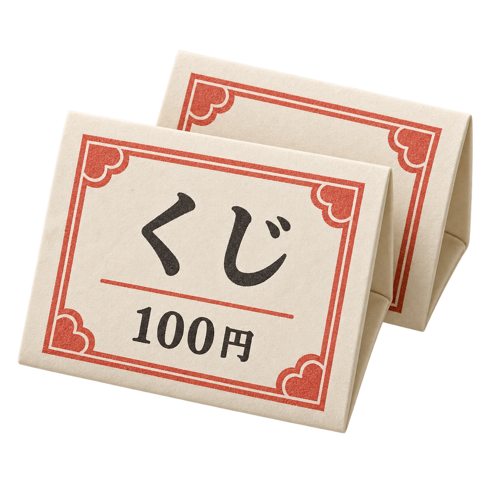
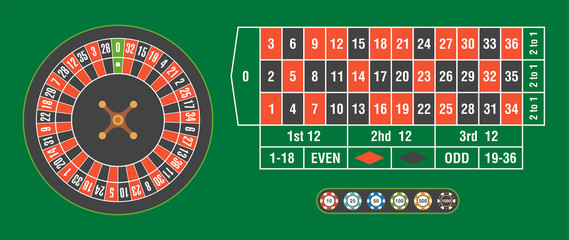
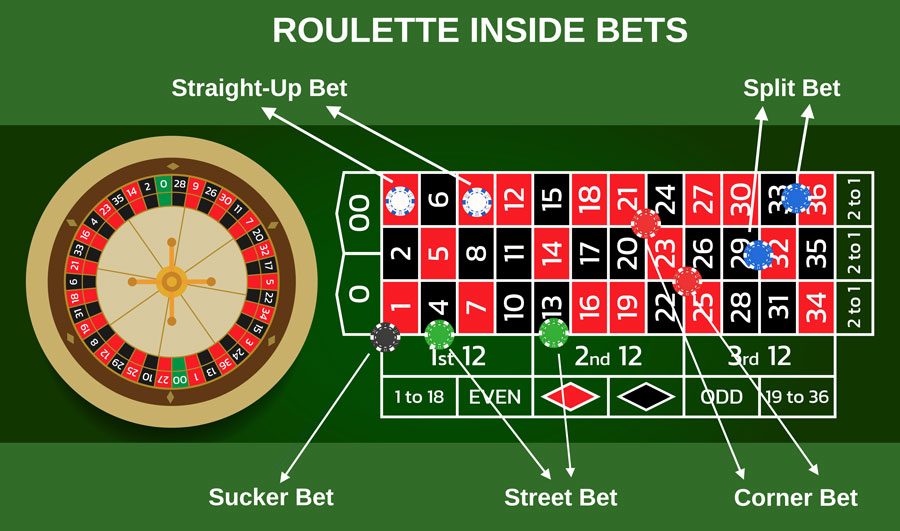
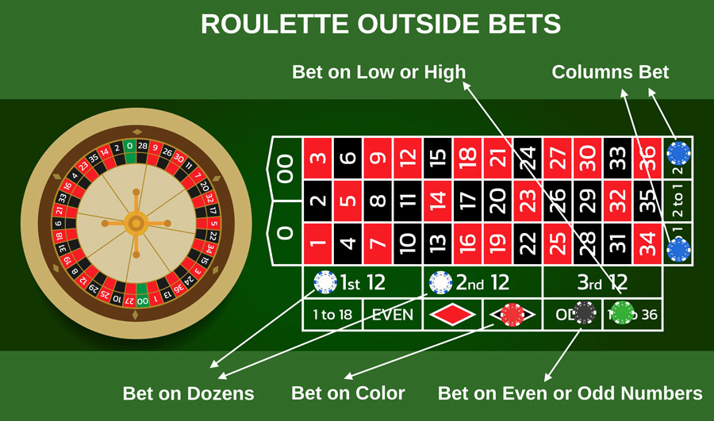
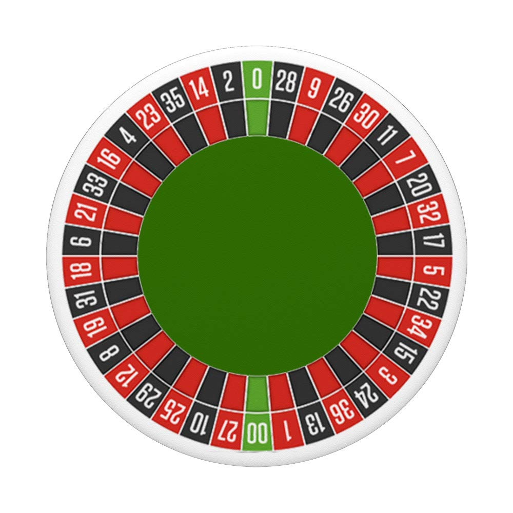
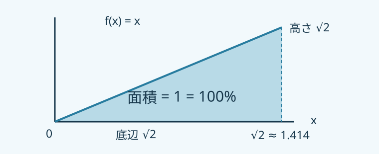

## 100円のくじ、買う？

<!-- _class: lottery-opening -->
<!-- _footer: 統計学B 第2週 ／ 教科書 第2章 第2節 p.117–129 -->

1枚 **100円**。 まだ開いていないくじを、手に持っています。

<large>0円　／　100円　／　1,000円</large>

賞金の確率は、順に **70%　／　25%　／　5%**。

買う？ 買わない？ その理由は？

<!-- Lottery-ticket illustration generated with OpenAI image generation. -->

## くじの賞金を $X$ とする

まだ開いていないくじ。賞金はいくら？

<large>$X\in\{0,100,1000\}$</large>

偶然の結果によって値が決まる「賞金の額」が確率変数 $X$。

<small>$x$ は具体的な値。$Pr(X=100)$ は「賞金が100円になる確率」。</small>

<!-- Adapted from Tsumura 2026 Week 2 slide 6; new editable teaching slide -->
## 100円のくじ、買う？

<!-- _class: lottery-example -->

$X$ = 賞金（円）。0円：70% ／ 100円：25% ／ 1,000円：5%。

$$\begin{aligned}E(X)&=\sum_x x\Pr(X=x)\\&=0\Pr(X=0)+100\Pr(X=100)+1000\Pr(X=1000)\\&=0\times0.70+100\times0.25+1000\times0.05=75\text{ 円}\end{aligned}$$

もらう賞金の平均（期待値）

75円

何度も引いたときの平均賞金

代金100円を引いた平均損益

−25円

75円 − 100円 = −25円

1枚あたり、平均 <strong>25円の損</strong>。毎回25円失うわけではありません。

## やってみる：くじの賞金と、払ったお金

<!-- _class: simulation-guide -->

結果の例：0円　100円　0円　1,000円　0円

$$E(X)=0(0.70)+100(0.25)+1000(0.05)=75\text{ 円}$$

この5枚の賞金平均は220円。繰り返すと青い平均線は75円に近づく傾向。100円の代金を引くと、期待損益は−25円／枚。

1枚引いて、次に1,000枚。賞金の平均75円と、1枚あたりの損益 −25円に近づくか試そう。

[やってみよう！](https://yohman.github.io/26-2-StatsB/agenda.html?activity=lottery#week-02)

<!-- 数列は説明用の例。確率・期待値は理論値。ライブの実測値は試行ごとに変わります。 -->

## 教科書　第2章・第2節　確率分布

<!-- _class: book-divider -->
<!-- _footer: 2-1 確率変数 ／ 教科書 p.117 -->

2-1確率変数

教科書 p.117

何が起きるか分からない。その結果を、数で表す。

<!-- Adapted from Tsumura 2026 Week 2 slide 4; new editable teaching slide -->
## 確率変数 $X$

<!-- _footer: 2-1 確率変数 ／ 教科書 p.117 -->

サイコロを振る前、出る目はまだ分かりません。

$X$ = 出た目　　$X\in\{1,2,3,4,5,6\}$

出たあとに観測した値を $x$ と書きます。

## やってみる：振る前のX、振ったあとのx

<!-- _footer: 2-1 確率変数 ／ 教科書 p.117 -->

<!-- _class: simulation-guide -->

振る前：1〜6のどれか ／ 振ったあとの例：4

$$X\in\{1,2,3,4,5,6\}\qquad x=4$$

「1回試す」を押すと、候補から1つの目が決まる。表の実測列に今回の結果が加わる。次に振る前は、またXの値が分からない。

サイコロを1回振る。Xの候補は1〜6、今回のxはどれ？

[やってみよう！](https://yohman.github.io/26-2-StatsB/agenda.html?activity=dice#week-02)

<!-- 数列は説明用の例。確率・期待値は理論値。ライブの実測値は試行ごとに変わります。 -->

## コインを５回投げて、ロボットは何回？

<!-- _footer: 2-1 確率変数 ／ 教科書 p.117 -->

<large>🤖 表（ロボット）　🐐 裏（ヤギ）</large>

$X$ = 5回中の表（ロボット）の回数。

<large>$X\in\{0,1,2,3,4,5\}$</large>

0回も、取りうる結果に含めます。

## やってみる：コインの表は、毎回50%？

<!-- _footer: 2-1 確率変数 ／ 教科書 p.117 -->

<!-- _class: simulation-guide -->

5回の例：🤖　🐐　🐐　🤖　🐐　　表は2回

$$\text{実測の表の割合}=\frac25=40\%\qquad\Pr(\text{表})=50\%$$

少ない回数では50%から離れることもある。横軸は投げた回数、縦軸はその時点までの表の割合。

投げる前に、$X$ が取りうる値を挙げてみよう。

[やってみよう！](https://yohman.github.io/26-2-StatsB/agenda.html?activity=coin#week-01)

<!-- 数列は説明用の例。確率・期待値は理論値。ライブの実測値は試行ごとに変わります。 -->

## 教科書　第2章・第2節　確率分布

<!-- _class: book-divider -->
<!-- _footer: 2-2 期待値 ／ 教科書 p.117 -->

2-2期待値

教科書 p.117

同じことを何度も繰り返すと、平均はいくら？

## サイコロの期待値は、なぜ3.5？

<!-- _class: dice-expectation -->
<!-- _footer: 2-2 期待値 ／ 教科書 p.117 -->

🎲 $X$ = 出た目。公平なサイコロでは、どの目も確率 $1/6$。

「出た目 × その目の確率」を、1〜6まで全部足す。

$$
E(X)=\sum_{x=1}^{6}x\Pr(X=x)
$$

$$
=1\times\frac16+2\times\frac16+3\times\frac16+4\times\frac16+5\times\frac16+6\times\frac16
$$

$$
\large\color{#167599}{=\frac{1+2+3+4+5+6}{6}=\frac{21}{6}=\boxed{3.5}}
$$

**何度も振ったときの平均が3.5に近づく。** 1回で3.5の目が出るわけではありません。

<!-- Yoh 2025 source PDF slide 22; original w5.md section 22 -->
##

<!-- _footer: 2-2 期待値 ／ 教科書 p.117 -->

<xxl>
🎲

</xxl>

<l>

$E(X)=\frac{(1+2+3+4+5+6)}{6}=3.5$

</l>

## やってみる：出目と平均を比べよう

<!-- _class: simulation-guide dice-results -->
<!-- _footer: 2-2 期待値 ／ 教科書 p.117 -->

| 4回振った結果の例 | 理論の期待値 |
| :---: | :---: |
| ⚁ ⚅ ⚀ ⚂ | $3.5$ |
| この4回の平均 | 何度も振ったときの平均の目安 |
| $\displaystyle\bar{x}=\frac{2+6+1+3}{4}=3$ | $E(X)=3.5$ |

**1回の出目は整数。平均は小数でもよい。**

1,000回振ってみよう。青い線は「そこまでの平均」。$3.5$ に近づく？

[やってみよう！](https://yohman.github.io/26-2-StatsB/agenda.html?activity=dice#week-02)

<!-- 2、6、1、3は説明用の結果。ライブの実測平均は試行ごとに変わります。 -->

<!-- Yoh 2025 source PDF slide 2; original w5.md section 2 -->
#

<!-- _footer: 2-2 期待値 ／ 教科書 p.117 -->

## ルーレット：どこに賭ける？

<!-- _class: roulette-reference -->
<!-- _footer: この図とリンク先は0のみの欧州式。次の2図と授業の計算は0・00の米国式。 -->
<!-- 図：Yoh提供の画像。ゲーム：https://playpager.com/roulette/ -->

[やってみよう！ ルーレット](https://playpager.com/roulette/)

## インサイドベット：数字に賭ける

<!-- _class: roulette-reference -->
<!-- _footer: 米国式ルーレット（0・00） -->
<!-- 図：Yoh提供の画像。ゲーム：https://playpager.com/roulette/ -->

[やってみよう！ ルーレット](https://playpager.com/roulette/)

## アウトサイドベット：グループに賭ける

<!-- _class: roulette-reference -->
<!-- _footer: 米国式ルーレット（0・00） -->
<!-- 図：Yoh提供の画像。ゲーム：https://playpager.com/roulette/ -->

[やってみよう！ ルーレット](https://playpager.com/roulette/)

## やってみる：100円賭けたら、平均いくら？

<!-- _class: simulation-guide roulette-expectation -->
<!-- _footer: 2-2 期待値 ／ 教科書 p.117 -->

米国式ルーレットで、赤に100円。$X$ は賭け金を差し引いた損益。

赤18・黒18・緑2（0・00）

| 赤：18個 | 黒18個 ＋ 緑（0・00）2個 |
| :---: | :---: |
| 勝ち：$+100$ 円 | 負け：$-100$ 円 |
| 確率 $18/38$ | 確率 $20/38$ |

$$
E(X)=(+100)\times\frac{18}{38}+(-100)\times\frac{20}{38}
$$

$$
\Large\color{#a34a3b}{E(X)\approx-5.26\text{ 円}}
$$

**100円賭けるごとに、平均5.26円の損失。**

1,000回試して、平均損益がどう変わるか比べよう。

[やってみよう！](https://yohman.github.io/26-2-StatsB/agenda.html?activity=roulette#week-02)

## やってみる：ALの確率を、12枚のカードで見る

<!-- _footer: 2-2 期待値 ／ 教科書 p.117 -->

<!-- _class: simulation-guide al-card-guide -->

説明用のポイントゲーム。−1は「1点失う」、4は「4点もらう」。

−1

−1

−1

3枚 / 12枚

0

1枚 / 12枚

1

1

2枚 / 12枚

2

1枚 / 12枚

3

1枚 / 12枚

4

4

4

4

4枚 / 12枚

よく混ぜて1枚引く。どのカードも同じ確率 1/12。

$$\begin{aligned}E(X)&=\sum_x x\Pr(X=x)\\&=(-1)\frac{3}{12}+0\frac{1}{12}+1\frac{2}{12}+2\frac{1}{12}+3\frac{1}{12}+4\frac{4}{12}=\frac53\approx1.6667\end{aligned}$$

「4」が4枚なので、$\Pr(X=4)=4/12$。平均では1回あたり約1.67点。

[やってみよう！](https://yohman.github.io/26-2-StatsB/agenda.html?activity=al-discrete#week-02)

<!-- カードはALの確率を可視化した説明用の例。課題の値を金額として扱っていません。 -->

## 教科書　第2章・第2節　確率分布

<!-- _class: book-divider -->
<!-- _footer: 2-3 確率分布 ／ 教科書 p.118 -->

2-3確率分布

教科書 p.118

何が起きる？ それぞれ、どれくらい起こりやすい？

<!-- Adapted from Tsumura 2026 Week 2 slide 10; new editable teaching slide -->
## 賞金の「地図」が確率分布

<!-- _footer: 2-3 確率分布 ／ 教科書 p.118 -->

$X$ = くじの賞金。取りうる値は **0円、100円、1,000円**。

$Pr(X=0)=0.70\qquad Pr(X=100)=0.25\qquad Pr(X=1000)=0.05$

<large>$0.70+0.25+0.05=1$</large>

値とその確率を並べたものが、確率分布です。

## 離散：壊れたロボットは何台？

<!-- _footer: 2-3 確率分布 ／ 教科書 p.118 -->

5台を検品。$X$ = 壊れたロボットの台数。

<svg class="monty-character monty-robot" viewBox="0 0 150 150" role="img" aria-label="ロボット"><path d="M75 23V13" stroke="#244a5a" stroke-width="6" stroke-linecap="round"/><circle cx="75" cy="11" r="7" fill="#efb55b"/><path d="m30 38-12 15v32l12 12m90-59 12 15v32l-12 12" fill="#7ecbd0" stroke="#244a5a" stroke-width="5" stroke-linejoin="round"/><rect x="27" y="25" width="96" height="93" rx="28" fill="#76cbd1" stroke="#244a5a" stroke-width="5"/><path d="M38 45q3-9 14-9h46q11 0 14 9v38q-2 13-16 15H53Q39 96 38 83z" fill="#19394b"/><path d="M45 46q4-6 11-6h24" fill="none" stroke="#a9f4ee" stroke-width="4" stroke-linecap="round" opacity=".8"/><circle cx="56" cy="66" r="8" fill="#8ff2f0"/><circle cx="94" cy="66" r="8" fill="#8ff2f0"/><circle cx="56" cy="66" r="3" fill="#fff"/><circle cx="94" cy="66" r="3" fill="#fff"/><path d="M67 82q8 7 16 0" fill="none" stroke="#a9f4ee" stroke-width="4" stroke-linecap="round"/><circle cx="45" cy="86" r="5" fill="#f29a9b"/><circle cx="105" cy="86" r="5" fill="#f29a9b"/><path d="M57 119v11m36-11v11" stroke="#244a5a" stroke-width="10" stroke-linecap="round"/><rect x="42" y="125" width="30" height="9" rx="4" fill="#244a5a"/><rect x="78" y="125" width="30" height="9" rx="4" fill="#244a5a"/><path d="m119 17 3 7 7 3-7 3-3 7-3-7-7-3 7-3z" fill="#efb55b"/><path d="m17 102 2 5 5 2-5 2-2 5-2-5-5-2 5-2z" fill="#efb55b"/></svg>
正常

<svg class="monty-character monty-robot" viewBox="0 0 150 150" role="img" aria-label="壊れたロボット"><path d="M75 23V13" stroke="#244a5a" stroke-width="6" stroke-linecap="round"/><circle cx="75" cy="11" r="7" fill="#efb55b"/><path d="m30 38-12 15v32l12 12m90-59 12 15v32l-12 12" fill="#d8b7a5" stroke="#244a5a" stroke-width="5" stroke-linejoin="round"/><rect x="27" y="25" width="96" height="93" rx="28" fill="#cba18a" stroke="#244a5a" stroke-width="5"/><path d="M38 45q3-9 14-9h46q11 0 14 9v38q-2 13-16 15H53Q39 96 38 83z" fill="#19394b"/><path d="M45 46q4-6 11-6h24" fill="none" stroke="#a9f4ee" stroke-width="4" stroke-linecap="round" opacity=".8"/><path d="M48 59l16 14m0-14L48 73m38-14 16 14m0-14L86 73" fill="none" stroke="#f0ac82" stroke-width="5"/><path d="M67 86q8-7 16 0" fill="none" stroke="#a9f4ee" stroke-width="4" stroke-linecap="round"/><circle cx="45" cy="86" r="5" fill="#f29a9b"/><circle cx="105" cy="86" r="5" fill="#f29a9b"/><path d="M57 119v11m36-11v11" stroke="#244a5a" stroke-width="10" stroke-linecap="round"/><rect x="42" y="125" width="30" height="9" rx="4" fill="#244a5a"/><rect x="78" y="125" width="30" height="9" rx="4" fill="#244a5a"/><path d="m119 17 3 7 7 3-7 3-3 7-3-7-7-3 7-3z" fill="#efb55b"/><path d="m17 102 2 5 5 2-5 2-2 5-2-5-5-2 5-2z" fill="#efb55b"/></svg>
故障

<svg class="monty-character monty-robot" viewBox="0 0 150 150" role="img" aria-label="ロボット"><path d="M75 23V13" stroke="#244a5a" stroke-width="6" stroke-linecap="round"/><circle cx="75" cy="11" r="7" fill="#efb55b"/><path d="m30 38-12 15v32l12 12m90-59 12 15v32l-12 12" fill="#7ecbd0" stroke="#244a5a" stroke-width="5" stroke-linejoin="round"/><rect x="27" y="25" width="96" height="93" rx="28" fill="#76cbd1" stroke="#244a5a" stroke-width="5"/><path d="M38 45q3-9 14-9h46q11 0 14 9v38q-2 13-16 15H53Q39 96 38 83z" fill="#19394b"/><path d="M45 46q4-6 11-6h24" fill="none" stroke="#a9f4ee" stroke-width="4" stroke-linecap="round" opacity=".8"/><circle cx="56" cy="66" r="8" fill="#8ff2f0"/><circle cx="94" cy="66" r="8" fill="#8ff2f0"/><circle cx="56" cy="66" r="3" fill="#fff"/><circle cx="94" cy="66" r="3" fill="#fff"/><path d="M67 82q8 7 16 0" fill="none" stroke="#a9f4ee" stroke-width="4" stroke-linecap="round"/><circle cx="45" cy="86" r="5" fill="#f29a9b"/><circle cx="105" cy="86" r="5" fill="#f29a9b"/><path d="M57 119v11m36-11v11" stroke="#244a5a" stroke-width="10" stroke-linecap="round"/><rect x="42" y="125" width="30" height="9" rx="4" fill="#244a5a"/><rect x="78" y="125" width="30" height="9" rx="4" fill="#244a5a"/><path d="m119 17 3 7 7 3-7 3-3 7-3-7-7-3 7-3z" fill="#efb55b"/><path d="m17 102 2 5 5 2-5 2-2 5-2-5-5-2 5-2z" fill="#efb55b"/></svg>
正常

<svg class="monty-character monty-robot" viewBox="0 0 150 150" role="img" aria-label="壊れたロボット"><path d="M75 23V13" stroke="#244a5a" stroke-width="6" stroke-linecap="round"/><circle cx="75" cy="11" r="7" fill="#efb55b"/><path d="m30 38-12 15v32l12 12m90-59 12 15v32l-12 12" fill="#d8b7a5" stroke="#244a5a" stroke-width="5" stroke-linejoin="round"/><rect x="27" y="25" width="96" height="93" rx="28" fill="#cba18a" stroke="#244a5a" stroke-width="5"/><path d="M38 45q3-9 14-9h46q11 0 14 9v38q-2 13-16 15H53Q39 96 38 83z" fill="#19394b"/><path d="M45 46q4-6 11-6h24" fill="none" stroke="#a9f4ee" stroke-width="4" stroke-linecap="round" opacity=".8"/><path d="M48 59l16 14m0-14L48 73m38-14 16 14m0-14L86 73" fill="none" stroke="#f0ac82" stroke-width="5"/><path d="M67 86q8-7 16 0" fill="none" stroke="#a9f4ee" stroke-width="4" stroke-linecap="round"/><circle cx="45" cy="86" r="5" fill="#f29a9b"/><circle cx="105" cy="86" r="5" fill="#f29a9b"/><path d="M57 119v11m36-11v11" stroke="#244a5a" stroke-width="10" stroke-linecap="round"/><rect x="42" y="125" width="30" height="9" rx="4" fill="#244a5a"/><rect x="78" y="125" width="30" height="9" rx="4" fill="#244a5a"/><path d="m119 17 3 7 7 3-7 3-3 7-3-7-7-3 7-3z" fill="#efb55b"/><path d="m17 102 2 5 5 2-5 2-2 5-2-5-5-2 5-2z" fill="#efb55b"/></svg>
故障

<svg class="monty-character monty-robot" viewBox="0 0 150 150" role="img" aria-label="ロボット"><path d="M75 23V13" stroke="#244a5a" stroke-width="6" stroke-linecap="round"/><circle cx="75" cy="11" r="7" fill="#efb55b"/><path d="m30 38-12 15v32l12 12m90-59 12 15v32l-12 12" fill="#7ecbd0" stroke="#244a5a" stroke-width="5" stroke-linejoin="round"/><rect x="27" y="25" width="96" height="93" rx="28" fill="#76cbd1" stroke="#244a5a" stroke-width="5"/><path d="M38 45q3-9 14-9h46q11 0 14 9v38q-2 13-16 15H53Q39 96 38 83z" fill="#19394b"/><path d="M45 46q4-6 11-6h24" fill="none" stroke="#a9f4ee" stroke-width="4" stroke-linecap="round" opacity=".8"/><circle cx="56" cy="66" r="8" fill="#8ff2f0"/><circle cx="94" cy="66" r="8" fill="#8ff2f0"/><circle cx="56" cy="66" r="3" fill="#fff"/><circle cx="94" cy="66" r="3" fill="#fff"/><path d="M67 82q8 7 16 0" fill="none" stroke="#a9f4ee" stroke-width="4" stroke-linecap="round"/><circle cx="45" cy="86" r="5" fill="#f29a9b"/><circle cx="105" cy="86" r="5" fill="#f29a9b"/><path d="M57 119v11m36-11v11" stroke="#244a5a" stroke-width="10" stroke-linecap="round"/><rect x="42" y="125" width="30" height="9" rx="4" fill="#244a5a"/><rect x="78" y="125" width="30" height="9" rx="4" fill="#244a5a"/><path d="m119 17 3 7 7 3-7 3-3 7-3-7-7-3 7-3z" fill="#efb55b"/><path d="m17 102 2 5 5 2-5 2-2 5-2-5-5-2 5-2z" fill="#efb55b"/></svg>
正常

今回の例：5台中、2台が故障。

<svg viewBox="0 0 550 300" role="img" aria-label="不良台数0から5の確率の棒グラフ。2台の確率31.25%。"><text x="55" y="18" font-size="17">確率</text><path d="M55 25V240H505" fill="none" stroke="#708178" stroke-width="2"/><text x="5" y="244" font-size="15">0%</text><text x="5" y="185" font-size="15">10%</text><text x="5" y="126" font-size="15">20%</text><text x="5" y="67" font-size="15">30%</text><rect x="78" y="221.5625" width="38" height="18.4375" rx="3" fill="#8bb5bd"/><text x="97" y="264" text-anchor="middle" font-size="20">0</text><rect x="148" y="147.8125" width="38" height="92.1875" rx="3" fill="#8bb5bd"/><text x="167" y="264" text-anchor="middle" font-size="20">1</text><rect x="218" y="55.625" width="38" height="184.375" rx="3" fill="#a85f40"/><text x="237" y="264" text-anchor="middle" font-size="20">2</text><rect x="288" y="55.625" width="38" height="184.375" rx="3" fill="#8bb5bd"/><text x="307" y="264" text-anchor="middle" font-size="20">3</text><rect x="358" y="147.8125" width="38" height="92.1875" rx="3" fill="#8bb5bd"/><text x="377" y="264" text-anchor="middle" font-size="20">4</text><rect x="428" y="221.5625" width="38" height="18.4375" rx="3" fill="#8bb5bd"/><text x="447" y="264" text-anchor="middle" font-size="20">5</text><text x="237" y="43" text-anchor="middle" fill="#a85f40" font-size="21" font-weight="700">31.25%</text><text x="505" y="290" text-anchor="end" font-size="18">壊れた台数</text></svg>
説明用モデル：各台の故障確率50%、互いに独立。

$$X\in\{0,1,2,3,4,5\}\qquad\Pr(X=2)=\frac{10}{32}=31.25\%$$

棒1本が「ちょうど2台」の確率。2.5台という結果はない。

[やってみよう！ 離散](https://yohman.github.io/26-2-StatsB/agenda.html?activity=discrete#week-02)

## 連続：ロボットの身長は何cm？

<!-- _footer: 2-3 確率分布 ／ 教科書 p.118・p.121 -->

1台を選んで測る。$X$ = ロボットの身長（cm）。

<svg style="width:77.5px" class="monty-character monty-robot" viewBox="0 0 150 150" role="img" aria-label="ロボット"><path d="M75 23V13" stroke="#244a5a" stroke-width="6" stroke-linecap="round"/><circle cx="75" cy="11" r="7" fill="#efb55b"/><path d="m30 38-12 15v32l12 12m90-59 12 15v32l-12 12" fill="#7ecbd0" stroke="#244a5a" stroke-width="5" stroke-linejoin="round"/><rect x="27" y="25" width="96" height="93" rx="28" fill="#76cbd1" stroke="#244a5a" stroke-width="5"/><path d="M38 45q3-9 14-9h46q11 0 14 9v38q-2 13-16 15H53Q39 96 38 83z" fill="#19394b"/><path d="M45 46q4-6 11-6h24" fill="none" stroke="#a9f4ee" stroke-width="4" stroke-linecap="round" opacity=".8"/><circle cx="56" cy="66" r="8" fill="#8ff2f0"/><circle cx="94" cy="66" r="8" fill="#8ff2f0"/><circle cx="56" cy="66" r="3" fill="#fff"/><circle cx="94" cy="66" r="3" fill="#fff"/><path d="M67 82q8 7 16 0" fill="none" stroke="#a9f4ee" stroke-width="4" stroke-linecap="round"/><circle cx="45" cy="86" r="5" fill="#f29a9b"/><circle cx="105" cy="86" r="5" fill="#f29a9b"/><path d="M57 119v11m36-11v11" stroke="#244a5a" stroke-width="10" stroke-linecap="round"/><rect x="42" y="125" width="30" height="9" rx="4" fill="#244a5a"/><rect x="78" y="125" width="30" height="9" rx="4" fill="#244a5a"/><path d="m119 17 3 7 7 3-7 3-3 7-3-7-7-3 7-3z" fill="#efb55b"/><path d="m17 102 2 5 5 2-5 2-2 5-2-5-5-2 5-2z" fill="#efb55b"/></svg>
145.5 cm

<svg style="width:84.3px" class="monty-character monty-robot" viewBox="0 0 150 150" role="img" aria-label="ロボット"><path d="M75 23V13" stroke="#244a5a" stroke-width="6" stroke-linecap="round"/><circle cx="75" cy="11" r="7" fill="#efb55b"/><path d="m30 38-12 15v32l12 12m90-59 12 15v32l-12 12" fill="#7ecbd0" stroke="#244a5a" stroke-width="5" stroke-linejoin="round"/><rect x="27" y="25" width="96" height="93" rx="28" fill="#76cbd1" stroke="#244a5a" stroke-width="5"/><path d="M38 45q3-9 14-9h46q11 0 14 9v38q-2 13-16 15H53Q39 96 38 83z" fill="#19394b"/><path d="M45 46q4-6 11-6h24" fill="none" stroke="#a9f4ee" stroke-width="4" stroke-linecap="round" opacity=".8"/><circle cx="56" cy="66" r="8" fill="#8ff2f0"/><circle cx="94" cy="66" r="8" fill="#8ff2f0"/><circle cx="56" cy="66" r="3" fill="#fff"/><circle cx="94" cy="66" r="3" fill="#fff"/><path d="M67 82q8 7 16 0" fill="none" stroke="#a9f4ee" stroke-width="4" stroke-linecap="round"/><circle cx="45" cy="86" r="5" fill="#f29a9b"/><circle cx="105" cy="86" r="5" fill="#f29a9b"/><path d="M57 119v11m36-11v11" stroke="#244a5a" stroke-width="10" stroke-linecap="round"/><rect x="42" y="125" width="30" height="9" rx="4" fill="#244a5a"/><rect x="78" y="125" width="30" height="9" rx="4" fill="#244a5a"/><path d="m119 17 3 7 7 3-7 3-3 7-3-7-7-3 7-3z" fill="#efb55b"/><path d="m17 102 2 5 5 2-5 2-2 5-2-5-5-2 5-2z" fill="#efb55b"/></svg>
158.2 cm

<svg style="width:90.5px" class="monty-character monty-robot" viewBox="0 0 150 150" role="img" aria-label="ロボット"><path d="M75 23V13" stroke="#244a5a" stroke-width="6" stroke-linecap="round"/><circle cx="75" cy="11" r="7" fill="#efb55b"/><path d="m30 38-12 15v32l12 12m90-59 12 15v32l-12 12" fill="#7ecbd0" stroke="#244a5a" stroke-width="5" stroke-linejoin="round"/><rect x="27" y="25" width="96" height="93" rx="28" fill="#76cbd1" stroke="#244a5a" stroke-width="5"/><path d="M38 45q3-9 14-9h46q11 0 14 9v38q-2 13-16 15H53Q39 96 38 83z" fill="#19394b"/><path d="M45 46q4-6 11-6h24" fill="none" stroke="#a9f4ee" stroke-width="4" stroke-linecap="round" opacity=".8"/><circle cx="56" cy="66" r="8" fill="#8ff2f0"/><circle cx="94" cy="66" r="8" fill="#8ff2f0"/><circle cx="56" cy="66" r="3" fill="#fff"/><circle cx="94" cy="66" r="3" fill="#fff"/><path d="M67 82q8 7 16 0" fill="none" stroke="#a9f4ee" stroke-width="4" stroke-linecap="round"/><circle cx="45" cy="86" r="5" fill="#f29a9b"/><circle cx="105" cy="86" r="5" fill="#f29a9b"/><path d="M57 119v11m36-11v11" stroke="#244a5a" stroke-width="10" stroke-linecap="round"/><rect x="42" y="125" width="30" height="9" rx="4" fill="#244a5a"/><rect x="78" y="125" width="30" height="9" rx="4" fill="#244a5a"/><path d="m119 17 3 7 7 3-7 3-3 7-3-7-7-3 7-3z" fill="#efb55b"/><path d="m17 102 2 5 5 2-5 2-2 5-2-5-5-2 5-2z" fill="#efb55b"/></svg>
170.0 cm

<svg style="width:96.8px" class="monty-character monty-robot" viewBox="0 0 150 150" role="img" aria-label="ロボット"><path d="M75 23V13" stroke="#244a5a" stroke-width="6" stroke-linecap="round"/><circle cx="75" cy="11" r="7" fill="#efb55b"/><path d="m30 38-12 15v32l12 12m90-59 12 15v32l-12 12" fill="#7ecbd0" stroke="#244a5a" stroke-width="5" stroke-linejoin="round"/><rect x="27" y="25" width="96" height="93" rx="28" fill="#76cbd1" stroke="#244a5a" stroke-width="5"/><path d="M38 45q3-9 14-9h46q11 0 14 9v38q-2 13-16 15H53Q39 96 38 83z" fill="#19394b"/><path d="M45 46q4-6 11-6h24" fill="none" stroke="#a9f4ee" stroke-width="4" stroke-linecap="round" opacity=".8"/><circle cx="56" cy="66" r="8" fill="#8ff2f0"/><circle cx="94" cy="66" r="8" fill="#8ff2f0"/><circle cx="56" cy="66" r="3" fill="#fff"/><circle cx="94" cy="66" r="3" fill="#fff"/><path d="M67 82q8 7 16 0" fill="none" stroke="#a9f4ee" stroke-width="4" stroke-linecap="round"/><circle cx="45" cy="86" r="5" fill="#f29a9b"/><circle cx="105" cy="86" r="5" fill="#f29a9b"/><path d="M57 119v11m36-11v11" stroke="#244a5a" stroke-width="10" stroke-linecap="round"/><rect x="42" y="125" width="30" height="9" rx="4" fill="#244a5a"/><rect x="78" y="125" width="30" height="9" rx="4" fill="#244a5a"/><path d="m119 17 3 7 7 3-7 3-3 7-3-7-7-3 7-3z" fill="#efb55b"/><path d="m17 102 2 5 5 2-5 2-2 5-2-5-5-2 5-2z" fill="#efb55b"/></svg>
181.7 cm

<svg style="width:103.0px" class="monty-character monty-robot" viewBox="0 0 150 150" role="img" aria-label="ロボット"><path d="M75 23V13" stroke="#244a5a" stroke-width="6" stroke-linecap="round"/><circle cx="75" cy="11" r="7" fill="#efb55b"/><path d="m30 38-12 15v32l12 12m90-59 12 15v32l-12 12" fill="#7ecbd0" stroke="#244a5a" stroke-width="5" stroke-linejoin="round"/><rect x="27" y="25" width="96" height="93" rx="28" fill="#76cbd1" stroke="#244a5a" stroke-width="5"/><path d="M38 45q3-9 14-9h46q11 0 14 9v38q-2 13-16 15H53Q39 96 38 83z" fill="#19394b"/><path d="M45 46q4-6 11-6h24" fill="none" stroke="#a9f4ee" stroke-width="4" stroke-linecap="round" opacity=".8"/><circle cx="56" cy="66" r="8" fill="#8ff2f0"/><circle cx="94" cy="66" r="8" fill="#8ff2f0"/><circle cx="56" cy="66" r="3" fill="#fff"/><circle cx="94" cy="66" r="3" fill="#fff"/><path d="M67 82q8 7 16 0" fill="none" stroke="#a9f4ee" stroke-width="4" stroke-linecap="round"/><circle cx="45" cy="86" r="5" fill="#f29a9b"/><circle cx="105" cy="86" r="5" fill="#f29a9b"/><path d="M57 119v11m36-11v11" stroke="#244a5a" stroke-width="10" stroke-linecap="round"/><rect x="42" y="125" width="30" height="9" rx="4" fill="#244a5a"/><rect x="78" y="125" width="30" height="9" rx="4" fill="#244a5a"/><path d="m119 17 3 7 7 3-7 3-3 7-3-7-7-3 7-3z" fill="#efb55b"/><path d="m17 102 2 5 5 2-5 2-2 5-2-5-5-2 5-2z" fill="#efb55b"/></svg>
193.4 cm

170.1、170.12… 間の値も取りうる。

<svg viewBox="0 0 550 300" role="img" aria-label="平均170cm、標準偏差6cmの身長モデル。164から176cmの曲線下の面積は約68.27%。"><text x="55" y="18" font-size="17">確率密度 f(x)</text><path d="M55 25V240H505" fill="none" stroke="#708178" stroke-width="2"/><path d="M226 240 L226.00 123.05 L228.25 118.18 L230.50 113.32 L232.75 108.51 L235.00 103.74 L237.25 99.05 L239.50 94.45 L241.75 89.96 L244.00 85.60 L246.25 81.39 L248.50 77.35 L250.75 73.49 L253.00 69.84 L255.25 66.40 L257.50 63.21 L259.75 60.27 L262.00 57.60 L264.25 55.21 L266.50 53.11 L268.75 51.32 L271.00 49.84 L273.25 48.68 L275.50 47.85 L277.75 47.35 L280.00 47.18 L282.25 47.35 L284.50 47.85 L286.75 48.68 L289.00 49.84 L291.25 51.32 L293.50 53.11 L295.75 55.21 L298.00 57.60 L300.25 60.27 L302.50 63.21 L304.75 66.40 L307.00 69.84 L309.25 73.49 L311.50 77.35 L313.75 81.39 L316.00 85.60 L318.25 89.96 L320.50 94.45 L322.75 99.05 L325.00 103.74 L327.25 108.51 L329.50 113.32 L331.75 118.18 L334.00 123.05 L334 240Z" fill="#a9d8d1"/><path d="M55.00 239.97 L57.25 239.96 L59.50 239.95 L61.75 239.95 L64.00 239.94 L66.25 239.92 L68.50 239.91 L70.75 239.89 L73.00 239.88 L75.25 239.85 L77.50 239.83 L79.75 239.80 L82.00 239.77 L84.25 239.73 L86.50 239.69 L88.75 239.64 L91.00 239.58 L93.25 239.51 L95.50 239.44 L97.75 239.35 L100.00 239.25 L102.25 239.14 L104.50 239.02 L106.75 238.88 L109.00 238.72 L111.25 238.54 L113.50 238.34 L115.75 238.11 L118.00 237.86 L120.25 237.57 L122.50 237.26 L124.75 236.91 L127.00 236.52 L129.25 236.08 L131.50 235.60 L133.75 235.08 L136.00 234.49 L138.25 233.85 L140.50 233.15 L142.75 232.37 L145.00 231.53 L147.25 230.61 L149.50 229.60 L151.75 228.51 L154.00 227.33 L156.25 226.04 L158.50 224.66 L160.75 223.17 L163.00 221.56 L165.25 219.83 L167.50 217.99 L169.75 216.01 L172.00 213.90 L174.25 211.66 L176.50 209.28 L178.75 206.75 L181.00 204.08 L183.25 201.27 L185.50 198.30 L187.75 195.18 L190.00 191.92 L192.25 188.51 L194.50 184.95 L196.75 181.24 L199.00 177.40 L201.25 173.42 L203.50 169.31 L205.75 165.08 L208.00 160.73 L210.25 156.27 L212.50 151.72 L214.75 147.08 L217.00 142.37 L219.25 137.59 L221.50 132.77 L223.75 127.92 L226.00 123.05 L228.25 118.18 L230.50 113.32 L232.75 108.51 L235.00 103.74 L237.25 99.05 L239.50 94.45 L241.75 89.96 L244.00 85.60 L246.25 81.39 L248.50 77.35 L250.75 73.49 L253.00 69.84 L255.25 66.40 L257.50 63.21 L259.75 60.27 L262.00 57.60 L264.25 55.21 L266.50 53.11 L268.75 51.32 L271.00 49.84 L273.25 48.68 L275.50 47.85 L277.75 47.35 L280.00 47.18 L282.25 47.35 L284.50 47.85 L286.75 48.68 L289.00 49.84 L291.25 51.32 L293.50 53.11 L295.75 55.21 L298.00 57.60 L300.25 60.27 L302.50 63.21 L304.75 66.40 L307.00 69.84 L309.25 73.49 L311.50 77.35 L313.75 81.39 L316.00 85.60 L318.25 89.96 L320.50 94.45 L322.75 99.05 L325.00 103.74 L327.25 108.51 L329.50 113.32 L331.75 118.18 L334.00 123.05 L336.25 127.92 L338.50 132.77 L340.75 137.59 L343.00 142.37 L345.25 147.08 L347.50 151.72 L349.75 156.27 L352.00 160.73 L354.25 165.08 L356.50 169.31 L358.75 173.42 L361.00 177.40 L363.25 181.24 L365.50 184.95 L367.75 188.51 L370.00 191.92 L372.25 195.18 L374.50 198.30 L376.75 201.27 L379.00 204.08 L381.25 206.75 L383.50 209.28 L385.75 211.66 L388.00 213.90 L390.25 216.01 L392.50 217.99 L394.75 219.83 L397.00 221.56 L399.25 223.17 L401.50 224.66 L403.75 226.04 L406.00 227.33 L408.25 228.51 L410.50 229.60 L412.75 230.61 L415.00 231.53 L417.25 232.37 L419.50 233.15 L421.75 233.85 L424.00 234.49 L426.25 235.08 L428.50 235.60 L430.75 236.08 L433.00 236.52 L435.25 236.91 L437.50 237.26 L439.75 237.57 L442.00 237.86 L444.25 238.11 L446.50 238.34 L448.75 238.54 L451.00 238.72 L453.25 238.88 L455.50 239.02 L457.75 239.14 L460.00 239.25 L462.25 239.35 L464.50 239.44 L466.75 239.51 L469.00 239.58 L471.25 239.64 L473.50 239.69 L475.75 239.73 L478.00 239.77 L480.25 239.80 L482.50 239.83 L484.75 239.85 L487.00 239.88 L489.25 239.89 L491.50 239.91 L493.75 239.92 L496.00 239.94 L498.25 239.95 L500.50 239.95 L502.75 239.96 L505.00 239.97" fill="none" stroke="#247c89" stroke-width="4"/><text x="118" y="264" text-anchor="middle" font-size="18">152</text><text x="226" y="264" text-anchor="middle" font-size="18">164</text><text x="280" y="264" text-anchor="middle" font-size="18">170</text><text x="334" y="264" text-anchor="middle" font-size="18">176</text><text x="442" y="264" text-anchor="middle" font-size="18">188</text><text x="280" y="172" text-anchor="middle" font-size="22" fill="#1b615d" font-weight="700">68.27%</text><text x="505" y="290" text-anchor="end" font-size="18">身長（cm）</text></svg>
説明用の正規モデル：平均170cm、標準偏差6cm。

$$\Pr(164\le X\le176)\approx68.27\%\qquad\Pr(X=170)=0$$

曲線の高さではなく、区間の面積が確率。

理想的な連続モデルでは、幅のない1点の面積は0。

[やってみよう！ 連続](https://yohman.github.io/26-2-StatsB/agenda.html?activity=continuous#week-02)

<!-- Adapted from Tsumura 2026 Week 2 slide 12; new editable teaching slide -->
## 台数か、動いた時間か

<!-- _footer: 2-3 確率分布 ／ 教科書 p.118 -->

**離散**：5台のうち壊れたロボットは何台？　$0,1,2,3,4,5$

**連続**：1台のバッテリーは何時間動く？　$2.1,2.13,2.137,\ldots$

<large>台数は数える。時間は測る。</large>

<small>今日は「何回起きた？」という離散の問いに進みます。</small>

## やってみる：連続の確率は、区間の面積

<!-- _footer: 2-3 確率分布 ／ 教科書 p.118 -->

<!-- _class: simulation-guide -->

身長モデル：平均170cm、標準偏差6cm　　164〜176cmの区間

$$\Pr(164\le X\le176)=\Pr(-1\le Z\le1)\approx68.27\%$$

右のスライダーで塗る範囲を広げると、面積も確率も増える。範囲を1点に縮めると確率0。左の棒1本の確率と比べよう。

台数は数える。時間は測る。グラフの違いを確かめよう。

[やってみよう！](https://yohman.github.io/26-2-StatsB/agenda.html?activity=discrete#week-02)

<!-- 数列は説明用の例。確率・期待値は理論値。ライブの実測値は試行ごとに変わります。 -->

## 離散確率分布：何を数える？

<!-- _class: book-reference distribution-overview -->
<!-- _footer: 2-3 確率分布 ／ 津村 W02 スライド14をもとに構成 ／ 詳細はWeek 3 -->

**結果が0、1、2…と数えられるとき。数え方で分布を選ぶ。**

| 分布 | 何を数える？ | 身近な例 |
| :--- | :--- | :--- |
| **二項分布** / Binomial | 独立な $n$ 回の試行での成功回数。毎回の成功確率は同じ $\pi$。 | コインを5回投げて、ロボット面は何回？ $X\in\{0,1,2,3,4,5\}$ |
| **ベルヌーイ分布** / Bernoulli | 1回だけ。成功なら $X=1$、失敗なら $X=0$。二項分布の $n=1$。 | コインを1回投げて、ロボット面なら1、ヤギ面なら0。 |
| **ポアソン分布** / Poisson | 一定の時間・範囲で起きる回数。発生は独立で、平均の発生率は一定とする。 | ロボット受付に1分間で届く注文数。平均 $\lambda$ 件。 |

**5回のコインは二項分布。1回ならベルヌーイ。注文の到着回数ならポアソン。**

## AL 02：積分を知らなくても、意味はわかる

<!-- _class: book-divider -->

AL 022つの空欄、2つの質問

先取り：教科書 p.121・p.129

上の空欄：確率を全部足すと？

下の空欄：平均の値はいくつ？

<!-- _footer: AL 02 先取り ／ 教科書 p.121・p.129 -->

## まず、ロボの配達時間を想像しよう

<!-- _class: book-reference -->

$X$ = 配達にかかる時間（説明用の例）。

$0\le X\le\sqrt2\approx1.414$ 時間。$f(x)=x$。

0時間から約1.414時間まで、途中の値も取れます。

**大きい値ほど密度が高い。高さではなく、面積が確率。**

<small>連続確率変数。f(x)は、その時刻ぴったりの確率ではありません。</small>

<!-- _footer: AL 02 先取り ／ 教科書 p.121・p.129 -->

## 上の空欄：三角形の面積を求める

<!-- _class: book-reference -->

$$\frac12\times\sqrt2\times\sqrt2=1$$

**確率の合計は1、つまり100%。**

<!-- _footer: AL 02 先取り ／ 教科書 p.121・p.129 -->

## 積分の記号は「小さな面積を全部足す」

<!-- _class: book-reference -->

$$\int_{0}^{\sqrt2}f(x)\,dx=1$$

**下の0から、上の√2まで**、細い長方形の面積を足す。

長方形の面積 = 高さ $f(x)$ × 小さな幅 $dx$。

<small>∫（インテグラル）は「足し合わせる」。dxは「小さな幅」。 長方形を限りなく細かくして、面積を全部足します。</small>

<!-- _footer: AL 02 先取り ／ 教科書 p.121・p.129 -->

## 下の空欄：くじの平均と同じ！

<!-- _class: book-reference -->

くじ：**賞金 × 確率** を全部足した。

今度は：**時間 × 小さな区間の確率** を全部足す。

$$E(X)=\sum_x x\Pr(X=x)\quad\longrightarrow\quad\int_0^{\sqrt2}xf(x)\,dx$$

<small>小さな区間の確率は、およそ f(x) × dx。だから x × f(x) × dx を足します。</small>

<!-- _footer: AL 02 先取り ／ 教科書 p.121・p.129 -->

## まずは簡単な例：0〜6で同じ密度

<!-- _class: book-reference al-calculation -->
<!-- Adapted from Tsumura 2026 Week 2 slide 8: continuous uniform expectation. -->

$f(x)=\frac16$（$0\le x\le6$）。どの区間も、同じ幅なら同じ確率。

$$\begin{aligned}
E(X)&=\int_0^6 xf(x)\,dx=\frac16\int_0^6 x\,dx\\
&=\left[\frac{x^2}{12}\right]_0^6\\
&=\frac{6^2}{12}-\frac{0^2}{12}=3
\end{aligned}$$

平均は3。0〜6のちょうど真ん中。

<small>$x$ の積分は $x^2/2$。$1/6$ を掛けると $x^2/12$。 角括弧は「上の端 − 下の端」。AL 02も同じ手順です。</small>

<!-- _footer: AL 02 先取り ／ 教科書 p.121・p.129 -->

## AL 02：同じ手順で、平均を求める

<!-- _class: book-reference al-calculation -->

$f(x)=x$、区間は $0\le x\le\sqrt2$。だから $xf(x)=x^2$。

$$\begin{aligned}E(X)&=\int_0^{\sqrt2}xf(x)\,dx=\int_0^{\sqrt2}x^2\,dx\\&=\left[\frac{x^3}{3}\right]_0^{\sqrt2}\\&=\frac{(\sqrt2)^3}{3}-\frac{0^3}{3}=\frac{2\sqrt2}{3}\approx0.9428\end{aligned}$$

下の空欄：平均の値は約0.9428

<small>$x^2$ を積分すると $x^3/3$。上の端√2を入れ、下の端0の値を引きます。 0.9428は確率ではありません。配達の例なら約56.6分です。</small>

<!-- _footer: AL 02 先取り ／ 教科書 p.121・p.129 -->

## ALの2つの空欄を整理しよう

<!-- _class: book-reference -->

$$\underbrace{\int_0^{\sqrt2}x\,dx}_{\text{確率の合計}}=\left[\frac{x^2}{2}\right]_0^{\sqrt2}=1$$

$$\underbrace{\int_0^{\sqrt2}x^2\,dx}_{\text{平均の値}}=\left[\frac{x^3}{3}\right]_0^{\sqrt2}\approx0.9428$$

**まず三角形 → 次に値×確率 → 最後に空欄を埋める。**

[やってみよう！ AL 02](https://yohman.github.io/26-2-StatsB/agenda.html?activity=al-continuous#week-02)

<!-- _footer: AL 02 先取り ／ 教科書 p.121・p.129 -->
