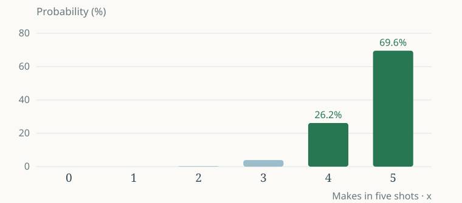
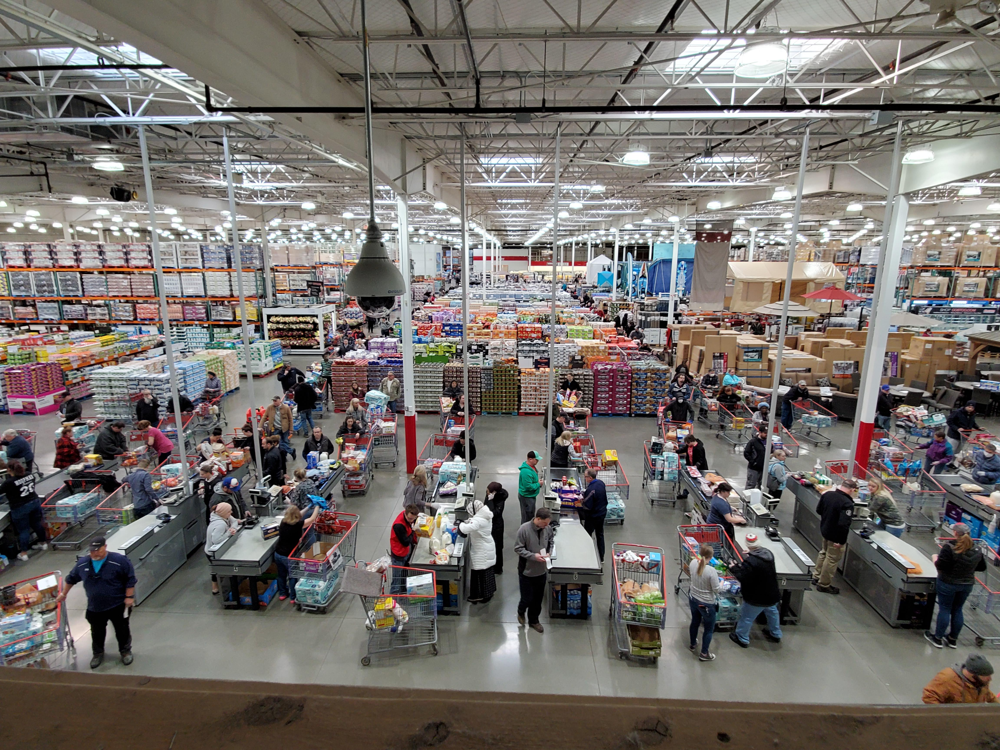
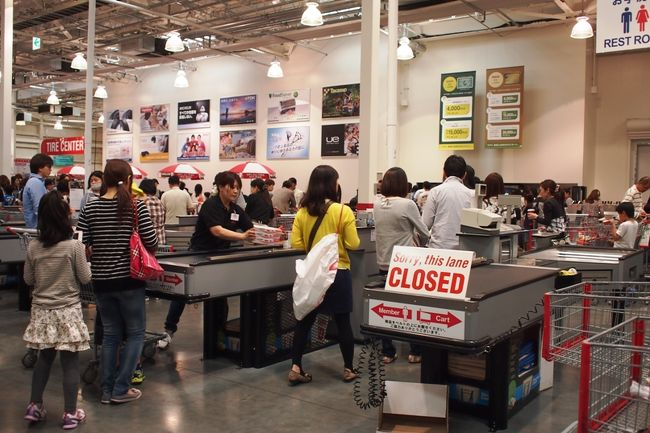
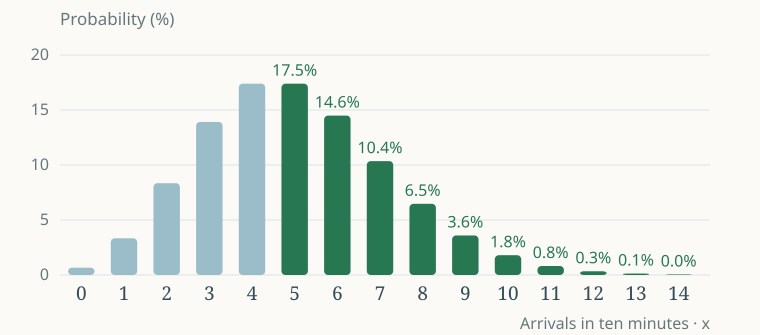

<!-- _class: opening -->

## 最後のフリースロー、誰に任せる？

カリー？　ヤニス？　「上手そう」から、数字で考えてみる。

写真・ストーリー：Yohの2025年講義。現在の選手成績を比較するスライドではありません。

---

## 93％なら、5本全部入る？

1本の成功率を **93％** として、5本のフリースローを考える。

チャンス

5本

何回投げるか

1本の成功率

93％

入る／外れる

知りたいこと

何本？

5本中の成功数

まず予想：全部成功する確率も93％？

π = 0.93 は2025年スライドから引き継ぐ授業用の設定。各投球は独立で、成功率は一定と仮定。

---

## 5本全部成功する確率は…

$$
\Pr(X=5)=(0.93)^5\approx0.6957
$$

約69.57％

1本ごとの93％と、5本全部の確率は違う。

成功・成功・成功・成功・成功 → 独立な5回の確率を掛ける。

---

<!-- _class: title -->

## Week 3 · 成功の回数、到着の人数

NBAからコストコへ。

**回数を固定する** → 二項分布

**時間を固定する** → ポアソン分布

4 離散確率分布　→　5 連続確率分布　→　6 平均値と分散

教科書 第2章 第2節「確率分布」p.118–129 ／ Week 2の続き

---

<!-- _class: book-divider -->

## 教科書 · 第2章 第2節

4　離散確率分布

p.118–120

成功した回数を数える。

まずは **二項分布**：決まった回数の中で、何回成功するか。

---

<!-- _class: book-reference -->

## 1本ならベルヌーイ、5本なら二項

1本の結果

0 または 1

外れる = 0 ／ 入る = 1

5本の成功数

0〜5

X = 5本のうち入った本数

$$
Y\sim\mathrm{Bernoulli}(\pi),\qquad X\sim B(n,\pi)
$$

大文字 X は成功数を表す確率変数。実際に3本入ったら、実現値 x = 3。

---

## 4本成功にも、5通りある

● ● ● ● × ● ● ● × ● ● ● × ● ● ● × ● ● ● × ● ● ● ●

$$
\Pr(X=4)=\underbrace{5}_{\text{並び方}}\times\underbrace{(0.93)^4(0.07)}_{\text{1通りの確率}}\approx26.18\%
$$

● = 成功 ／ × = 失敗。成功数は同じでも、失敗する位置が違う。

---

<!-- _class: book-reference -->

## 並び方を数える記号：C

$$
{}_nC_x=\frac{n!}{x!(n-x)!},\qquad {}_5C_4=5
$$

n

全部で何回？

5本投げる

x

成功は何回？

4本成功

C

何通り？

失敗する位置が5通り

階乗 n! は n × (n−1) × … × 1。0! = 1。教科書 p.119。

---

<!-- _class: try -->

## ロボットとヤギで、並び方を見よう

🤖 🤖 🐐 🐐 🐐　　🤖 🐐 🤖 🐐 🐐

5か所にロボット2体を置く。順番は何通り？

$$
{}_5C_2=\frac{5!}{2!3!}=10
$$

[やってみよう！](https://yohman.github.io/26-2-StatsB/agenda.html?activity=combinations#week-03)

n と x のスライダーを動かす → 式の数字と、全ての並び方が変わる。

---

<!-- _class: book-reference -->

## 二項分布：式を3つに分ける

$$
\Pr(X=x)={}_nC_x\,\pi^x(1-\pi)^{n-x}
$$

並び方

ₙCₓ

成功の位置を選ぶ

成功

πˣ

x 回成功する

失敗

(1−π)ⁿ⁻ˣ

残り n−x 回は失敗

n 回・独立・成功率 π が一定。この条件がそろったときに使う。教科書 p.119。

---

## 「ちょうど4本」と「4本以上」は違う

$$
\begin{aligned}\Pr(X=4)&\approx26.18\%\\\Pr(X\ge4)&=\Pr(X=4)+\Pr(X=5)\approx95.75\%\end{aligned}
$$

4本以上なら、**4本と5本の両方**を足す。

「以上」は、その値を含む。まず、どの結果を足すかを決めよう。

---

## 成功数の「地図」が、二項分布

$$
\Pr(X\ge4)=\Pr(X=4)+\Pr(X=5)\approx95.75\%
$$

横軸：5本のうち成功した本数。縦軸：その成功数になる確率。緑の2本を足す。

---

<!-- _class: try -->

## NBAラボ：予想して、投げて、比べる

$$
X\sim B(5,0.93),\qquad\Pr(X\ge4)\approx95.75\%
$$

**①** 1セット5本。何本入った？

**②** 100セット繰り返す。成功数の分布は？

**③** 成功率を65％に変える。どの棒が変わる？

[やってみよう！](https://yohman.github.io/26-2-StatsB/agenda.html?activity=nba#week-03)

線は理論の確率、棒は実測の割合。試行を増やしても毎回一致するわけではない。

---

<!-- _class: book-reference -->

## 平均4.65本。でも4.65本は入らない

$$
\begin{aligned}E(X)&=n\pi=5\times0.93=4.65\\\operatorname{Var}(X)&=n\pi(1-\pi)=5\times0.93\times0.07=0.3255\end{aligned}
$$

**期待値**：5本のセットを何度も繰り返した平均。

**分散**：セットごとの成功数のばらつき。

平均は小数でもよい。実際の成功数は0〜5の整数。教科書 p.120。

---

<!-- _class: book-reference -->

## NBAの話が、教科書の野球につながる

打率32％の選手が5打席で **ちょうど3安打**。

$$
\Pr(X=3)={}_5C_3(0.32)^3(0.68)^2\approx0.151519
$$

約15.15％

フリースローの成功 → ヒットに置き換えただけ。教科書 p.118–120の例。

---

<!-- _class: try -->

## 野球ラボ：1打席と1試合を分ける

$$
\underbrace{\pi=0.32}_{\text{1打席のヒット率}}\quad\ne\quad\underbrace{\Pr(X=3)\approx0.1515}_{\text{5打席で3安打の確率}}
$$

1試合を5打席として、100試合を繰り返そう。

**3安打の棒**と15.15％を比較する。

[やってみよう！](https://yohman.github.io/26-2-StatsB/agenda.html?activity=batting#week-03)

---

## 今度は、回数が決まっていない

あなたはコストコでレジ担当。退勤まで、あと10分。

その10分間に、**新しく何人来る？**

Yohの2025年講義のストーリーを、一定時間の到着人数として整理。

---

## 平均5人。でも、今日は3人？8人？

10分で平均5人

0人、1人、2人、… 上限は決まっていない。

知りたいこと： <strong>ちょうど3人？　5人以上？</strong>

仮想の授業モデルです。実際のコストコの測定値ではありません。

---

<!-- _class: book-divider -->

## 教科書 · 第2章 第2節

4　ポアソン分布

p.120

固定した時間・範囲の中に、何件起こるか。

平均の発生数 **λ（ラムダ）** が、分布を決める。

---

<!-- _class: book-reference -->

## ポアソン：10分の平均をλにする

$$
X\sim\mathrm{Poisson}(\lambda),\qquad \Pr(X=x)=\frac{\lambda^xe^{-\lambda}}{x!}
$$

X

到着人数

10分間に新しく来た人

λ

5

その10分間の平均人数

x

3

求めたい人数

λ = 平均人数。e ≈ 2.71828 は定数。確率式はYohの2025年講義を継承。

---

## ちょうど3人、来る確率は？

$$
\Pr(X=3)=\frac{5^3e^{-5}}{3!}=\frac{125\times0.0067379}{6}\approx0.14037
$$

約14.04％

平均5人だからといって、毎回5人ではない。

3! = 3 × 2 × 1 = 6。λ と x を入れて計算する。

---

## 5人以上？「4人以下」を引けばよい

$$
\begin{aligned}\Pr(X\ge5)&=1-\Pr(X\le4)\\&=1-\sum_{x=0}^{4}\frac{5^xe^{-5}}{x!}\\&\approx1-0.440493=0.559507\end{aligned}
$$

約55.95％

5人以上は無限に続く。反対側の0〜4人を足して、1から引く。

---

## 式の中身を、人数で確かめる

| 到着人数 x | 0 | 1 | 2 | 3 | 4 |
| --- | --- | --- | --- | --- | --- |
| 確率 | 0.67％ | 3.37％ | 8.42％ | 14.04％ | 17.55％ |

$$
\Pr(X\le4)\approx44.05\%,\qquad \Pr(X\ge5)\approx55.95\%
$$

**0〜4人の棒を足す** → 残りが5人以上。

小数のまま足し、最後に丸める。丸めた表の合計にはわずかな誤差がある。

---

## 5人以上は、右側の棒を全部足す

$$
\Pr(X\ge5)\approx55.95\%
$$

横軸：10分の到着人数。縦軸：その人数になる確率。図は14人まで。15人以上もあり、式では全て含める。

---

<!-- _class: try -->

## コストコラボ：10分間を何度も繰り返す

$$
\lambda=5,\qquad E(X)=\operatorname{Var}(X)=5
$$

**①** 1回の10分間を再生。いつ、何人来た？

**②** 100回繰り返して、人数の棒グラフを作る。

**③** 時間を20分に。平均人数はどう変わる？

[やってみよう！](https://yohman.github.io/26-2-StatsB/agenda.html?activity=costco#week-03)

到着時刻はランダム。平均到着率が一定なら、時間を2倍にするとλも2倍。

---

## 同じ「5」でも、二項とは違う

NBA

5本投げる

n = 5 ／ 成功数は0〜5

コストコ

平均5人来る

λ = 5 ／ 人数は0,1,2,…

$$
\text{二項}:\ E(X)=n\pi\qquad\text{ポアソン}:\ E(X)=\lambda
$$

**試行回数**と**平均発生数**を取り違えない。

---

## ポアソンを使う前に、条件を確認

**独立**：1人の到着が、次の到着を決めない。

**一定の率**：時間帯の途中で混雑度が急変しない。

**小さな時間では、複数の到着はまれ**。

団体客、セール開始、混雑による相互作用があるなら、このモデルが合わない可能性。到着人数だけでは退勤時刻は決まりません。

---

<!-- _class: book-reference -->

## 二項からポアソンへの橋

$$
n\ \text{が大きく},\quad\pi\ \text{が小さく},\quad n\pi=\lambda
$$

たくさんの小さなチャンスから、まれに発生する。

$$
B(n,\pi)\approx\mathrm{Poisson}(n\pi)
$$

[やってみよう！](https://yohman.github.io/26-2-StatsB/agenda.html?activity=probability#week-03)

ベルヌーイ・二項・ポアソンの棒を比較。教科書 p.120の近似の考え方。

---

<!-- _class: book-divider -->

## 教科書 · 第2章 第2節

5　連続確率分布

p.121–128

人数ではなく、長さ・時間・測定値を扱う。

棒の高さではなく、**範囲の面積**が確率。

---

<!-- _class: book-reference -->

## ロボットの身長は、小数まで測れる

🤖　🤖　🤖　　160.2 cm？　160.23 cm？

$$
\Pr(a<X\le b)=\int_a^b f(x)\,dx=F(b)-F(a)
$$

**密度 f(x)**：どの付近に値が集まるか。

**累積分布 F(b)**：b 以下になる確率。

一点の確率は0。全範囲の面積は1。Week 2のAL2と同じ「面積」の考え方。教科書 p.121。

---

<!-- _class: book-reference -->

## 正規分布：平均を中心に、左右対称

$$
X\sim N(\mu,\sigma^2),\qquad Z=\frac{X-\mu}{\sigma}
$$

中心は **μ**。広がりは **σ**。

ロボットの身長モデルで、平均と標準偏差を動かす。

[やってみよう！](https://yohman.github.io/26-2-StatsB/agenda.html?activity=normal-w2#week-03)

μ±σ に約68％、μ±2σ に約95％。正規モデルでの割合。教科書 p.122–124。

---

<!-- _class: book-reference -->

## 標準正規分布表は「面積」の表

$$
\Pr(Z>1.96)=0.025,\qquad\Pr(Z\le1.96)=1-0.025=0.975
$$

教科書の表：**右側の裾の面積**を読む。

左右対称だから、左の裾も同じ面積。

$$
\Pr(-1.96<Z<1.96)=1-2(0.025)=0.95
$$

同じz値でも、「右側」「左側」「中央」のどれを求めるかで答えが変わる。教科書 p.124–125。

---

<!-- _class: book-reference -->

## t分布：標本から平均を考えるとき

$$
T=\frac{\bar X-\mu}{s/\sqrt n},\qquad\nu=n-1
$$

母集団の標準偏差が未知 → 標本の **s** を使う。

標本が小さいほど、正規分布より裾が厚い。

[やってみよう！](https://yohman.github.io/26-2-StatsB/agenda.html?activity=t-w2#week-03)

正規母集団からの独立標本を想定。nを増やして裾を比較しよう。教科書 p.125–127。後の推定で再登場。

---

<!-- _class: book-reference -->

## カイ二乗分布：ばらつきを調べるとき

$$
\chi^2=\frac{(n-1)s^2}{\sigma^2},\qquad\nu=n-1
$$

平均との差を **二乗** して足す → 負にはならない。

自由度が小さいと、右の裾が長い。

[やってみよう！](https://yohman.github.io/26-2-StatsB/agenda.html?activity=chi-w2#week-03)

正規母集団からの独立標本を想定。平均ではなく分散を調べる道具。教科書 p.127–128。

---

<!-- _class: book-divider -->

## 教科書 · 第2章 第2節

6　確率分布の平均値と分散

p.129

分布が変わっても、聞きたいことは同じ。

**どこが中心？　どれくらい散らばる？**

---

<!-- _class: book-reference -->

## 期待値：値 × 起こりやすさ

$$
\mu_X=E(X)=\sum_x x\Pr(X=x)
$$

離散：各値の「値 × 確率」を全部足す。

$$
\mu_X=E(X)=\int_{-\infty}^{\infty}x f(x)\,dx
$$

連続：小さな区間ごとの寄与を、積分で足す。

Week 2のくじとAL2でやった計算が、教科書 p.129の一般式につながる。

---

<!-- _class: book-reference -->

## 分散：平均との差を二乗して平均する

$$
\sigma_X^2=\operatorname{Var}(X)=\sum_x(x-\mu_X)^2\Pr(X=x)
$$

$$
\sigma_X^2=\int_{-\infty}^{\infty}(x-\mu_X)^2f(x)\,dx
$$

差を二乗するので、プラスとマイナスが打ち消されない。

分散の単位は元の単位の二乗。標準偏差は √Var(X) で、元の単位に戻る。教科書 p.129。

---

<!-- _class: try -->

## 平均が同じでも、安心感は違う

配達ロボットA：いつも30分。

配達ロボットB：10分か50分、半々。

$$
E(A)=E(B)=30,\qquad\operatorname{Var}(A)=0,\quad\operatorname{Var}(B)=400
$$

[やってみよう！](https://yohman.github.io/26-2-StatsB/agenda.html?activity=delivery#week-03)

平均だけでなく、ばらつきも見る。「30分で届く」の意味が変わる。

---

## どの分布？　まず質問を言葉にする

| 問いたいこと | モデル | 中心・ばらつき |
| --- | --- | --- |
| 1回の成功／失敗 | ベルヌーイ | π ／ π(1−π) |
| n回中、何回成功？ | 二項 | nπ ／ nπ(1−π) |
| 一定時間に、何件発生？ | ポアソン | λ ／ λ |
| 測定値・平均・分散 | 連続分布 | 値の範囲と面積を見る |

表の「中心・ばらつき」は期待値／分散。式を選ぶ前に、X・条件・求める範囲を決める。

---

## AL：式に入れる前に、4つ書く

何を数える？

X

成功数／発生数

条件は？

n, π ／ λ

試行回数と率／平均人数

どの結果？

x ／ 以上

ちょうど？　範囲？

**④** 選んだ式に代入 → 答えを確率・人数の言葉で説明する。

授業内のALワークシートに取り組み、指定セルの値を **UNIPA** で回答。

締切：次回授業前日の火曜日 23:59。遅れての提出は受け付けません。

