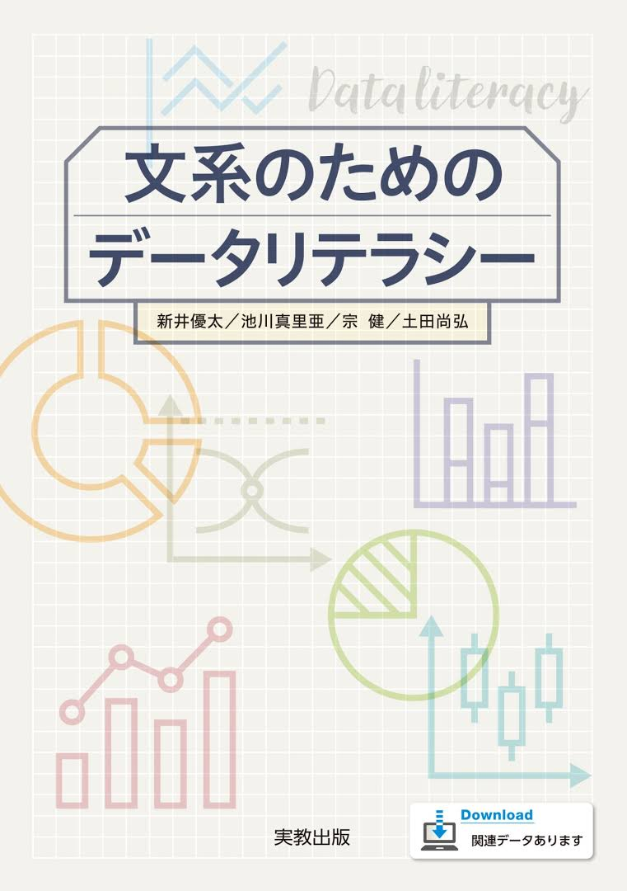
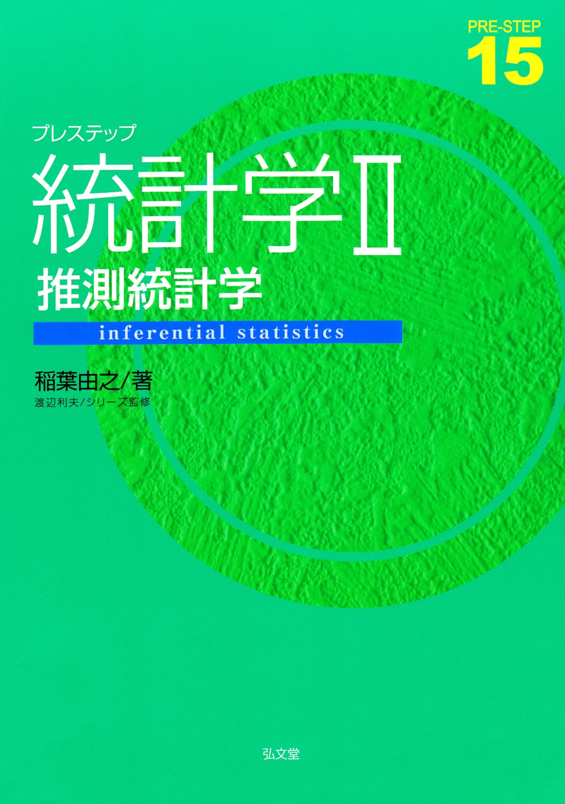
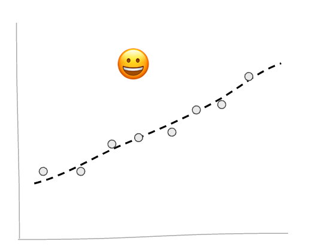
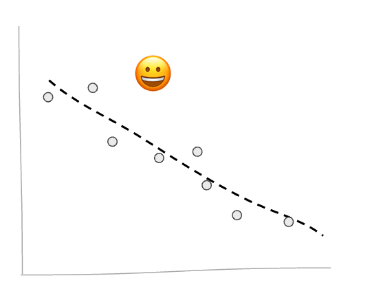
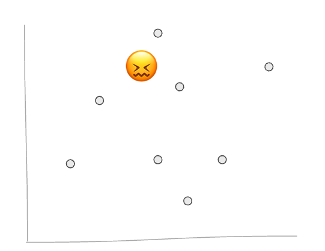

# 

<xlarge>

統計学 **A** **B**

</xlarge>

Week 1 

# Hello! Again?

# Join the class!

1-class-統計学-yoh-2025

# Textbook｜教科書

【タイトル】
文系のためのデータリテラシー

【著者】
新井優太・池川真里亜・宗健・土田尚弘（2024）

教科書は必ず購入してください。

<!--  -->

## Grading｜成績評価

- 毎週課題（9-10回） 70%
- 期末試験 30%
- クラスの平均点，標準偏差等によっては，合計調整を行う
- 出席率60%以上で評価対象となります
(大学全体と同様)</small>

##

<xl>
Let's play a game!
</xl>

https://wayou.github.io/t-rex-runner/

## Enter your score here!

https://docs.google.com/forms/d/e/1FAIpQLScuErDfLHlYav2oUWgYkNof1z1VF0c_7EUdGdixckcwlVODBg/viewform?usp=sharing&ouid=107596347287849219109

## 平均値と分散、標準偏差

### 平均 average

<large>

$$\overline{x}=\frac{1}{n} \sum_{i=1}^{n} x_{i}=\frac{1}{n}\left(x_{1}+\cdots+x_{n}\right)$$

</large>

### 分散 variance

一つの変数の平均からの散らばりを統計的に図る

 

<large>

$$
s^2_x = \frac{1}{n}\sum_{i=1}^n(x_i-\overline{x})^2
$$
</large>

### 標準偏差 standard deviation

標準偏差は分散の平方根である
 

<large>

$$s_{x} = \sqrt{\frac{1}{n} \sum_{i=1}^N (x_i - \overline{x})^2}\$$

</large>

###

Let's do it! 

<xl>

Find the mean ($\bar{x}$) and 
standard deviation ($\sigma$)

</xl>

## Shift gears...

What about two variables?

# <plum>共分散</plum>と<plum>相関係数</plum> covariance and correlation
二つの変数の関係性

<xl>👩🏼‍🤝‍👨🏻</xl>

#

なんで二つ覚える必要があるの？

#

<plum>共分散</plum>

関係性の方向と強さは分かるけど、値が標準されてないので比較が難しい
 
<plum>相関係数</plum>
値が標準化されるので、必ず-1から1の間の数値になるので比較に相応しい

##

関係性は三通りしかない

##

<plum>正</plum>

<small>プラスの関係</small>

##

<plum>負</plum>

<small>マイナスの関係</small>

##

<plum>関係ない</plum>

## すなわち 

<plum>共分散</plum>
<plum>相関係数</plum>
2つの変数間の関係性を評価するための統計的な指標である

# Say what? 😕

## Examples
じゃ〜色んな例を考えてみよう

### 
| independent variable 説明変数|| dependent variable 目的変数|
|---|---|---|
|Pokemon's caught 捕まえたポケモン数| ➡️ |Distance walked 歩いた距離|

###
#### プラスかマイナス？

### 

| independent variable 説明変数|| dependent variable 目的変数|
|---|---|---|
|Advertising 広告費| ➡️ | revenue 利益|

###
#### プラスかマイナス？

###

| independent variable 説明変数|| dependent variable 目的変数|
|---|---|---|
|walking minutes to station 駅まで徒歩何分| ➡️ |rent 家賃|

<small style="font-size:0.6em">[source: ie agent](https://ieagent.jp/blog/chie/ekitoho20fun-201877)</small>
###
#### プラスかマイナス？

###

| independent variable 説明変数|| dependent variable 目的変数|
|---|---|---|
|hours spent partying| ➡️ |grades|

###
#### プラスかマイナス？

###

| independent variable 説明変数|| dependent variable 目的変数|
|---|---|---|
|hours practiced 練習量| ➡️ |points per game 得点力|

###
#### プラスかマイナス？

###

| independent variable 説明変数|| dependent variable 目的変数|
|---|---|---|
|student height 身長| ➡️ |grades 成績|

##

#### プラスかマイナス？

##

<large>🧮</large>
Let's do the math 

### 分散 variance

一つの変数の平均からの散らばりを統計的に図る

 

<medium>

$$
s^2 = \frac{1}{n}\sum_{i=1}^n(x_i-\overline{x})^2
$$

</medium>

### 標準偏差 standard deviation

標準偏差は分散の平方根である
 

<medium>

$$s_{x} = \sqrt{\frac{1}{n} \sum_{i=1}^N (x_i - \overline{x})^2}\$$

### 共分散 covariance

二つの変数の平均からの散らばりを統計的に図る

 

<medium>

$$
s_{xy} = \frac{1}{n}\sum_{i=1}^n(x_i-\overline{x})(y_i-\overline{y})
$$

### 相関係数 correlation
標準化した共分散の値

 

$$\begin{align*} r &= \frac{s_{xy}}{s_xs_y} \\[5pt] &= \frac{\frac{1}{n}\sum_{i=1}^n(x_i-\overline{x})(y_i-\overline{y})}{\sqrt{\frac{1}{n}\sum_{i=1}^n(x_i-\overline{x})^2}\sqrt{\frac{1}{n}\sum_{i=1}^n(y_i-\overline{y})^2}} \end{align*}$$

##

この計算だと、**相関係数**は必ず

-1 から +1

の間の数値になる

##

<table>
<tr class=gray>
<th>相関係数rの値</th><th>相関</th>
</tr>
<tr>
<td>

$$ 
-1\hphantom{.0} \leq r \leq -0.7
$$

</td>
<td>
    強い負の相関
</td>
</tr>

<tr>
<td>

$$ 
-0.7 \leq r \leq -0.4
$$

</td>
<td>
    負の相関
</td>
</tr>

<tr>
<td>

$$ 
-0.4 \leq r \leq -0.2
$$

</td>
<td>
    弱い負の相関
</td>
</tr>

<tr>
<td>

$$ 
-0.2 \leq r \leq \hphantom{-} 0.2
$$

</td>
<td>
    ほとんど相関がない
</td>
</tr>

<tr>
<td>

$$ 
\hphantom{-}0.2 \leq r \leq \hphantom{-}0.4
$$

</td>
<td>
    弱い正の相関
</td>
</tr>

<tr>
<td>

$$ 
\hphantom{-}0.4 \leq r \leq \hphantom{-}0.7
$$

</td>
<td>
    正の相関
</td>
</tr>

<tr>
<td>

$$ 
\hphantom{-}0.7 \leq r \leq \hphantom{-}1\hphantom{.7}
$$

</td>
<td>
    強い正の相関
</td>
</tr>
</table>

##

では実際に計算してみよう

##

🌞 ↔️ 🍦

天気とアイスクリームの関係ってどうなん？

##

🌞 ↔️ 🍢

天気とおでんの関係ってどうなん？

##

🌞 ↔️ 🎮

天気とゲームの関係ってどうなん？

##
🌞 | 🍦
--|--
10°C|50
20°C|100
0°C|50
30°C|200

この関係性を統計学な数値で表すには？

## 
まずは共分散を計算する

<medium>

$$
s_{xy} = \frac{1}{n}\sum_{i=1}^n(x_i-\overline{x})(y_i-\overline{y})
$$

🌞→x 🍦→y

##
🌞の平均

<medium>

$\overline{x} =(10+20+0+30)/4=15$

##

🍦の平均

<medium>

$\overline{y} =(50+100+50+200)/4=100$

##

<medium>

🌞 | 🍦 | $x_i-\overline{x}$
--|--|--
10°C|50|10-15=-5
20°C|100|20-15=5
0°C|50|0-15=-15
30°C|200|30-15=15

##

<medium>

🌞 | 🍦 | $x_i-\overline{x}$| $y_i-\overline{y}$
--|--|--|--
10°C|50|-5|50-100=-50
20°C|100|5|100-100=0
0°C|50|-15|50-100=-50
30°C|200|15|200-100=-100

##

🌞 | 🍦 | $x_i-\overline{x}$| $y_i-\overline{y}$ | $(x_i-\overline{x})*(y_i-\overline{y})$
--|--|--|--|--
10°C|50|-5|-50|250
20°C|100|5|0|0
0°C|50|-15|-50|750
30°C|200|15|-100|1500

##

🌞 | 🍦 | $x_i-\overline{x}$| $y_i-\overline{y}$ | $(x_i-\overline{x})(y_i-\overline{y})$
--|--|--|--|--
10°C|50|-5|-50|250
20°C|100|5|0|0
0°C|50|-15|-50|750
30°C|200|15|-100|1500
-|-|-|-|**2500** 

##

<medium>

$$
s_{xy} = \frac{1}{n}\sum_{i=1}^n(x_i-\overline{x})(y_i-\overline{y})
$$

$$
s_{xy} = \frac{2500}{4} = 625
$$

##

625?

正の相関関係なのはわかるけど、その強度は？🧐

比較するものがないので、わからん！🥺

## 

そこで相関係数（correlation）の出番

<medium>

$$\begin{align*} r &= \frac{s_{xy}}{s_xs_y} \\[5pt] &= \frac{\frac{1}{n}\sum_{i=1}^n(x_i-\overline{x})(y_i-\overline{y})}{\sqrt{\frac{1}{n}\sum_{i=1}^n(x_i-\overline{x})^2}\sqrt{\frac{1}{n}\sum_{i=1}^n(y_i-\overline{y})^2}} \end{align*}$$

##

すでに$s_{xy}$はやったので

<medium>

$$r = \frac{625}{s_xs_y}$$

##

🌞→ $s_x$ 🍦→ $s_y$

<medium>

標準偏差を計算！

##

🌞の標準偏差は

<medium>

$$
s_x =\sqrt{\frac{1}{n}\sum_{i=1}^n(x_i-\overline{x})^2}
$$

##

<medium>

🌞 |  $x_i-\overline{x}$| $(x_i-\overline{x})^2$
--|--|--|
10°C|-5|25
20°C|5|25
0°C|-15|225
30°C|15|225
-|-|**500** 

##

🌞

<medium>

$$
s_x = \sqrt{\frac{500}{n}}
= \sqrt{\frac{500}{4}}
= \sqrt{125}
= 11.18
$$

##

🍦の標準偏差は

<medium>

$$
s_y =\sqrt{\frac{1}{n}\sum_{i=1}^n(y_i-\overline{y})^2}
$$

##

<medium>

🍦 |  $y_i-\overline{y}$| $(y_i-\overline{y})^2$
--|--|--|
50|-50|2500
100|0|0
50|-50|2500
200|-100|20000
-|-|**25000** 

##

🍦

$$
s_y = \sqrt{\frac{25000}{n}}
= \sqrt{\frac{25000}{4}}
= \sqrt{6250}
= 79.06
$$

##

🌞 ↔️ 🍦

相関係数（correlation）は！

<medium>

$$
r = \frac{625}{s_xs_y}
=\frac{625}{{11.18}*{79.06}}
= 0.71
$$ 

##

<medium>

<table>
<tr class=gray>
<th>相関係数rの値</th><th>相関</th>
</tr>
<tr>
<td>

$$ 
-1\hphantom{.0} \leq r \leq -0.7
$$

</td>
<td>
    強い負の相関
</td>
</tr>

<tr>
<td>

$$ 
-0.7 \leq r \leq -0.4
$$

</td>
<td>
    負の相関
</td>
</tr>

<tr>
<td>

$$ 
-0.4 \leq r \leq -0.2
$$

</td>
<td>
    弱い負の相関
</td>
</tr>

<tr>
<td>

$$ 
-0.2 \leq r \leq \hphantom{-} 0.2
$$

</td>
<td>
    ほとんど相関がない
</td>
</tr>

<tr>
<td>

$$ 
\hphantom{-}0.2 \leq r \leq \hphantom{-}0.4
$$

</td>
<td>
    弱い正の相関
</td>
</tr>

<tr>
<td>

$$ 
\hphantom{-}0.4 \leq r \leq \hphantom{-}0.7
$$

</td>
<td>
    正の相関
</td>
</tr>

<tr>
<td>

$$ 
\hphantom{-}0.7 \leq r \leq \hphantom{-}1\hphantom{.7}
$$

</td>
<td>

**強い正の相関 🌞 ↔️ 🍦**

</td>
</tr>
</table>

## 課題「01 課題　復習」

- UNIPAで「テスト管理」を開く
- 「01 課題　復習」をクリック
- .xlsxファイルをダウンロード
- テストで回答を選び、提出
- 締切は来週の授業の前までf