

# Let's make a deal!

1963年のアメリカで放送されたテレビ番組

#
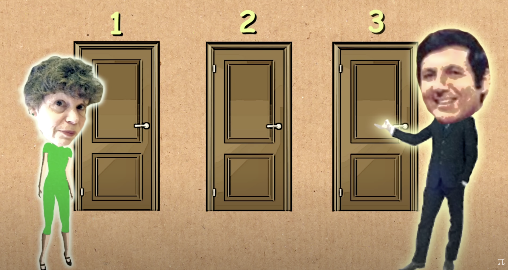

#

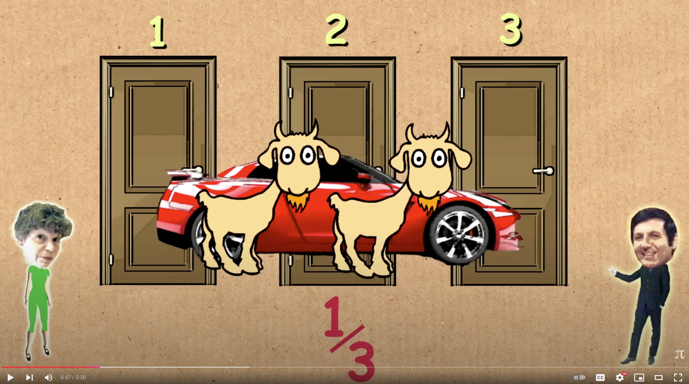

# 

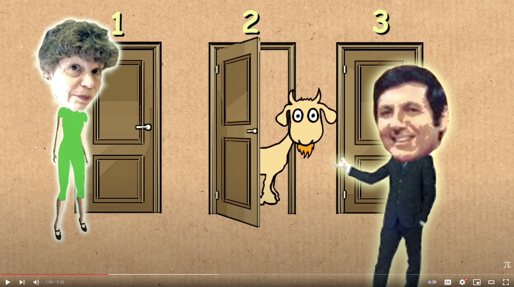

##

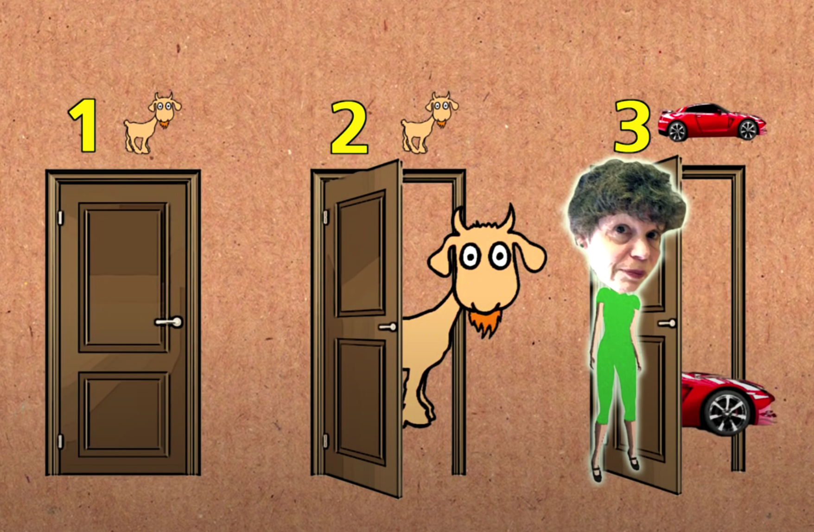

[The Monty Hall Problem](https://www.youtube.com/watch?v=C4vRTzsv4os&ab_channel=Numberphile)

# 

<xlarge>

統計学B

</xlarge>

Week 3

# 確率と確率変数
probability and random variables

## クイズ３（p３０）

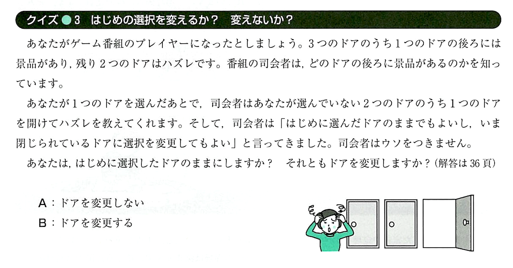

##

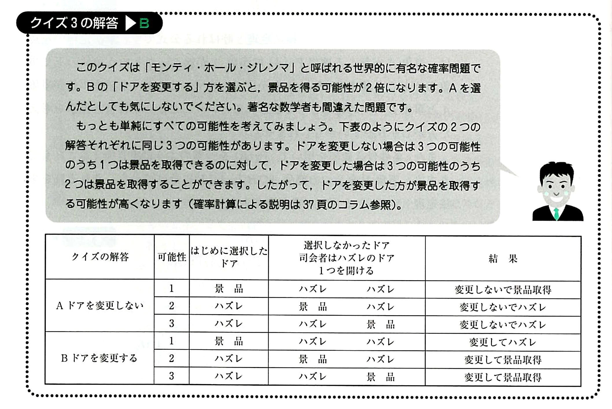

#

<!-- web simulator of monty hall dilemma -->
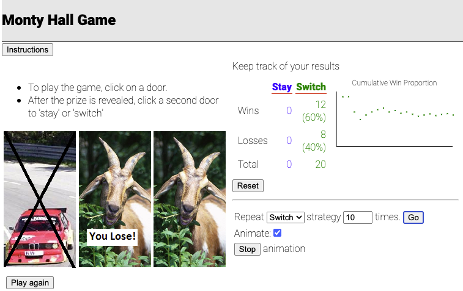

https://www.rossmanchance.com/applets/2021/montyhall/Monty.html

# 推測統計学のプロセス

#

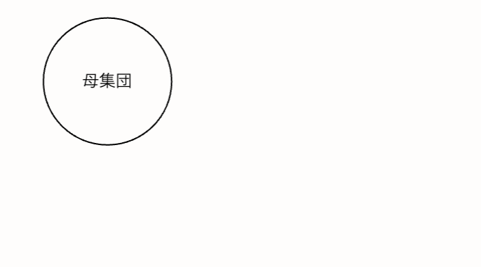

#

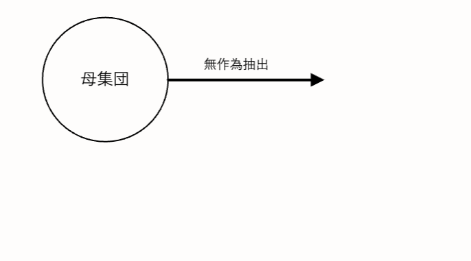

#

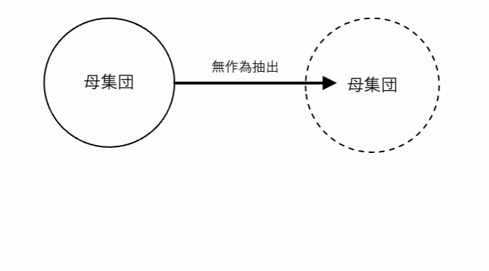

#

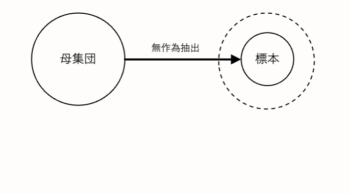

#

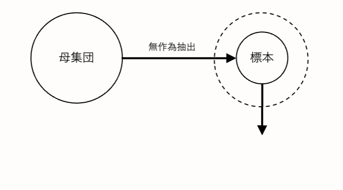

#

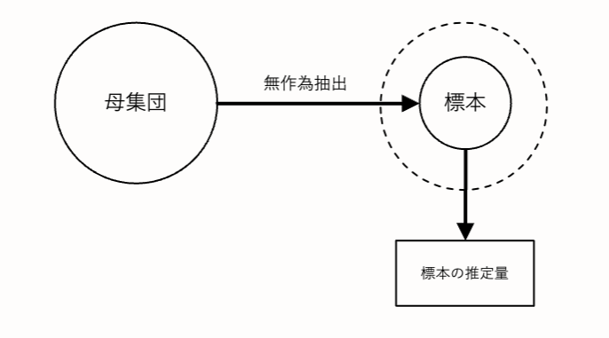

#

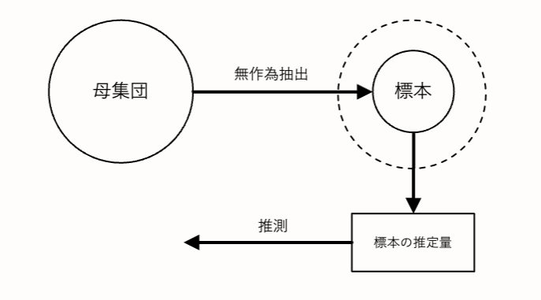

#

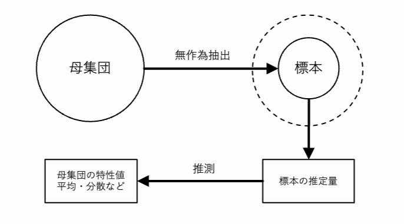

#

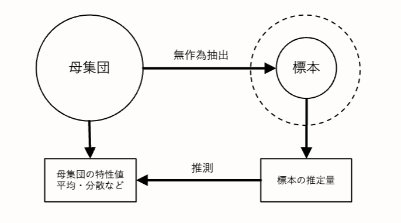

#

<!-- full process diagram -->
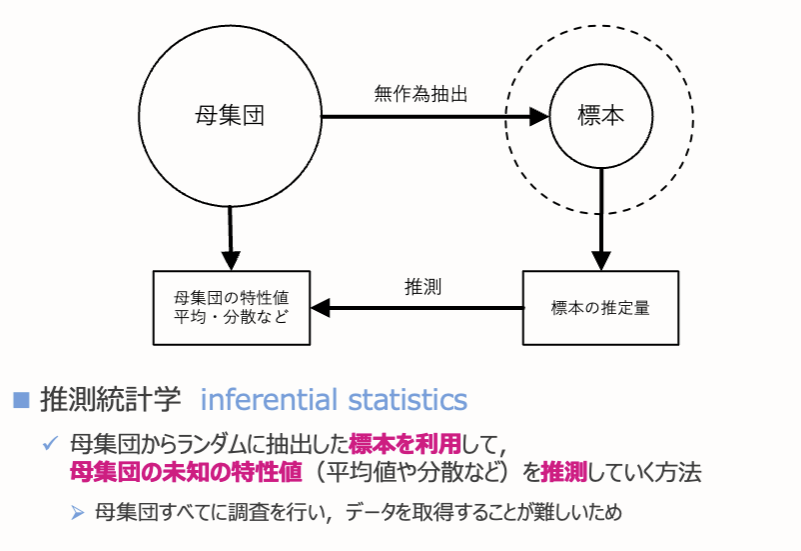

# Let's do it!

<!-- which is heads/tails official -->
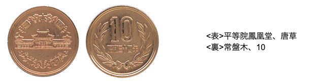
https://www.mof.go.jp/policy/currency/coin/general_coin/list.htm

Enter your results ➡︎ [Google Sheet](https://docs.google.com/spreadsheets/d/1vwu8iJ-u8NZ-f6UoNJEo80q3uMiujRQzzBD-VhjLXYo/edit?usp=sharing)

# Let's Python it!

クラス資料から `03 Coin tossing.ipynb` をダウンロードして実行してみましょう。

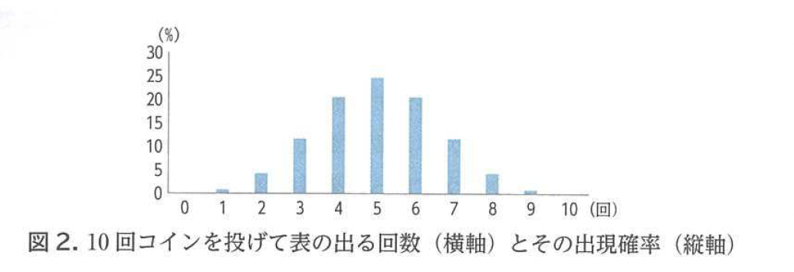

# 

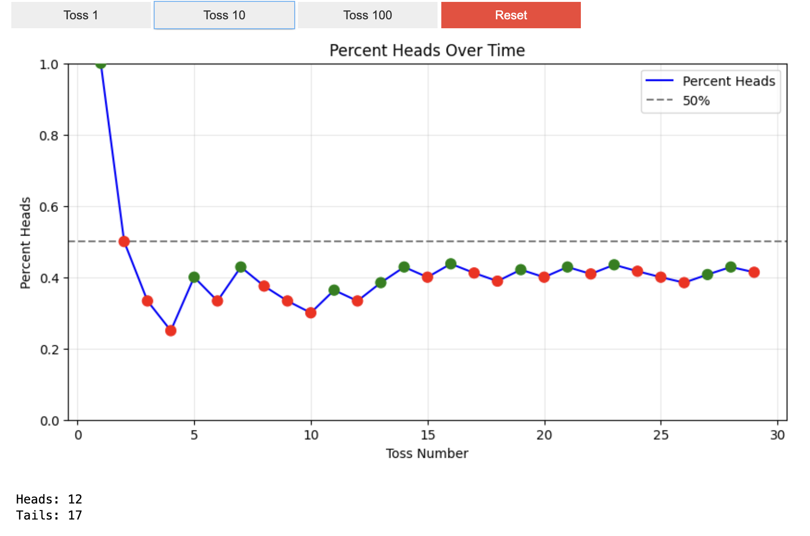

## Probabilityとは？

- <medium>確率 probability</medium>
  - 偶然性の確からしさを測る指標
  - the likelihood or chance of an event occurring

- <medium>事象 event</medium>
  - 偶然性を伴って生じる結果
  - a specific outcome or result that can occur in a given situation or experiment
    - サイコロを投げて「<b>2</b>」の目が出ること
    - コインを投げて<b>表</b>が出ること

### 例） 事象A： コイン投げで「表」が出ること

- 余事象 complementary event
  - 事象<gray>A</gray>が起こらないこと
  - 事象<gray>A</gray>の補集合
    - コイン投げで「裏」が出る
    - <gray>$\bar{A}$</gray> ={裏}

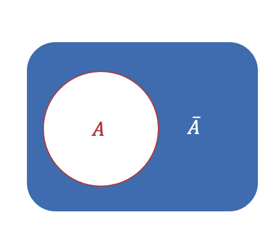

##

What is the probability of getting an ace from a deck of cards?

トランプからエースを引く確率は?

<large>P(🂡)</large>

##

What is the probability of getting a heart?

<large>P(❤️)</large>

- 事象$A$: heart

##

What is the probability of *NOT* getting a heart?

- $A$: heart❤️
- $\bar{A}$: not heart❤️

<large>$P(\bar{A})$</large>

##

What is the probability of *NOT* getting a heart?

- $A$: heart❤️
- $\bar{A}$: not heart❤️

<large>$P(A) + P(\bar{A}) = 1$</large>

### 例）	事象A：	コイン投げで「表」が出ること

- 全事象（標本空間）universal set
  - 起こり得る結果すべて
    - <gray>Ω={表, 裏}

- 空事象 empty set
  - 事象が何も起こらないこと
    - <gray>𝜙 （ファイ）

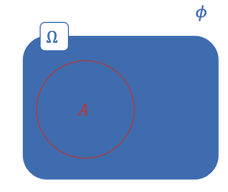

## omega?

Difference between <plum>Ω</plum> and <plum>ω</plum>

##

**事象A：	コイン投げで「表」が出ること**
**事象B：	コイン投げで「裏」が出ること**

- 和事象 <eng>union set</eng>
    - 事象Aまたは事象B
    - 事象Aと事象Bの少なくとも1つが起こること
      - 表か裏のどちらかが出ること
      - <gray>𝐴∪𝐵</gray> ("A" or "B")

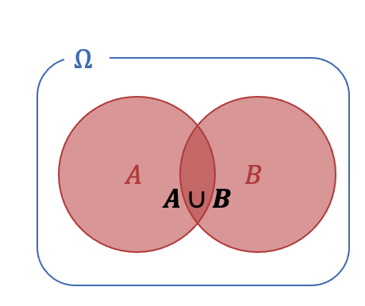

### Union Set Example:

Let's consider two sets, A and B:

- Set A = {1, 2, 3, 4}
- Set B = {3, 4, 5, 6}

A∪B is the set of all elements that are in either set A or set B, or both. In this case:
<plum>A∪B={1,2,3,4,5,6}
</plum>

##

**事象A：	コイン投げで「表」が出ること**
**事象B：	コイン投げで「裏」が出ること**

- 積事象 <eng>Intersection set</eng>
  - 事象Aかつ事象B
  - 事象Aと事象Bがともに起こること
    - 表と裏の両方が出ること
    - <gray>𝐴∩𝐵</gray> ("A" and "B")

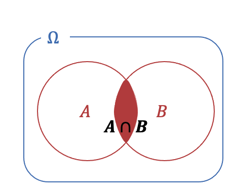

##

**事象A：	コイン投げで「表」が出ること**
**事象B：	コイン投げで「裏」が出ること**

- 排反事象 <eng>Mutually exclusive events</eng>
    - 積事象が空事象であること
      - <gray>𝐴∩𝐵=𝜙
      - 表と裏が同時に出ることはありえないため事象Aと事象Bは互いに排反である。

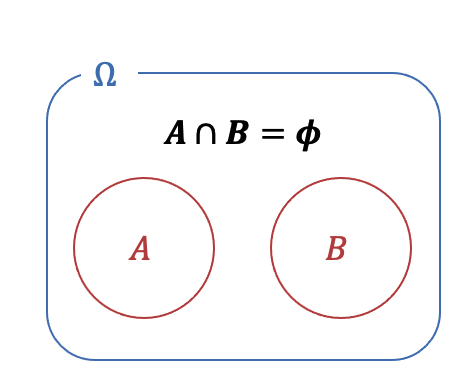

### Intersection Set Example:

Let's consider two sets, A and B:

- Set A = {1, 2, 3, 4}
- Set B = {3, 4, 5, 6}

The intersection set A∩B is the set of all elements that are common to both set A and set B. In this case:

<plum>A∩B={3,4}
</plum>

## 例題3-1　サイコロによる事象の例

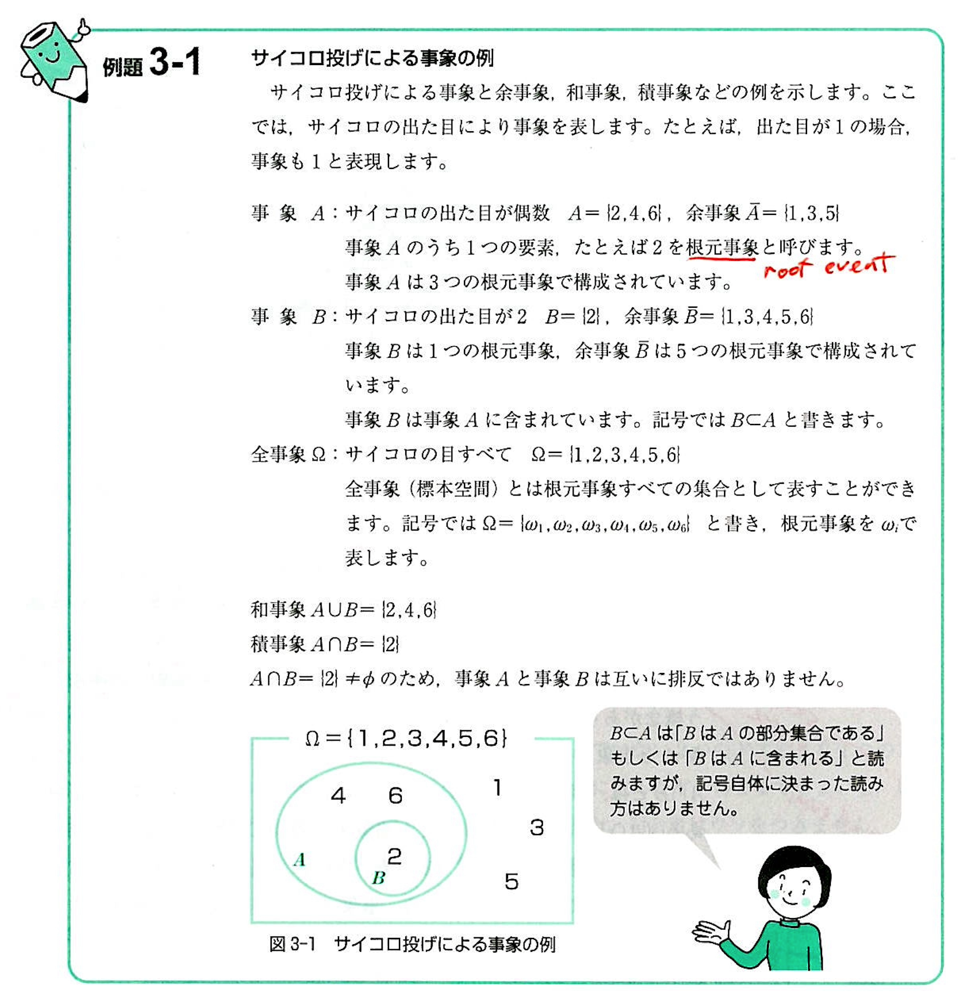

## 例題3-1　サイコロによる事象の例

- 事象A
  - 出た目が偶数
    - 2, 4, 6
- 事象B
  - 出た目が2
    - 2
- 全事象
  - サイコロの目すべて
    - 1, 2, 3, 4, 5, 6

## 例題3-1　サイコロによる事象の例

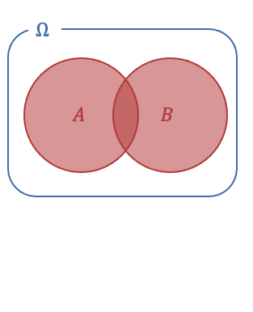
- 事象A
  - 出た目が偶数
    - 2, 4, 6
- 事象B
  - 出た目が2
    - 2
- 全事象
  - サイコロの目すべて
    - 1, 2, 3, 4, 5, 6

### 例題3-1　サイコロによる事象の例

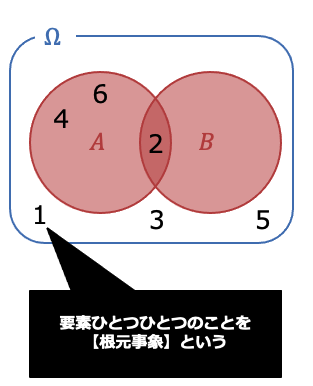
- 事象A
  - 出た目が偶数
    - 2, 4, 6
- 事象B
  - 出た目が2
    - 2
- 全事象
  - サイコロの目すべて
    - 1, 2, 3, 4, 5, 6

### 例題3-1　サイコロによる事象の例

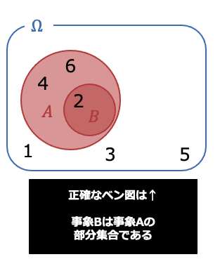
- 事象A
  - 出た目が偶数
    - 2, 4, 6
- 事象B
  - 出た目が2
    - 2
- 全事象
  - サイコロの目すべて
    - 1, 2, 3, 4, 5, 6

# （２） 確率の公理 
Probability Axioms

確率の公理は、確率論において確率の性質を定義し、 理論の基礎を構築するための基本的な原則です。

## 確率の公理 
probability axioms

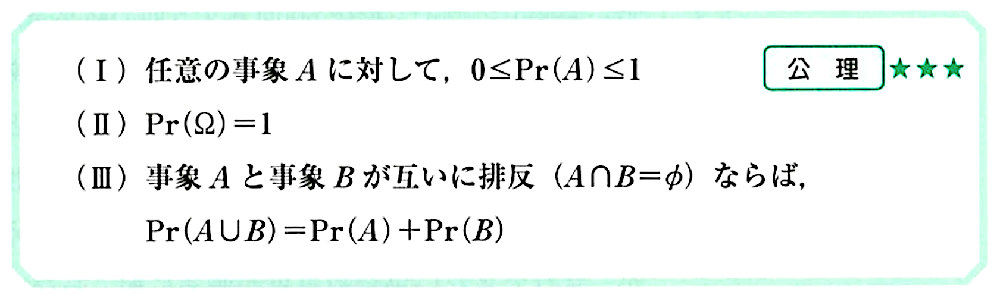
##

<small>

1. **非負性公理（Non-Negativity Axiom）**：
   すべての事象 $A$ に対して、その確率 $P(A)$ は非負の値を取ります。
  
   <plum>$0\leq P(A) \leq 1$</plum>

2. **正規化条件（Normalization Axiom）**：
   サンプル空間（全事象） $\Omega$ の確率は1です。
  
   <plum>$P(\Omega) = 1$</plum>

3. **加法公理（Additivity Axiom）**：
   互いに排反（相互に交わらない）な事象 $A_1, A_2, \ldots$ の列に対して、それらの和集合の確率は個別の確率の和に等しい。
    
   <plum>$P(A_1 \cup A_2 \cup \ldots) = P(A_1) + P(A_2) + \ldots$</plum>

</small>

## 例えば…　加法公理Additivity Axiom

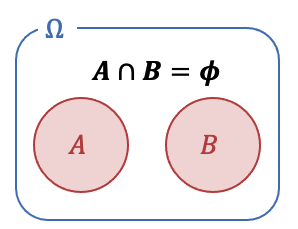
- 事象Aと事象Bが排反(𝐴∩𝐵=𝜙)ならば、	
  Pr⁡(𝐴∪𝐵)=Pr⁡(𝐴)+Pr⁡(𝐵)
  - 積事象が空事象であれば、和事象の確率は和事象を構成する事象の確率の和

##
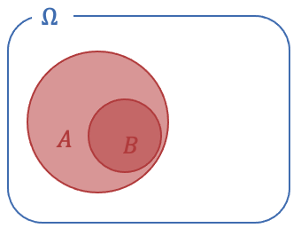
③	事象Bが事象Aに含まれるならば

<gray>$Pr⁡(𝐵)≤Pr⁡(𝐴)$</gray>

図で見ると一目瞭然

##
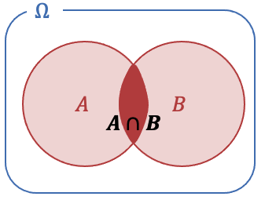

④	<gray>$Pr⁡(𝐴∪𝐵)=Pr⁡(𝐴)+Pr⁡(𝐵)−Pr⁡(𝐴∩𝐵)$</gray>
- 図でみるとわかりやすい
- 薄い円A（Pr⁡(𝐴)）と
薄い円B（Pr⁡(𝐵)）の合計から
重複している
濃色部分（Pr⁡(𝐴∩𝐵)）
を引く

#

<!-- textbook scan -->
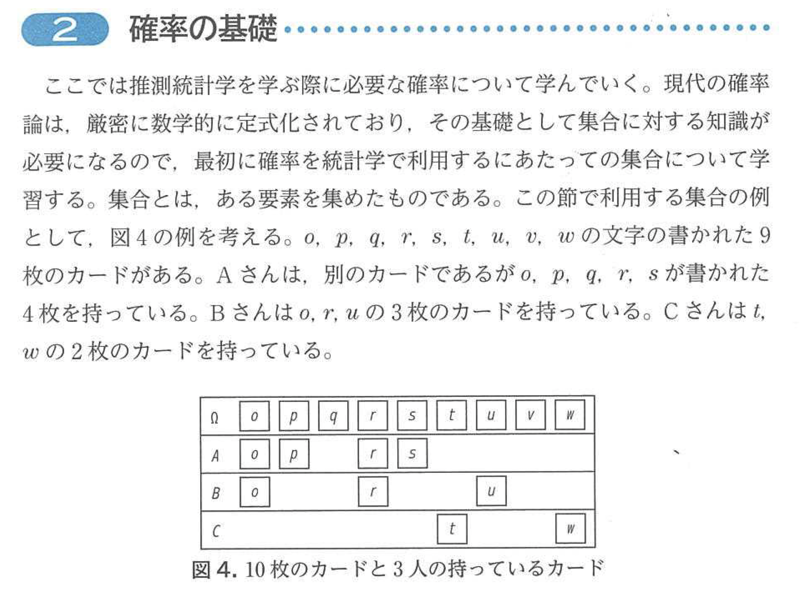

#
<!-- close up -->
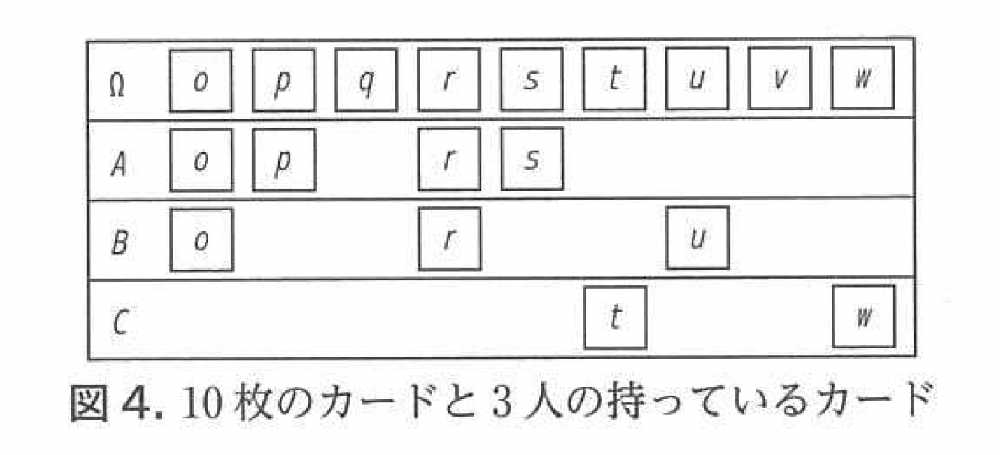

#

<!-- jishou A -->
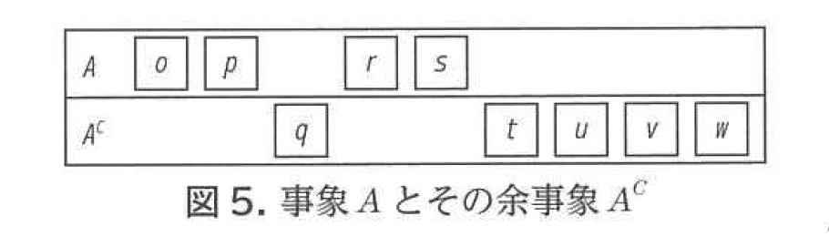

#

<!-- all possible outcomes -->
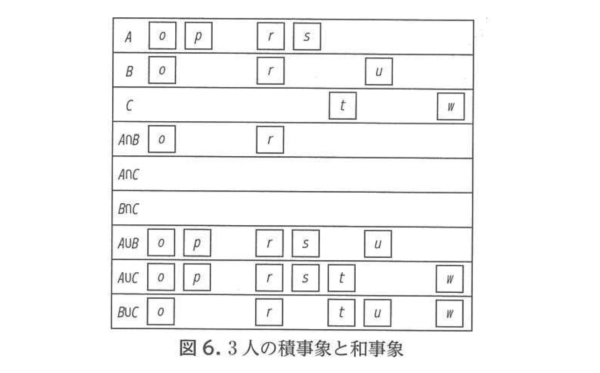

#

<!-- diagrams -->

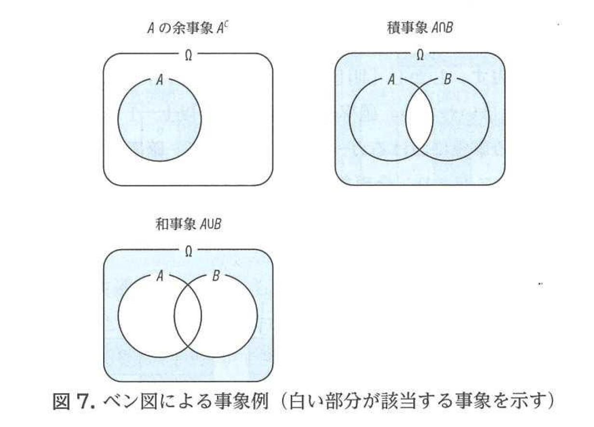

#

<!-- pr A,B,C -->
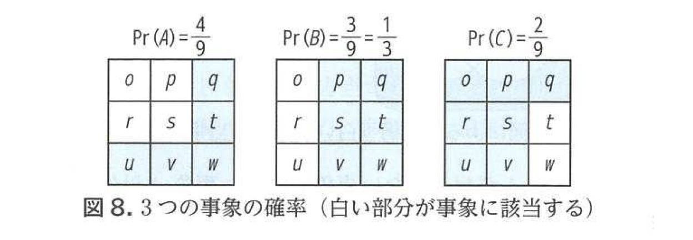

#

<!-- all kinds of permutations -->
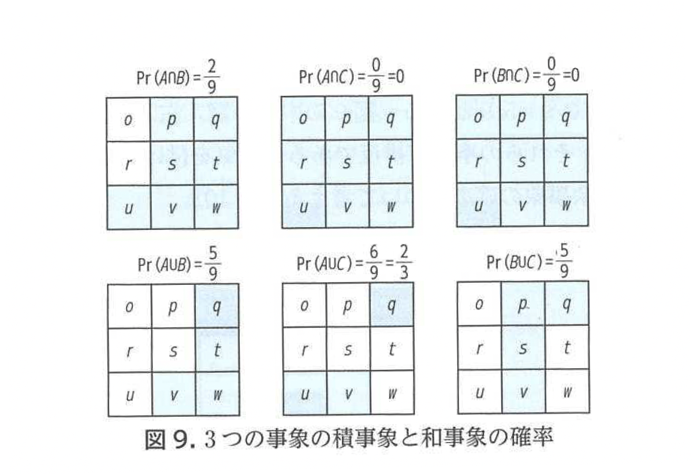

#

<!-- conditional A and B -->
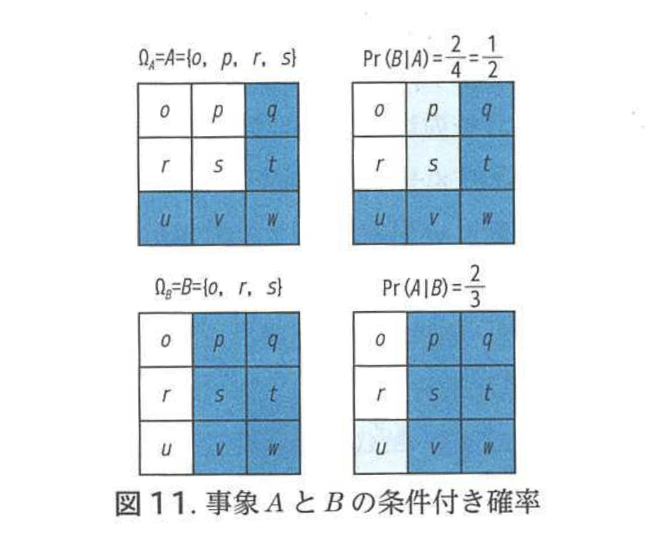

#

<!-- conditional with new player D -->
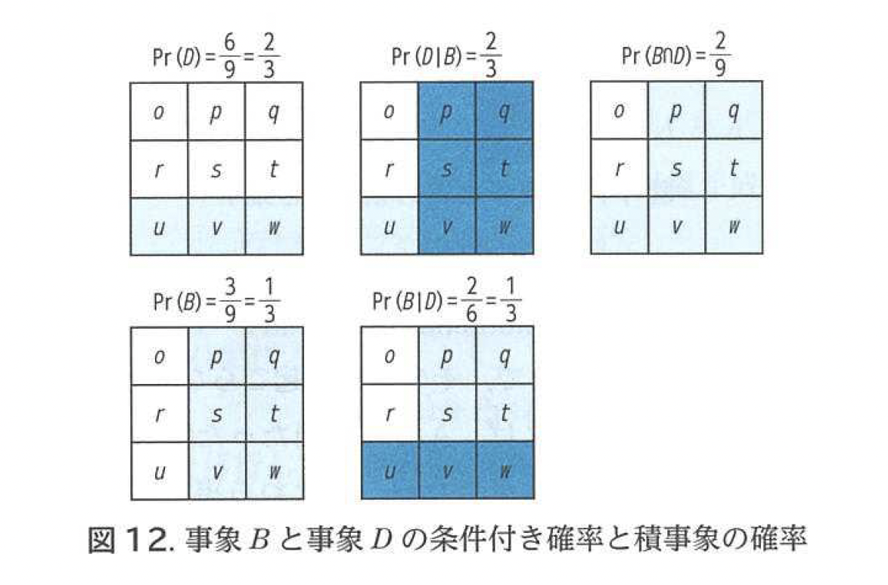

#

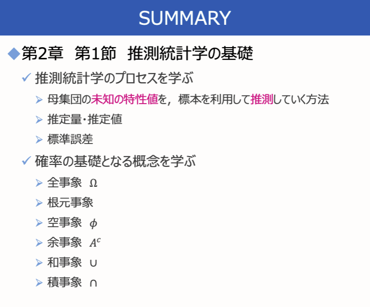