

# 

<xlarge>

統計学B

</xlarge>

Week 5

#

#

#

#

#
Roulette
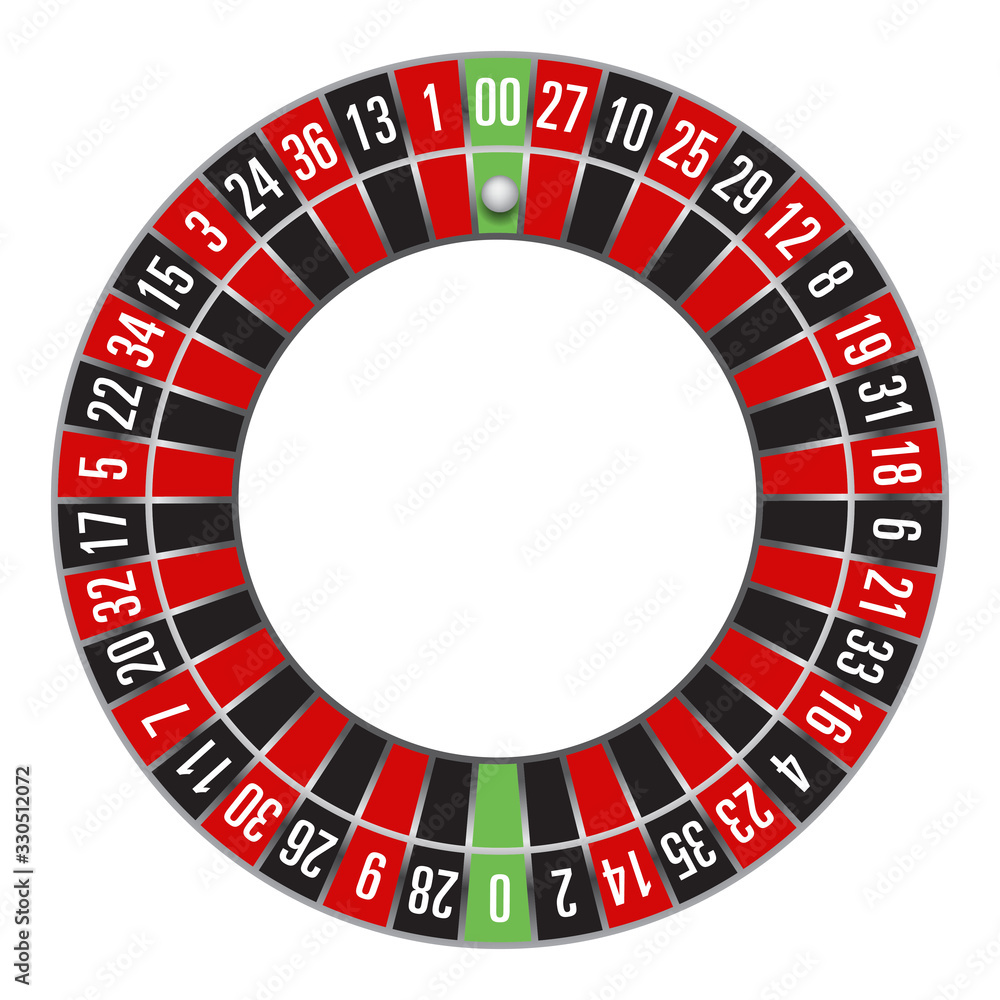

#

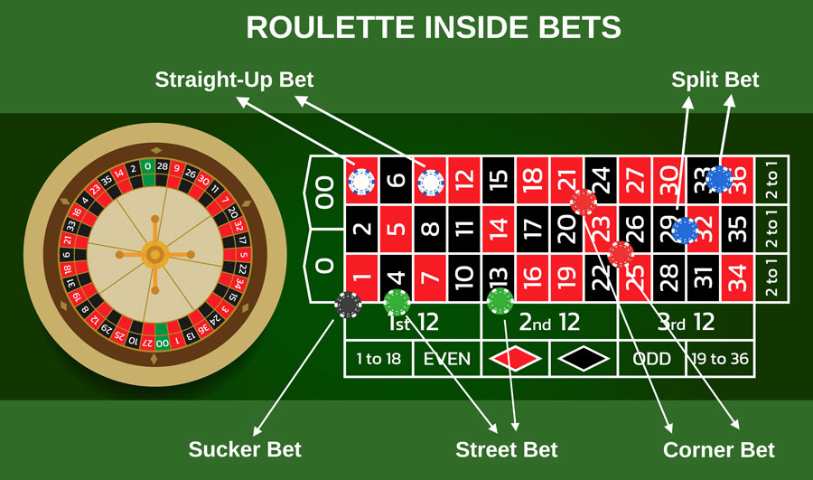

#

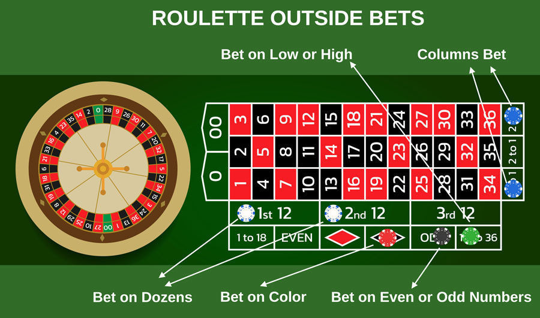

# Try it!

https://playpager.com/roulette/

#
Why does the house always win?
#

$$
\text{House Edge} = \frac{ \text{Losing Bet Amount}}{\text{Total Pockets}} - \frac{ \text{Winning Bet Amount}}{\text{Total Pockets}}
$$

 

$$
\text{House Edge} = \frac{20}{38} - \frac{18}{38} = 0.526  - 0.474
$$

 

<l>

$$
\text{House Edge} = \frac{2}{38} \approx \textcolor{red}{0.0526} \, \text{(or 5.26\%)}
$$

</l>

#

<xxl>
5.26%? 
</xxl>
What does that mean?

#
<l><red>**赤**</red></l>または<l>**黒**</l>にそれぞれ<l>100円</l>の賭けを<l>100回</l>行うと、ハウスエッジが<l>5.26％</l>であるため、その<l>100回</l>の賭けで平均的に<l>5.26円</l>を失うことになる。

#

<!-- python screen -->
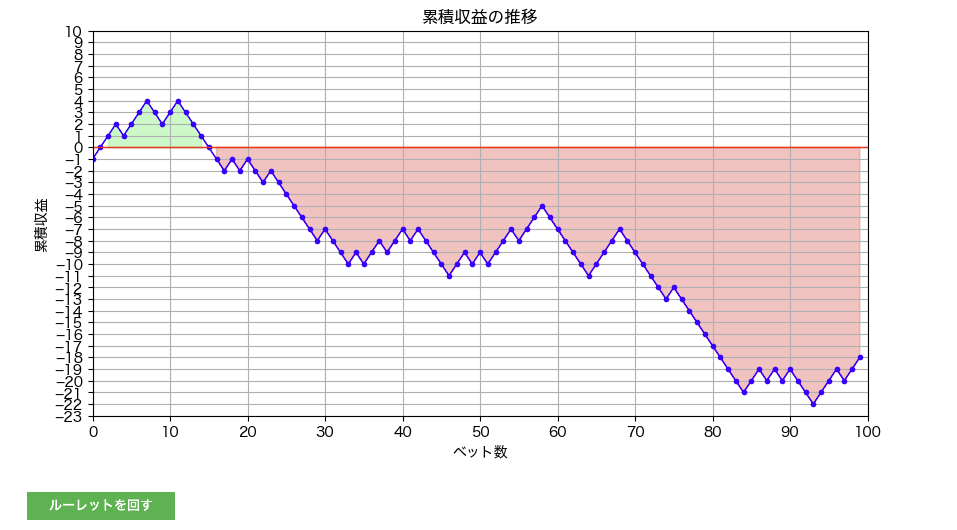

# 大数の法則
The law of large numbers

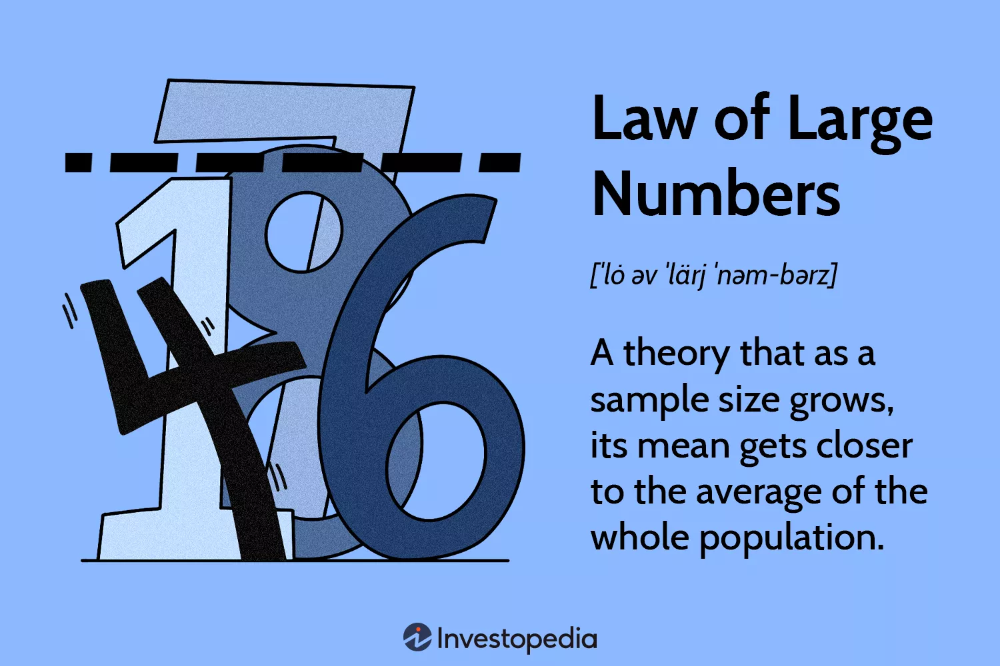　

## 😩え？どういうこと？

すなわち、何かをくり返いしやり続けたら、
それを多く繰り返すことによっていわゆる「期待値」に近づく！

##

さっきのルーレットの例だと、やればやるほど、<xl><red>5.26</red></xl>に近づく！

要するにだよ〜、

<l>

千円賭けたら、<red>52.6円</red>失う
一万円賭けたら、<red>526円</red>失う
十万円賭けたら、<red>5,260円</red>失う
…

##

What about a coin toss?

<xxl>
🪙

##
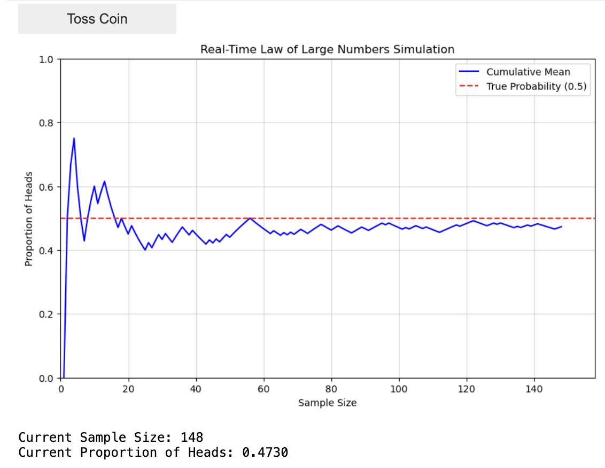

## 確率変数の期待値

The expected value of a random variable

## 期待値？Expected value? Huh?
What is the average outcome (expected value) when you role a dice?

<xxl>
🎲 

##

<xxl>
🎲 

</xxl>

<l>

$E(X)=\frac{(1+2+3+4+5+6)}{6}=3.5$

</l>

##

## 二項分布
binomial distribution

## 二項分布の式

<large>

$$ 
P(X = x) =  _nC_x \cdot \pi^x \cdot (1 - \pi)^{n - x}

$$

</large>

##

<xxxl>
🤯
</xxxl>

## 二項分布の式

<large>

$$ 
P(X = x) =  _nC_x \cdot \pi^x \cdot (1 - \pi)^{n - x}

$$

</large>

- <gray>$P(X = x)$</gray> $x$個の成功が$n$回の試行でちょうど得られる確率
- <gray>$x$</gray> は求めたい成功の回数です
- <gray>$n$</gray> は試行の総数
- <gray>$_nC_x$</gray> 組み合わせ、n回の試行からk回の成功のパターンの数
- <gray>$\pi$</gray> は単一の試行での成功確率

##

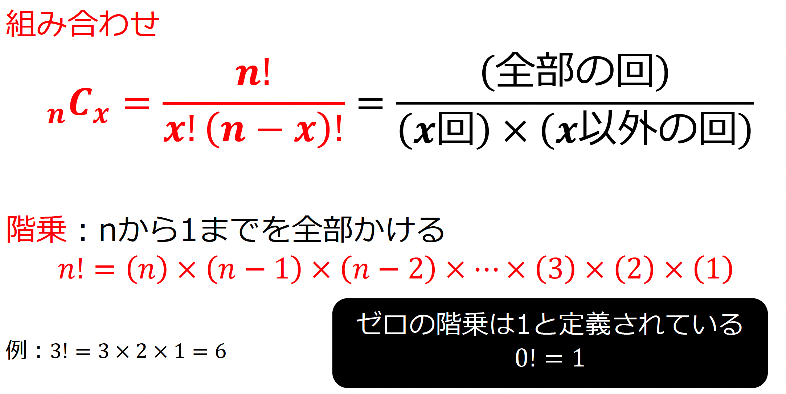

- 階乗：factorial
- 組み合わせ：the number of ways to choose "x" elements from a set of "n" elements

## 問題

- クラス内で <red>2 人</red>の生徒のグループを作成する方法は何通りありますか?
  
  なお、クラスの人数を<red>22人</red>とする

<large> 

$_{22}C_2$

</large>

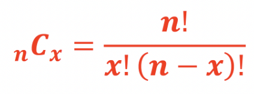

## 問題

- サッカー日本代表入りメンバーが20人選ばれた
- スタメンのパターンは何通りある？（サッカーは１１人制）

## 秘密…

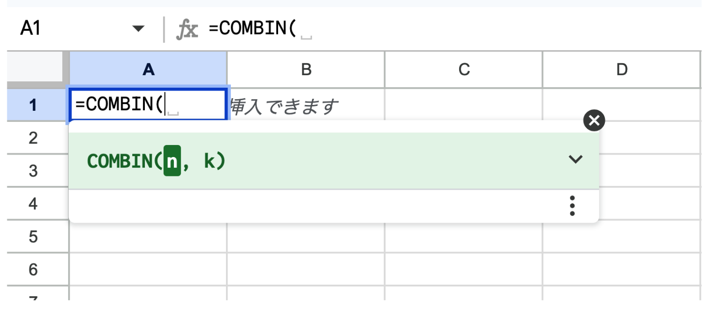

##

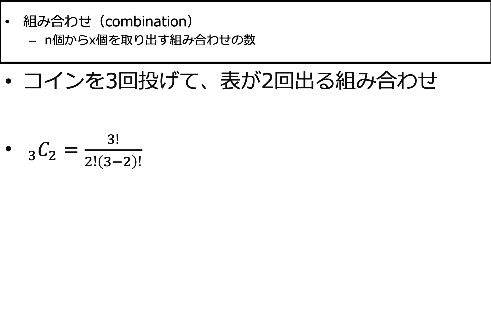

##

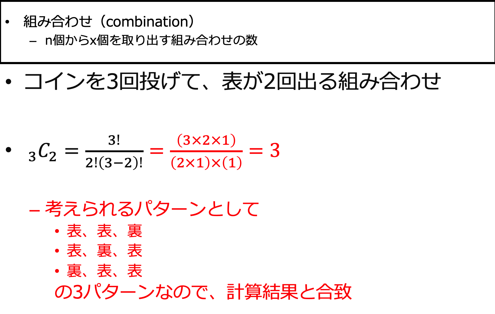

##

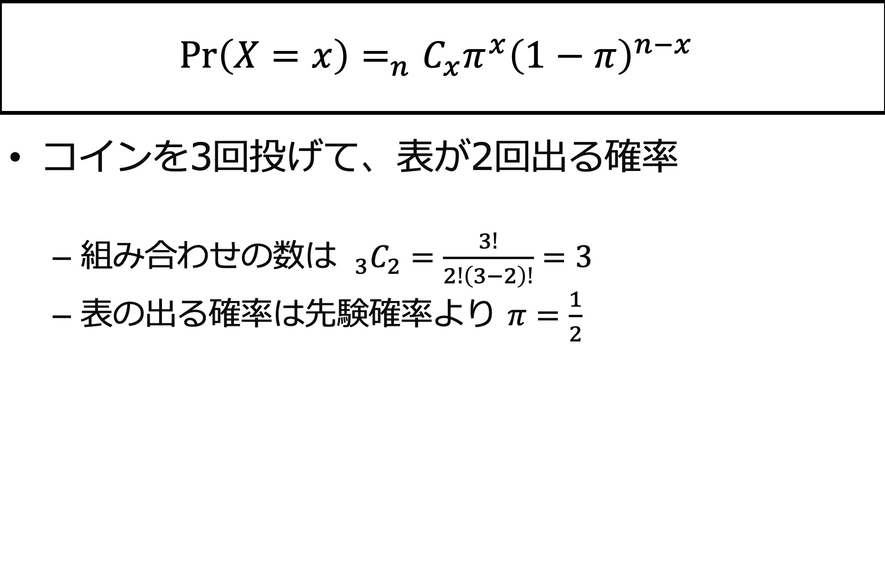

##

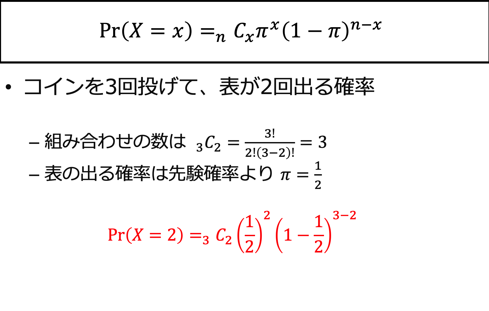

##

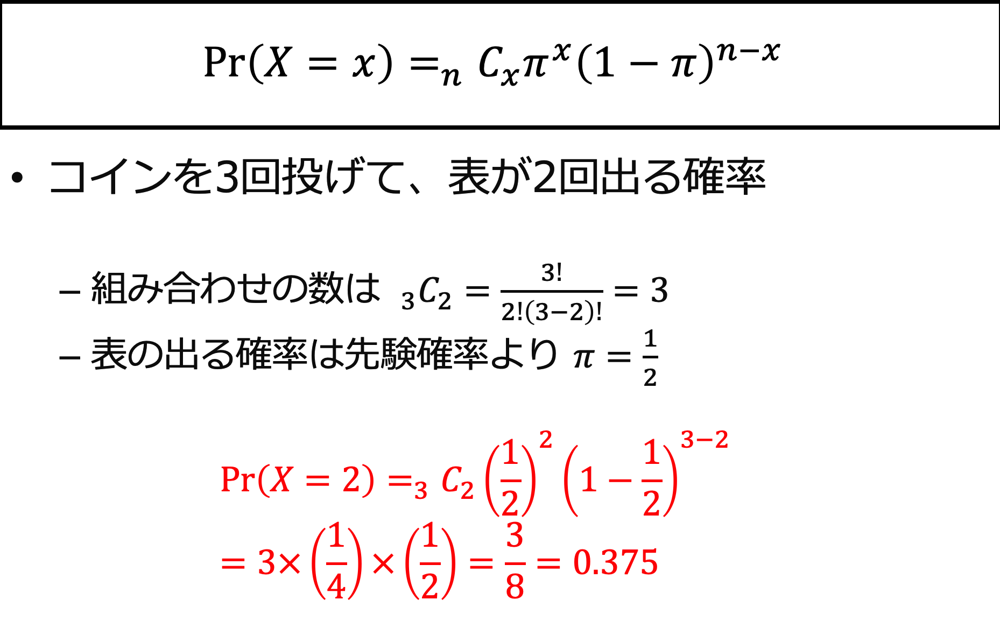

## p45
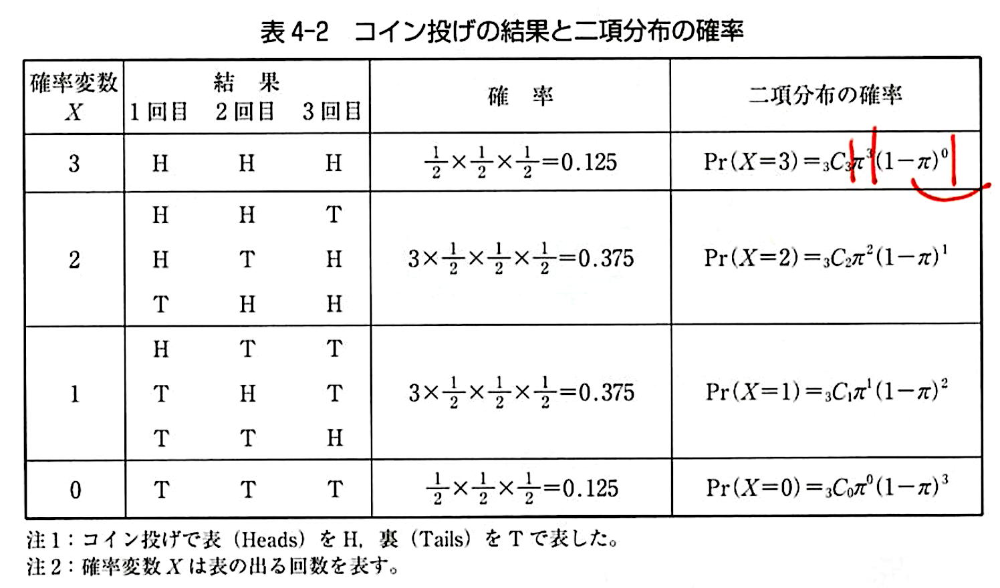
<!-- 
## 

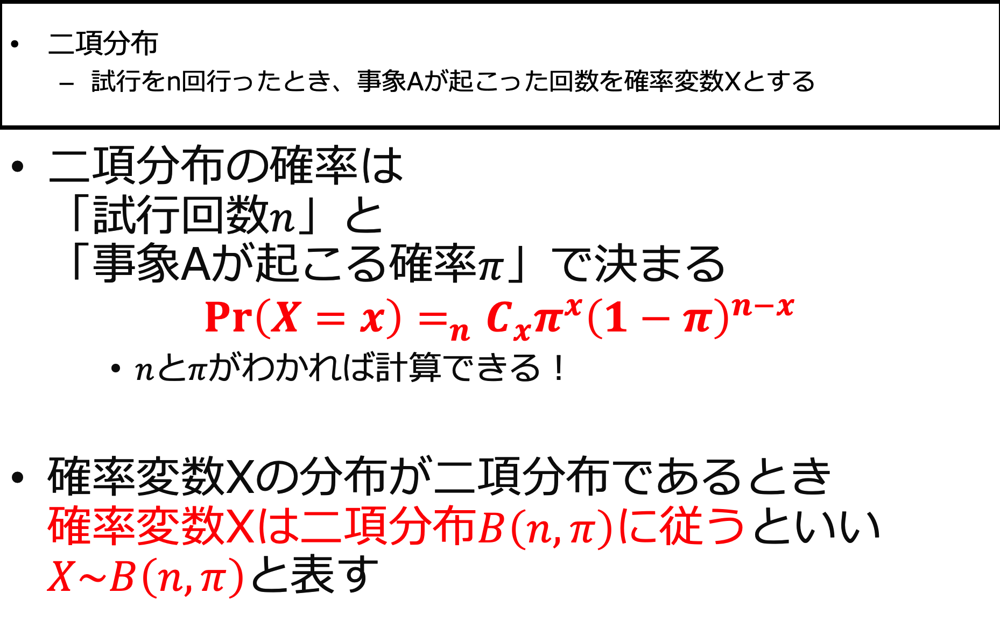

## p46
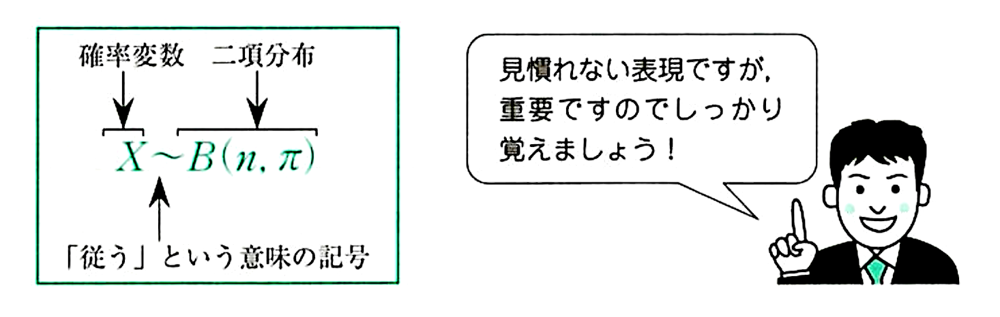 -->

## 練習問題

サイコロを10個投げて、１の目が3個出る確率は？
<large>🎲🎲🎲
</large>

## 🎲🎲🎲

<medium>

$$ 
P(X = x) =  _nC_x \cdot \pi^x \cdot (1 - \pi)^{n - x}

$$

</medium>

$n = 10$
$x = 3$
$\pi = \frac{1}{6}$

## 二項分布にしたがう確率変数の期待値

##

<xl>

  <plum>超重要！</plum>

</xl>

<l>

期待値 ➡︎ <gray>	$𝐸(𝑋)=𝑛𝜋$ </gray>
分散 ➡︎ <gray>	$𝑉𝑎𝑟(𝑋)=𝑛𝜋(1−𝜋)$ </gray>

</l>

##

<medium>打率.282のOhtaniが、今日5回打席に立つ</medium>

①ちょうど５本ヒットを打つ確率は？
②この試合で期待されるヒット数（期待値）は？
③ヒット数の分散は？

##

<xxxl>😩</xxxl>

勉強していないあなた、運だけを頼りにミニテストを受ける。
なんと、4択問題が5問。
適当に答えたとき、ちょうど2問正解する確率は？

## 

<l>逆に、4択問題が5問あるミニテストで、4問以上正解する確率は？</l>

hint:

$$
P(X \geq 4)
= P(X = 4) + P(X = 5)
= \sum_{x=4}^{5} {}_5C_x \, (0.25)^x \, (0.75)^{5-x}
$$
