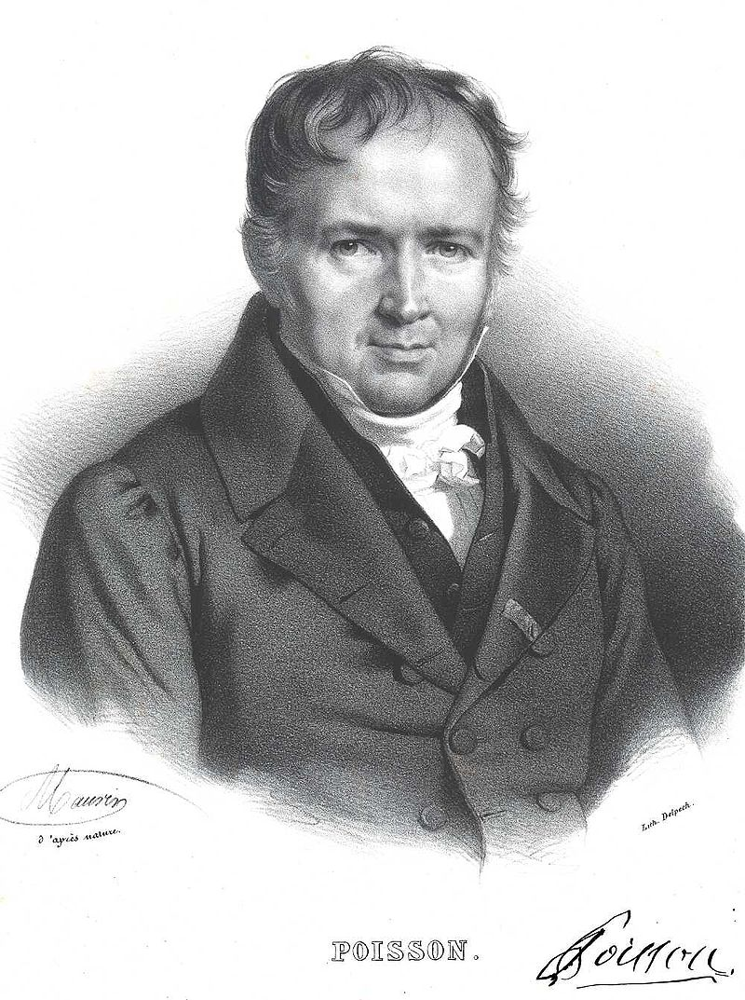
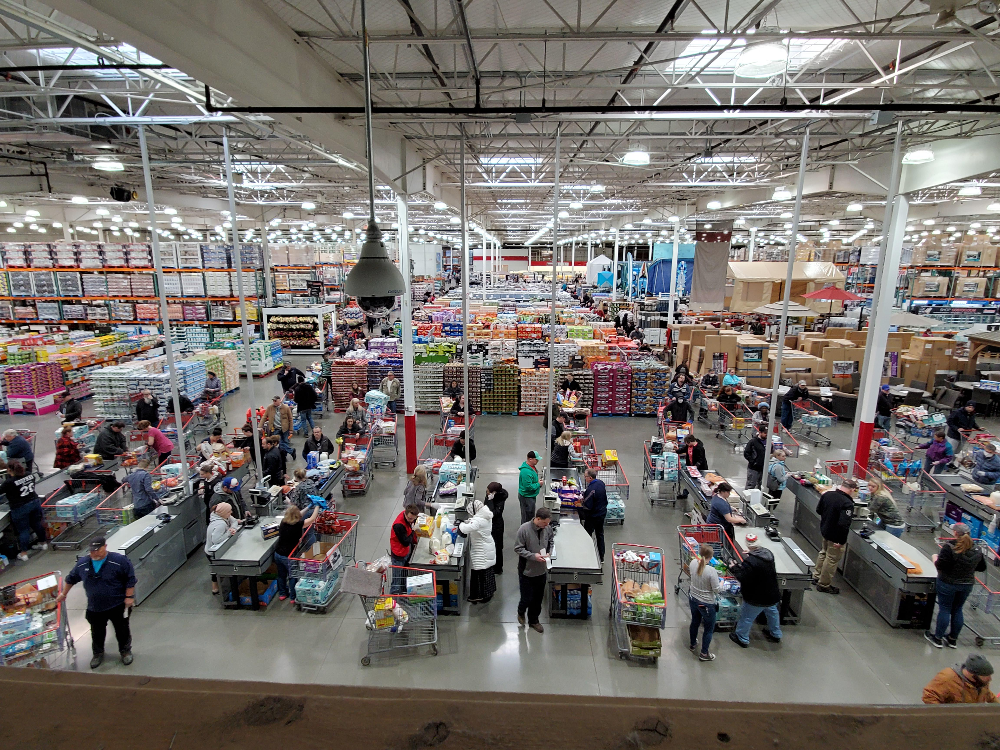
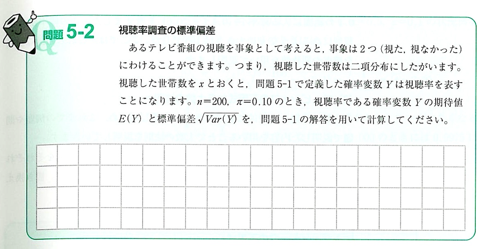

# 

<xlarge>

統計学B

</xlarge>

Week 6

## ポアソン分布
Poisson Distribution

<large>
🤔
</large>

<medium>
<red>教科書に載ってないけど期末試験に出るぞ！
</medium>

## ポアソン分布

- Siméon Denis Poisson
- French mathematician
- 1781-1840
- ポアソン分布・ポアソン方程式などで知られるフランスの数学者、地理学者、物理学者

##

🥐

<xl>

ポアソン = poisson ≠ croissant

</xl>

##

Events over time/space

一定の時間や空間の中で発生するイベントの数

#

<xl>

時間に関する例

</xl>

- 1時間内にコールセンターにかかってくる電話の数。
- 1年間に発生する地震の回数。
- 1日内に店舗に来店する顧客の数。

<xl>

  空間に関する例

</xl>

- ある土地の中に生えている木の本数。
- 天空の特定の領域に見える星の数。
- 製造ラインのシート上に見つかる欠陥の数。

## 応用問題

時間通り帰れるかな？

## あなたはコストコのレジで働いている。
5時までのシフトなので、10分前にレジをクローズして時間通りに帰れるようにしたい。

<medium>

過去のデータから10分前なら平均で
<green>5人</green>のお客さんが並んでいることがわかる。

</medium>

##

<medium>❶</medium>
これから4:50になるところだけど、<red>ちょうど3人</red>並んでいる確率は？
<medium>❷</medium>
<red>5人以上</red>並んでいる確率は？

##

ポアソンで分かること

<xxl>

$\lambda = \frac{回数}{時間帯}$

</xxl>
"lambda"はポアソンの平均と分散

##

ポアソンで分かること

<l>

$E(X) = 期待値 = \mu = \lambda = 5$

 

$𝑉𝑎𝑟(X) = 分散 = \sigma^2  = 5$

</l>

##

<xl>

$E(X) = 𝑉𝑎𝑟(X) = \lambda$

</xl>

##
<red>ポアソン分布関数は</red>

<xl>

$Pr⁡(𝑥)=\frac{(\lambda^𝑥 𝑒^{-\lambda})}{𝑥!}$

</xl>

「e」は数学的な定数であるオイラー数（Euler's number）を表し、
おおよそ2.71828と等しい値

## 

<xxl>❶</xxl>

これから5:00になるところだけど、<red>ちょうど3人</red>並んでいる確率はなんでしょう？

<l>

$Pr⁡(𝑥)=\frac{(\lambda^𝑥 𝑒^{-\lambda})}{𝑥!}$

 

$Pr⁡(3)=\frac{(5^3 𝑒^{-5})}{3!}=0.140$

</l>

## 計算ムズッ！🥶

## ポアソン分布表1

## ポアソン分布表2

##

## <l>❷</l> <red>5人以上</red>並んでいる確率は？
5人以上を計算するには４人以下のそれぞれの確率を足して、１から引く！

<medium> 

$1-(P(0)+P(1)+P(2)+P(3)+P(4))$

$1-(0.007+0.034+0.084+0.140+0.175) = 1-0.44 = 0.56$

</medium>

## ポアソン分布表2

## 

<xl>❶</xl>

<red>ちょうど3人</red>並んでいる確率は？（早く帰れる🥳）

<xxl>
14%
</xxl>

<xl>❷</xl>

<red>
5人以上</red>並んでいる確率は？(すなわち、時間通りに帰れないない😭)

<xxl>
56%
</xxl>

## 練習問題

このデータを元に常磐線では平均で月1.5回の人身事故があるとする。
事故数を$x$とすると、その確率分布はポアソン分布で近似できるものとする。

<medium>

$\lambda = 1.5$

</medium>

## 

No|質問
--|:--
❶|人身事故の数の期待値と分散を求めなさい
❷|確率分布関数を示しなさい
❸|人身事故が一つも起こらない確率を求めなさい
❹|人身事故が4回以上起こる確率を求めなさい

      

## ポアソン分布表1

## p65 問題5-2

## p65 問題5-2

- あるテレビ番組の視聴を事象とすると
事象は2つ（視た・視なかった）なので
視聴した世帯数は二項分布にしたがう
- 視聴した世帯数を𝑥とおくと
問題5-1で定義した確率変数𝑌は
視聴率を表す
- 𝑛=200, 𝜋=0.10のときの
視聴率の期待値と標準偏差を求めよ

##
- 問題5-1より
  - 期待値
<gray>$𝐸(𝑌)=𝜋=0.10$

  - 分散
<gray>$𝑉𝑎𝑟(𝑌)=\frac{1}{𝑛} 𝜋(1−𝜋)=\frac{1}{200}×0.10×0.90=0.00045$

  - 標準偏差
<gray>$\sqrt{𝑉𝑎𝑟(𝑌)} =\sqrt{0.00045}=0.0212$
