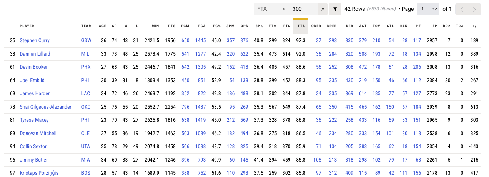

#

#

https://www.nba.com/stats

[cheat link](https://www.nba.com/stats/players/traditional?CF=FTA*G*200&PerMode=Totals&Season=2023-24&dir=A&sort=FT_PCT)

#

https://youtu.be/xt5vzE0QCvk?si=GqBP0s8zGlBSeMIQ

https://youtu.be/RSxdKWvvt9U?si=BP8wijTyKqa1NZiA&t=234

#

<medium>
<b>
<green>Stef</green>が今日の試合で５本のフリースローを打つとして、

フリースローの成功率(x)の確率は？
</b>

</medium>

1. 期待値と分散を求めよ
1. 確率分布関数を示しなさい
1. フリースローが０回、１回、２回、３回、４回、５回
入る確率をそれぞれ計算せよ
1. フリースロー成功率が４回以上である確率を求めよう

# 

期待値

<medium>

$$
E[X] = n \pi
$$

</medium>

 

分散

<medium>

$$
Var(X) = n \pi (1 - \pi)
$$

</medium>

# 

確率分布関数

<medium>

$$
P(X = x) = {}_nC_x \, \pi^x \, (1 - \pi)^{n - x}
$$

$$
\quad x = 0, 1, 2, 3, 4, 5
$$

# identify the variables

$n = 5$ : 試行回数 (フリースローの本数)

$\pi = 0.93$ : フリースロー成功率

#

<medium>
<b>
<green>Giannis</green>が今日の試合で５本のフリースローを打つとして、

フリースローの成功率(x)の確率は？
</b>

</medium>

1. 期待値と分散を求めよ
1. 確率分布関数を示しなさい
1. フリースローが０回、１回、２回、３回、４回、５回
入る確率をそれぞれ計算せよ
1. フリースロー成功率が４回以上である確率を求めよう

#

So, who do you want on your team?

　

#

Really?

https://youtu.be/02JLHU1jxDs?si=hmfTeMf5yV4vvBQ_&t=211

## ポアソン分布
Poisson Distribution

<large>
🤔
</large>

## ポアソン分布

- Siméon Denis Poisson
- French mathematician
- 1781-1840
- ポアソン分布・ポアソン方程式などで知られるフランスの数学者、地理学者、物理学者

##

🥐

<xl>

ポアソン = poisson ≠ croissant

</xl>

##

Events over time/space

一定の時間や空間の中で発生するイベントの数

#

<xl>

時間に関する例

</xl>

- 1時間内にコールセンターにかかってくる電話の数。
- 1年間に発生する地震の回数。
- 1日内に店舗に来店する顧客の数。

#

<xl>

  空間に関する例

</xl>

- ある土地の中に生えている木の本数。
- 天空の特定の領域に見える星の数。
- 製造ラインのシート上に見つかる欠陥の数。

## 応用問題

時間通り帰れるかな？

## あなたはコストコのレジで働いている。
5時までのシフトなので、10分前にレジをクローズして時間通りに帰れるようにしたい。

<medium>

過去のデータから10分前なら平均で
<green>5人</green>のお客さんが並んでいることがわかる。

</medium>

#

<medium>❶</medium>
これから4:50になるところだけど、<red>ちょうど3人</red>並んでいる確率は？
<medium>❷</medium>
<red>5人以上</red>並んでいる確率は？

##
<red>ポアソン分布関数は</red>

<xl>

$Pr⁡(𝑥)=\frac{(\lambda^𝑥 𝑒^{-\lambda})}{𝑥!}$

</xl>

「e」は数学的な定数であるオイラー数（Euler's number）を表し、
おおよそ2.71828と等しい値

##

え？$\lambda$ って何？

<xxl>

$\lambda = \frac{回数}{時間帯}$

</xxl>

この場合は

$\lambda = 5$ 人

## Identify the variables

平均してレジに **5人** 並んでいる
そのとき、**3人** 並んでいる確率を求めよ。

<small>Average number of customers in line</small>

<l>

$$\lambda = 5 $$ 

</l>

<small>Number of customers in line</small>

<l>

$$x = 3$$

</l>

## 

<xxl>❶</xxl>

これから5:00になるところだけど、<red>ちょうど3人</red>並んでいる確率はなんでしょう？

<l>

$Pr⁡(𝑥)=\frac{(\lambda^𝑥 𝑒^{-\lambda})}{𝑥!}$

 

$Pr⁡(3)=\frac{(5^3 𝑒^{-5})}{3!}=0.140$

</l>

## 計算ムズッ！🥶

## ポアソン分布表1

## ポアソン分布表2

##

## <l>❷</l> <red>5人以上</red>並んでいる確率は？
5人以上を計算するには４人以下のそれぞれの確率を足して、１から引く！

<medium> 

$1-(P(0)+P(1)+P(2)+P(3)+P(4))$

$1-(0.007+0.034+0.084+0.140+0.175) = 1-0.44 = 0.56$

</medium>

## ポアソン分布表2

## 

<xl>❶</xl>

<red>ちょうど3人</red>並んでいる確率は？（早く帰れる🥳）

<xl>
14%
</xl>

<xl>❷</xl>

<red>
5人以上</red>並んでいる確率は？(すなわち、時間通りに帰れないない😭)

 

<xl>
56%
</xl>

## では、期待値と分散は？

<l>

$E(X) = 期待値 = \mu = \lambda = 5$

 

$𝑉𝑎𝑟(X) = 分散 = \sigma^2  = 5$

</l>

##

すなわち

<xl>

$E(X) = 𝑉𝑎𝑟(X) = \lambda$

</xl>

期待値と分散は同じ値！

## 練習問題

このデータを元に常磐線では平均で月1.5回の人身事故があるとする。
事故数を$x$とすると、その確率分布はポアソン分布で近似できるものとする。

<medium>

$\lambda = 1.5$

</medium>

## 

No|質問
--|:--
❶|人身事故の数の期待値と分散を求めなさい
❷|確率分布関数を示しなさい
❸|人身事故が一つも起こらない確率を求めなさい
❹|人身事故が4回以上起こる確率を求めなさい

      

## ポアソン分布表1

