

<xlarge>

統計学B

</xlarge>

Week 7

#

Let's kiss💋

<xxxl>👩‍❤️‍💋‍👨</xxxl>

#

#

#

#

#

Will they ever kiss?

<xxxl>👩‍❤️‍💋‍👨</xxxl>
#

[The Dichotomy Paradox](https://www.youtube.com/watch?v=EfqVnj-sgcc&t=251s&ab_channel=TED-Ed)

<white>ゼノンの二分法のパラドクスとは</white>

 

 
 
 
 
 
 
 
 
 
 
 
 
 

#
<xxl>

$Pr⁡(𝑋=𝑥)=0$

### 

<medium>連続確率変数に対応する確率$Pr⁡(𝑋=𝑥)$は<red>ゼロ</red>になる

😟え？なんで？

##

- There are no "exact" values
  - $Pr⁡(𝑋=𝑥)=0$
- 連続変数では<red>相対度数は表現できない</red>が、
- 連続変数では<red>累積度数は表現できる</red>
  - 駅からの距離<red>480m0cm0mm</red>ちょうどの物件はほぼないが、
  - 駅からの距離<red>480m以下</red>の物件数は計算できる

##

But really?

How tall are you?

or...

Imagine the number <red><xl>$\pi$</xl></red>

Is it <red>$3.14$</red>?
Or <red>$3.14159$</red>?
...or... <red>$3.141592653589793$… </red>?

# <red>連続</red>確率分布
continuous probability distribution

# $F(x)$ 分布関数 

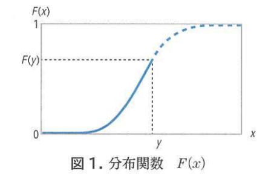

Cumulative Distribution Function: CDF

<small>
教科書121ページ参照
</small>

##

- 単調に増加する関数
  - 減少することがない
- 𝑥の取り得る値は-∞から∞の間
  - 𝐹(−∞)=0
  - 𝐹(+∞)=1

##

<xl>💡Lightbulb lifespan💡 </xl>

寿命（時間）:
- $F(1000) = 0.10$
- $F(5000) = 0.90$

##

<xl> 🍜ラーメン屋🍜 </xl>

待ち時間（分）:
- $F(20) = 0.10$
- $F(60) = 0.90$

## 確率密度関数  

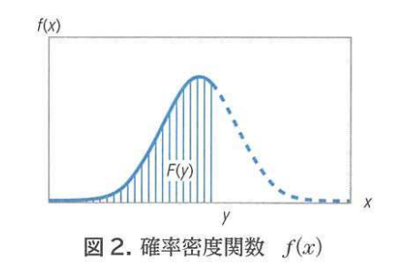

  The probability density function (PDF) 
$$
F(y) = \int_{−∞}^{y} f(x) \, dx 
$$

##

<xl>

$\int_{-∞}^{∞}f(x) \, dx = 1$

</xl>

<small>

教科書121ページ参照

</small>

#

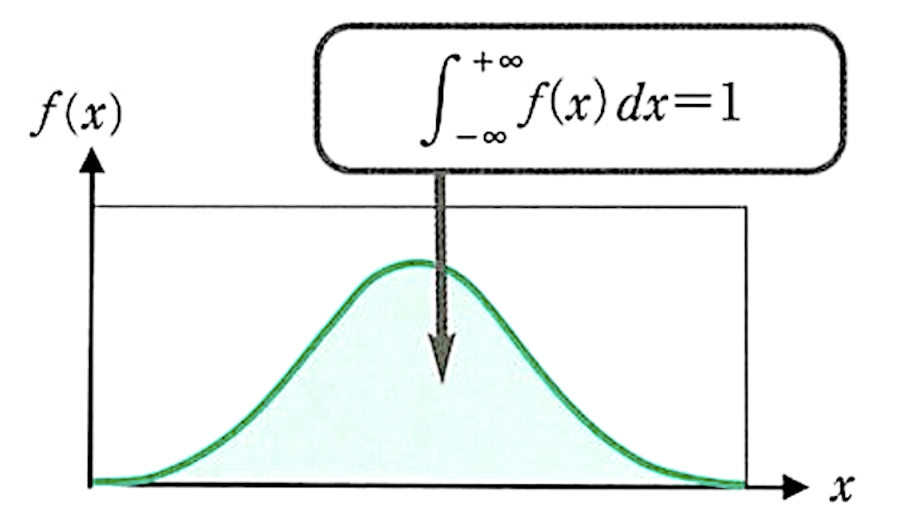

- test scores💯 
- human heights🧍🏽‍♂️

##
<xl>

$\int_{-∞}^{y}f(x) \, dx$

</lx>

#
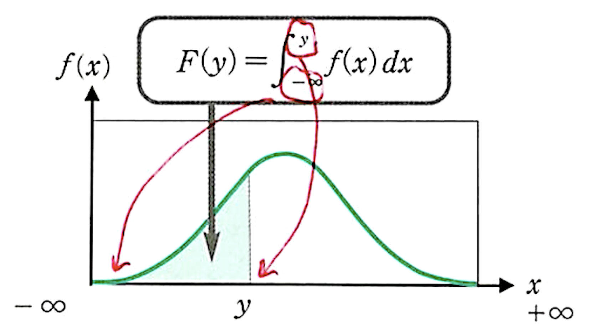
##
<xl>

$\int_{\alpha}^{\beta}f(x) \, dx$

</lx>

#
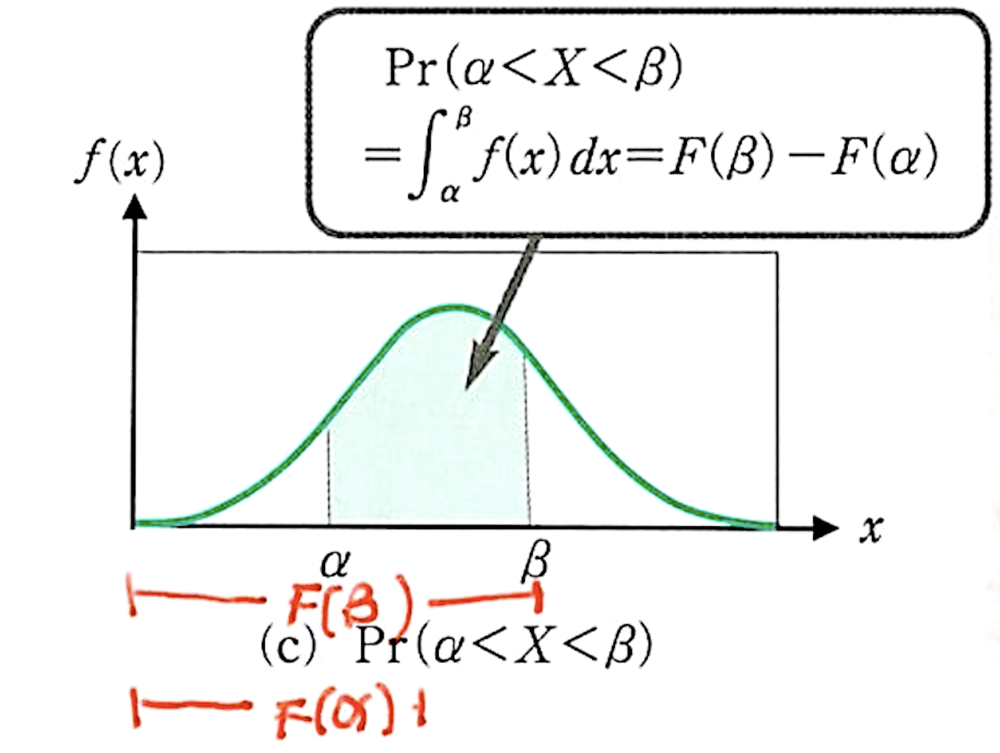

## 確率密度分布𝑓(𝑥)と𝑥軸の間の面積は1

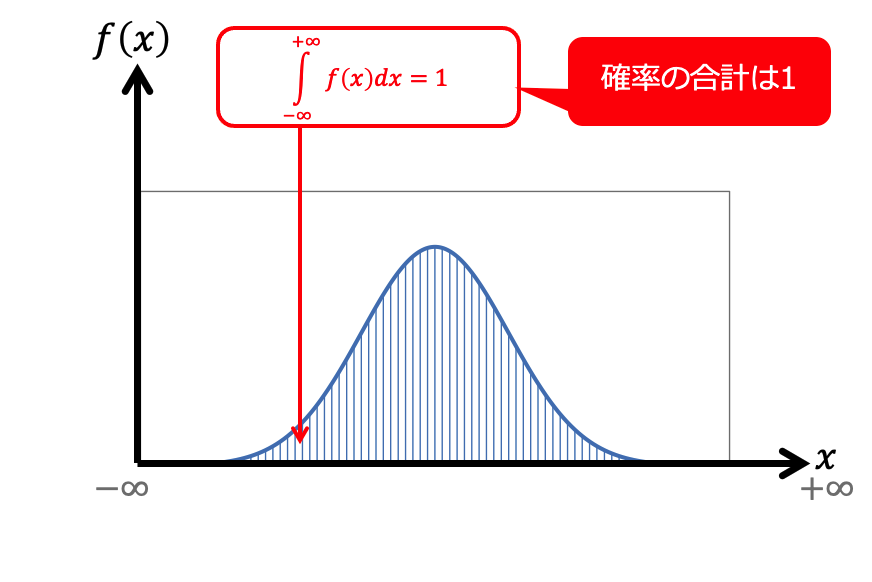

### 𝑥が𝑦のときの𝑓(𝑥)と𝑥軸で囲まれた部分の面積

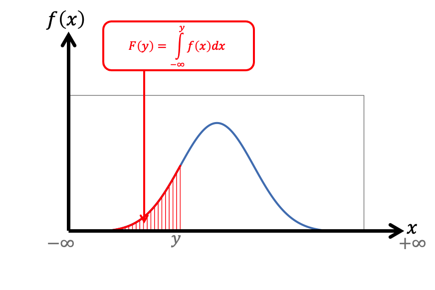

## 分布関数 𝐹(𝑥)

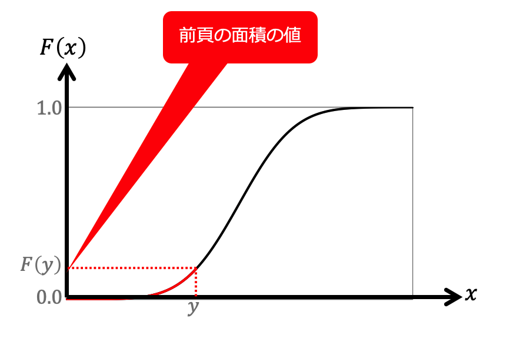

## 色部分の面積　Pr⁡(𝛼<𝑋<𝛽)　の求め方

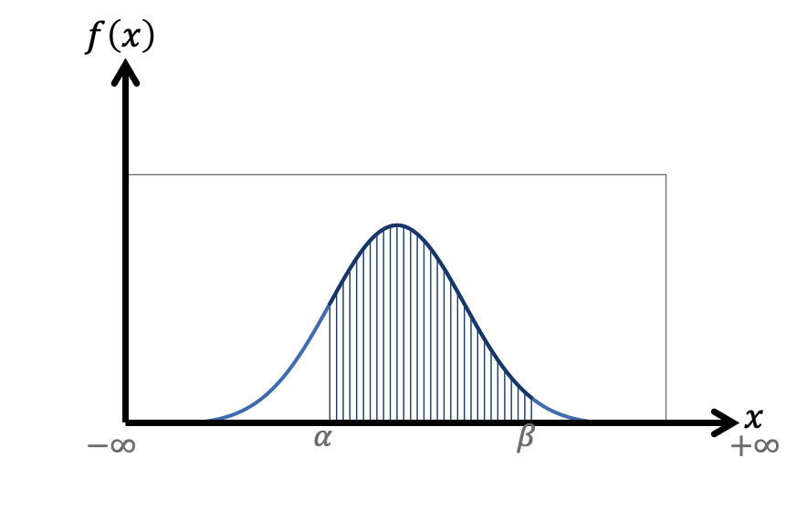

## 緑の面積から赤の面積を引く

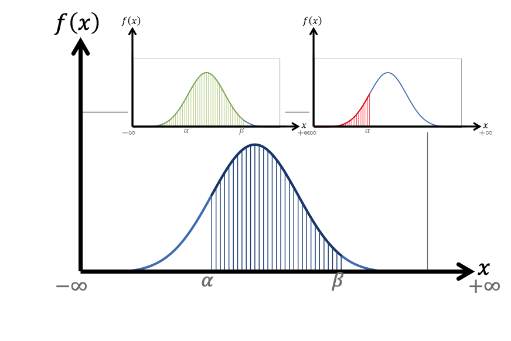

## 緑の面積から赤の面積を引く

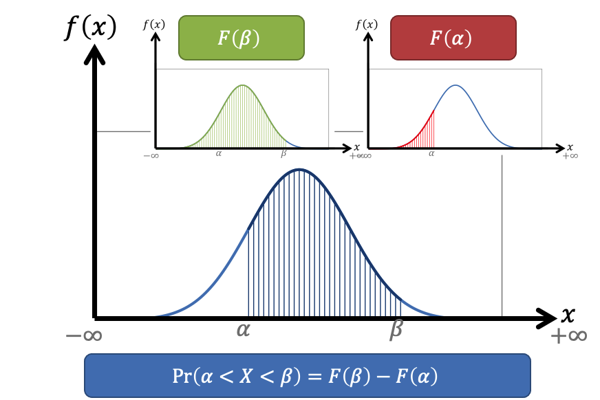

##

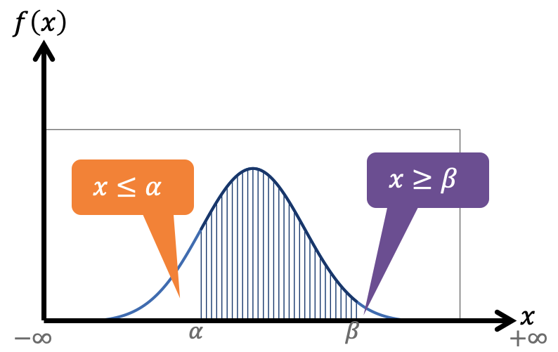

##

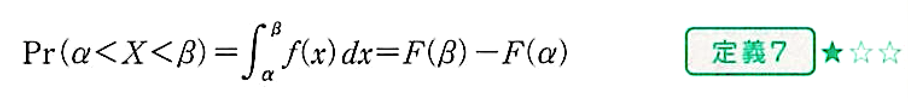
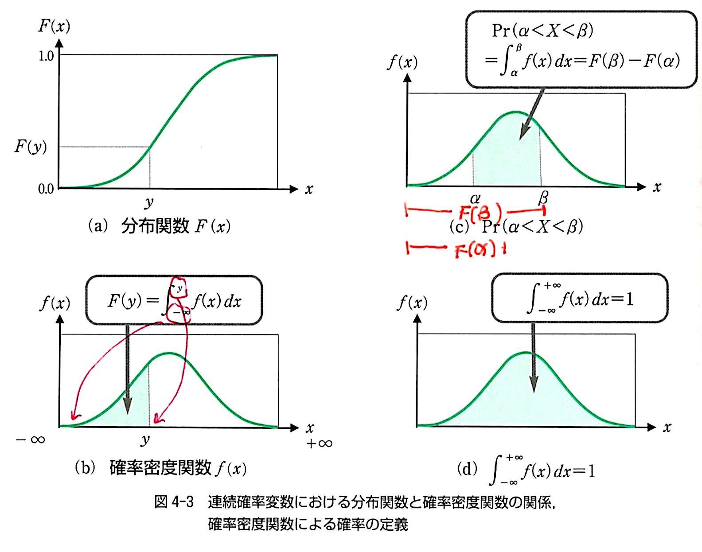

# 正規分布とカイ二乗分布

Normal Distribution and Chi-Square Distribution

## 　正規分布の確率計算

<small>
教科書122ページ参照
</small>

- 正規分布　（復習）
  - 平均を中心とした左右対称の連続確率分布
- 中心極限定理　（復習）
  - 標本平均は正規分布にしたがう
  - 母集団がどのような分布であっても
標本平均に関しては確率による評価ができる
    - 確率計算は簡単ではない…

$$
Pr⁡(𝛼<𝑋<𝛽)=∫_𝛼^𝛽𝑓(𝑥)𝑑𝑥=∫_𝛼^𝛽\frac{1}{\sqrt2𝜋𝜎_𝑋^2} exp⁡\{−\frac{(𝑥−𝜇_𝑋)^2}{2𝜎_𝑋^2}\}𝑑𝑥
$$

## 標準正規分布
standard normal distribution

<xxxl>

$Z$

</xxxl>

### 標準正規分布

- 標準化　（復習）
  - 平均値と標準偏差を統一する方法
    - 平均＝０
    - 標準偏差＝１

- 標準化が適用できない場合
  - データに外れ値が含まれる場合
  - 度数分布が左右対称の単峰の分布でない場合
    - 正規分布は<red>左右対称</red>の確率分布で
    <red>外れ値が生じない</red>形状なので
    標準化を適用できる！

### 標準正規分布

<small>
教科書123ページ参照
</small>

- 標本平均$\bar{𝑋}$を標準化する
- $𝑍：\bar{𝑋}$を標準化した確率変数

$$𝑍=\frac{\bar{𝑋 }−𝐸(\bar{𝑋})}{\sqrt{𝑉𝑎𝑟(\bar{𝑋})}}=\frac{\bar{𝑋}−𝜇_𝑋}{\sqrt\frac{𝜎_𝑋^2}{𝑛}}=\frac{標本平均−母平均}{\sqrt{\frac{母分散}{標本数}}}$$

###

Say what?

###

Ok, imagine 期末試験クラス平均 $\mu$ ＝ 50

Standard deviation・標準偏差 $\sigma$ = 10 

Variance・分散 $\sigma^2$ = 100

###

Your test score = 60

What is your Z score?

###

<xl>

$Z = \frac{X - \mu}{\sigma}$

</xl>

###

Using the numbers:

$X = 60$ <whitesmoke>(individual’s score)</whitesmoke>
$\mu = 50$ <whitesmoke>(population mean)</whitesmoke>
$\sigma = 10$ <whitesmoke>(population standard deviation)</whitesmoke>

<xl>

$Z = \frac{60 - 50}{10} = \frac{10}{10} = 1$

</xl>

#

###

Now imagine...

<xl>
「標本」の場合は？

###

You take a sample 

<xl>

$n = 4$

</xl>

and the sample mean 

<xl>

$\bar{X} = 60$ ✨👏

</xl>

###

What is this sample mean's Z score?

###

<xl>

$Z = \frac{\bar{X} - \mu_x}{\frac{\sigma_x}{\sqrt{n}}}$

</xl>

 
🤨 ちょっと違うぞ！

#

1人のZ score

<xl>

$Z = \frac{X - \mu}{\sigma}$

</xl>

vs

標本平均のZ score

<xl>

$Z = \frac{\bar{X} - \mu_x}{\frac{\sigma_x}{\sqrt{n}}}$

</xl>

###

$Z = \frac{\bar{X} - \mu_x}{\frac{\sigma_x}{\sqrt{n}}}$

- $\bar{X} = 60$ <whitesmoke>(sample mean)</whitesmoke>
- $\mu_x = 50$  <whitesmoke>(population mean)</whitesmoke>
- $\sigma_x = 10$  <whitesmoke>(population standard deviation)</whitesmoke>
- $n = 4$  <whitesmoke>(sample size)</whitesmoke>

 

<xxl>

$Z = \frac{60 - 50}{\frac{10}{\sqrt{4}}}$

</xxl>

#

### 標準正規分布表の見方
<plum>超重要！</plum>

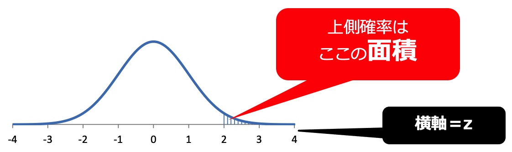

##

p 202
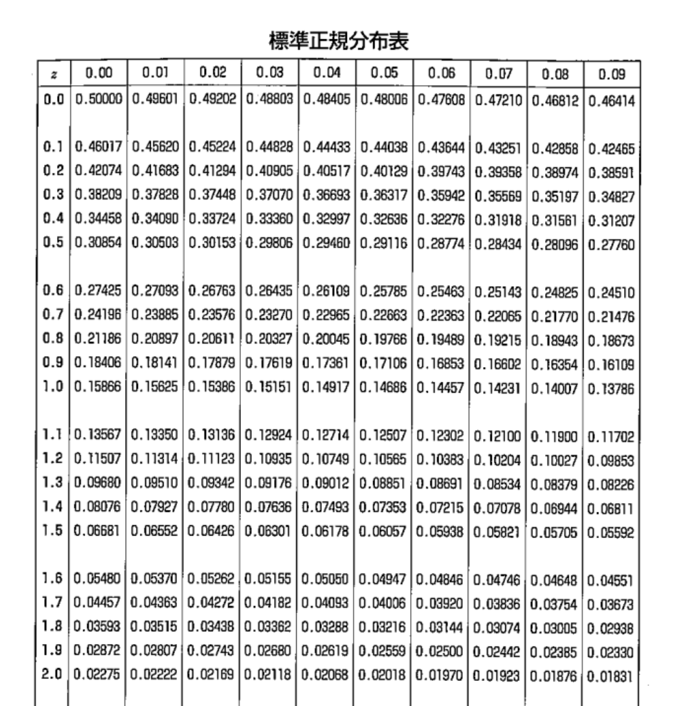

### 標準正規分布表の見方

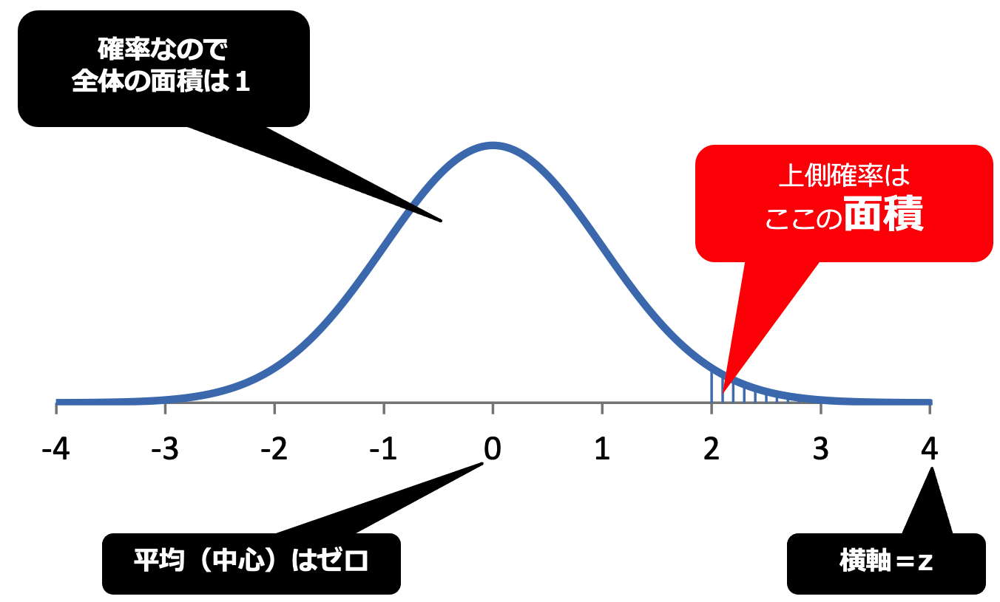

### 例）z=2.00のとき

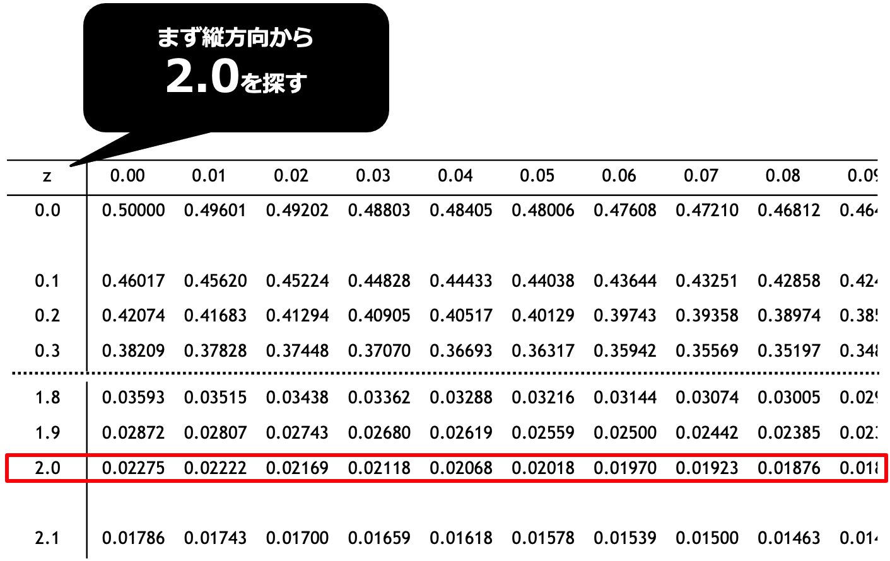

### 例）z=2.00のとき

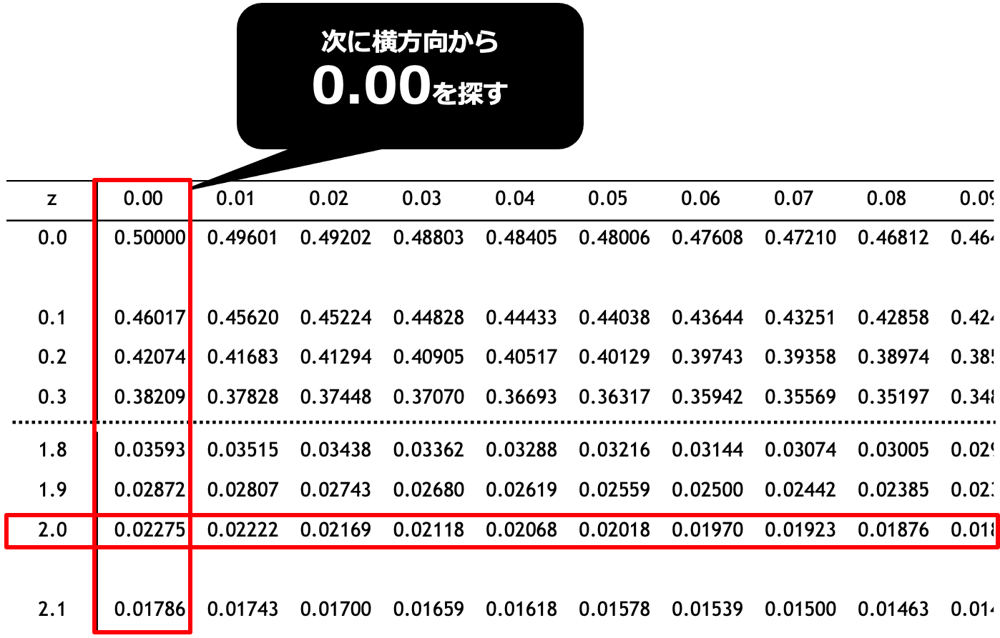

### 例）z=2.00のとき

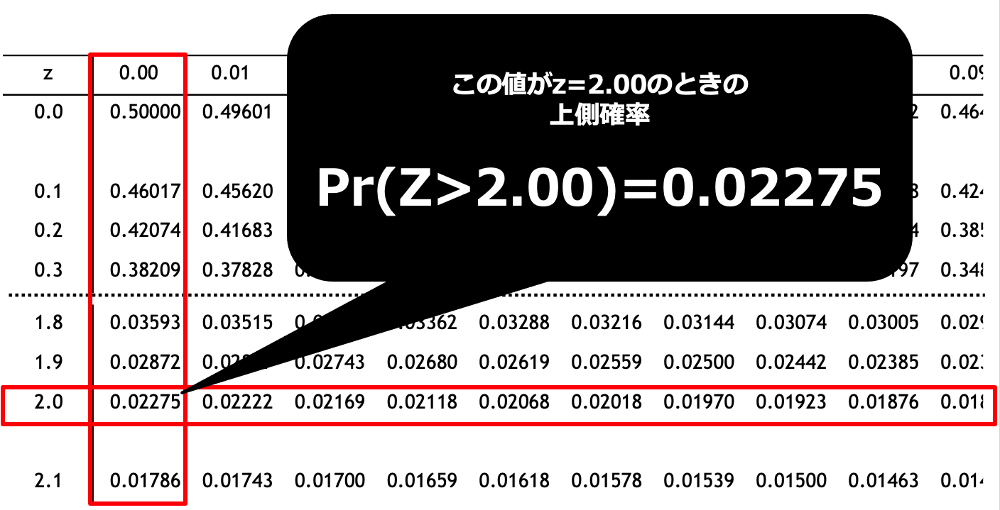

### 例）z=5.00のとき

<small>

- 標準正規分布表にはz=3.09までしかない…
  - もっとも近い値で計算する
  - z=3.09の確率をみると
    0.00100とものすごく小さい値
  - z>3.09のときはどんどん0に近似するので
    ほぼ0とみなすことが多い
    教科書によってはさらに細かい表まであることもある
</small>

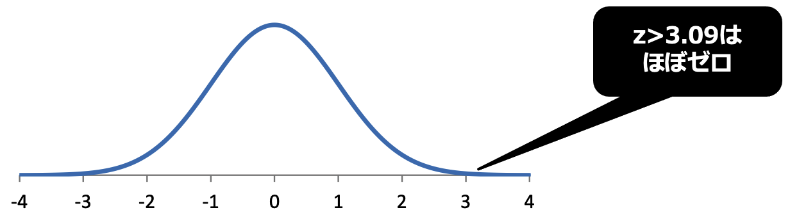

### 例）z=-2.00のとき

- もしzがマイナスの値だったら…？
  - 左右対称
  - 面積全体は1
  (確率の合計は1)
    - つまり、絶対値の上側確率を計算して1から引けば求めることができる

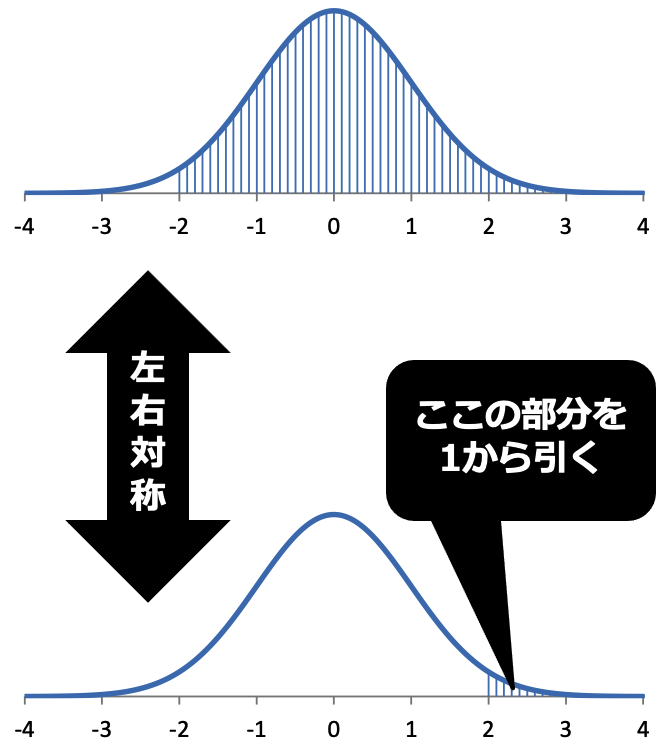

### 例）-1.00<z<1.00のとき

- Pr⁡(−1.00<𝑍<1.00)
正規分布は左右対称
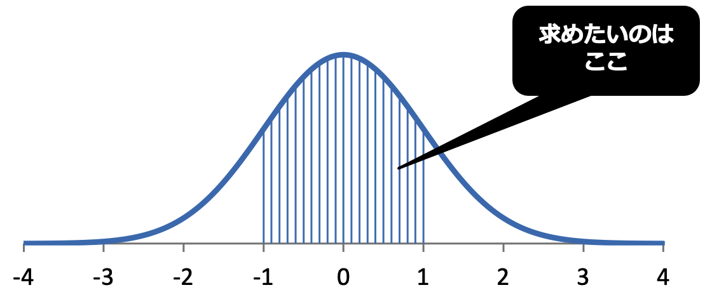

### 例）-1.00<z<1.00のとき

- Pr⁡(−1.00<𝑍<1.00)
正規分布は左右対称
<red>両端の白い部分の面積は同じ</red>

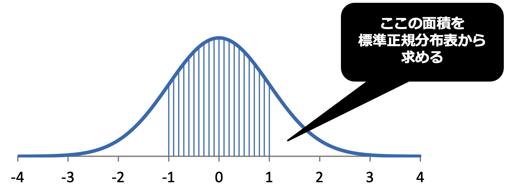

### 例）-1.00<z<1.00のとき

- Pr⁡(−1.00<𝑍<1.00)
正規分布は左右対称
両端の白い部分の面積は同じ
<red>確率の合計は1</red>

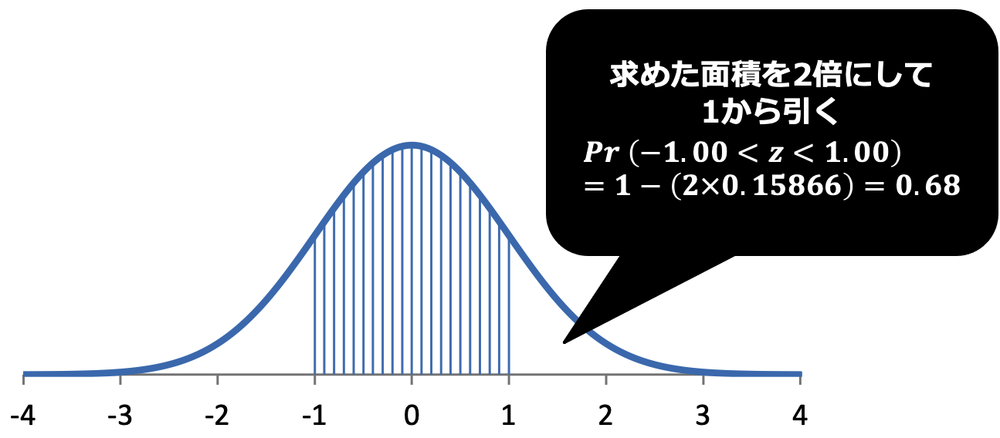

##

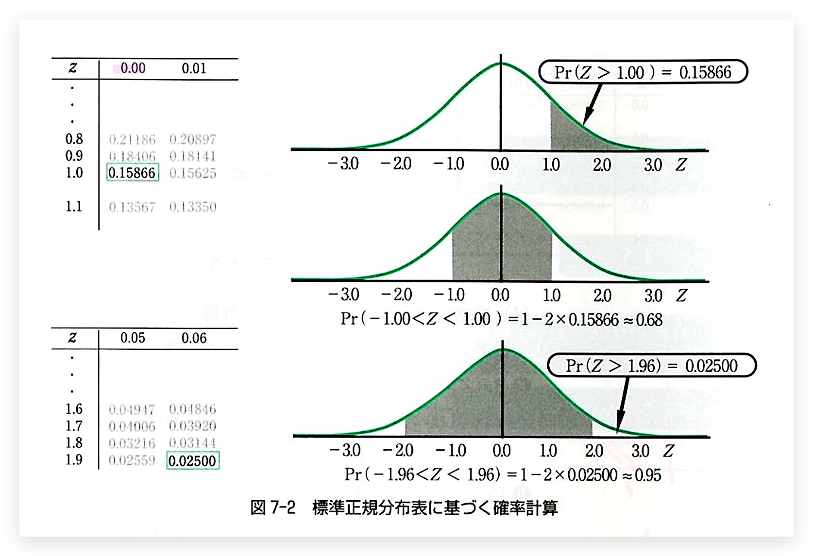

##

##

- 母集団2万人の来店頻度
  - 平均		$2.00$
  - 標準偏差	$1.41$
  - 分散		$1.41^2=1.976$
- 標本平均$\bar{𝑋}$の分布⇒正規分布
  - 平均		$2.00$
  - 分散		$\frac{1.976}𝑛$
- 標本の大きさが200のときに
母平均±0.1の範囲内に
標本平均が含まれる確率を求める

### 

- 母平均	2.00
- 母分散	1.976
- 標本数	200

- 標本平均が母平均より0.1大きい場合のZ

$$
𝑍=\frac{\bar{𝑋} −𝐸(\bar{𝑋}  )}{\sqrt{𝑉𝑎𝑟(\bar{𝑋}  )}} )=\frac{\bar{𝑋} −𝜇_x}{\sqrt{\frac{𝜎_x^2}{𝑛}}}=\frac{標本平均−母平均}{\sqrt{\frac{母分散}{標本数}}}
$$

### 

- 母平均	2.00
- 母分散	1.976
- 標本数	200

- 標本平均が母平均より0.1大きい場合のZ

$$
𝑍=\frac{\bar{𝑋} −𝐸(\bar{𝑋}  )}{\sqrt{𝑉𝑎𝑟(\bar{𝑋}  )}} )=\frac{\bar{𝑋} −𝜇_x}{\sqrt{\frac{𝜎_x^2}{𝑛}}}=\frac{2.10-2.00}{\sqrt{\frac{1.976}{200}}}=1.01
$$

### 

- 母平均	2.00
- 母分散	1.976
- 標本数	200

- $Z=1.01$のときの上側確率を
標準正規分布表から求める
- $Pr⁡(−1.01<𝑍<1.01)$を求める

### 標準正規分布表でLook up→

$$

Pr⁡(−1.01<𝑍<1.01)=1-2*0.15625
=0.69

$$

##

So what does this mean?

##

<green>200人</green>のサンプルを抽出した場合、

標本平均が<green>2.00 ± 0.1（1.90から2.10）</green>の範囲に入る確率は

<xxl>

<red>約69%</red>

### 

- 標本数がn=1000のとき
母平均±0.1の範囲内に
標本平均が含まれる確率を求めよ

### 

- 標本数がn=1000のとき
母平均±0.1の範囲内に
標本平均が含まれる確率を求めよ

$$
𝑍=\frac{\bar{𝑋} −𝐸(\bar{𝑋}  )}{\sqrt{𝑉𝑎𝑟(\bar{𝑋}  )}} )=\frac{\bar{𝑋} −𝜇_𝑋}{\sqrt{\frac{𝜎_𝑋^2}{𝑛}}}=\frac{2.10-2.00}{\sqrt{\frac{1.976}{1000}}}≈2.25
$$

### 標準正規分布表でLook up→

$$

Pr⁡(−2.25<𝑍<2.25)=

$$

&nbsp;&nbsp;&nbsp;&nbsp;&nbsp;&nbsp;&nbsp;&nbsp;&nbsp;&nbsp;

##
        

   
標準正規分布曲線を描いてラベルを付ける

##

<green>1000人</green>のサンプルを抽出した場合、

標本平均が<green>2.00 ± 0.1（1.90から2.10）</green>の範囲に入る確率は

<xxl>

<red>約97.6%</red>

