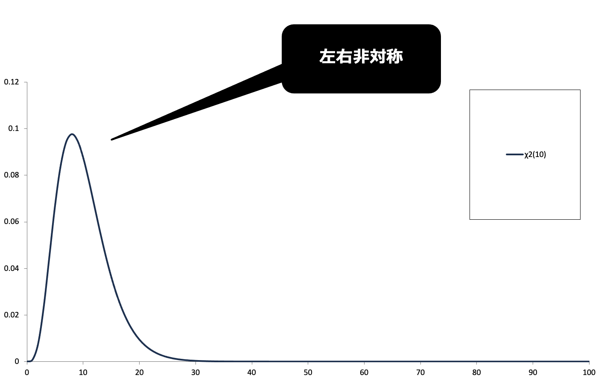
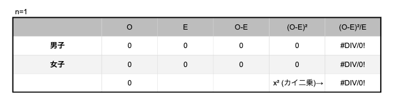
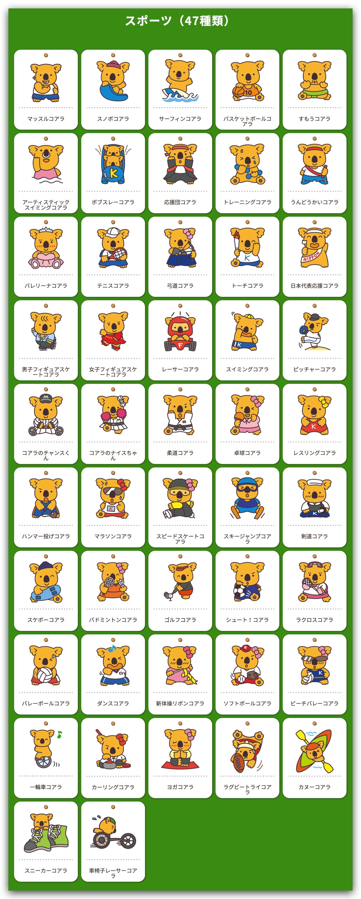
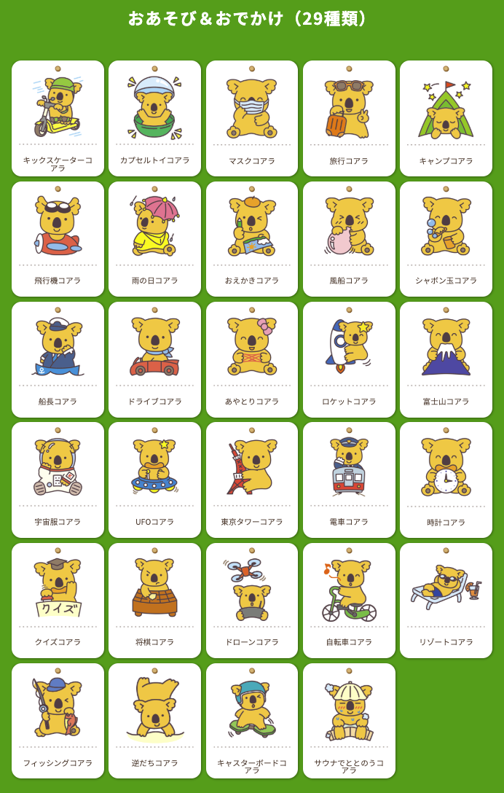
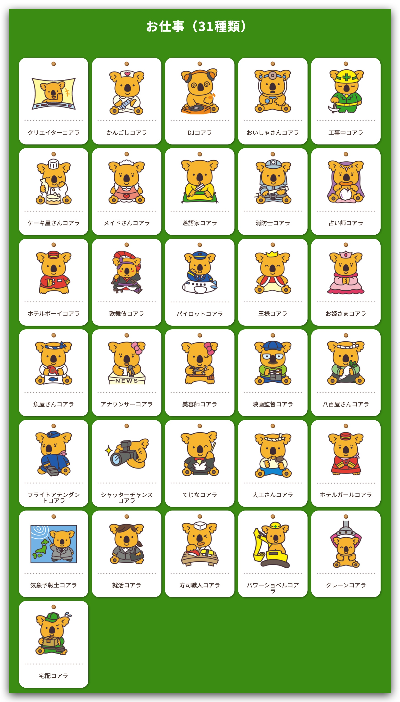
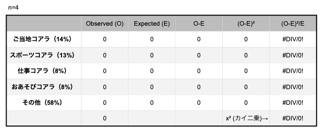

<xlarge>

統計学B

</xlarge>

Week 8?

# -- Add Original W8 content here --
The material covers the Gauten Board and reviews Z scores

# カイ二乗分布

##

Karl Pearson (1857-1936)
- English mathematician
- big boss of stats
- but... also one of the fathers of eugenics 「優生学」

## 「優生学」
> Eugenics is the scientifically erroneous and immoral theory of “racial improvement” and “planned breeding,” which gained popularity during the early 20th century. Eugenicists worldwide believed that they could perfect human beings and eliminate so-called social ills through genetics and heredity.

優生学とは、20世紀初頭に人気を博した「人種改良」と「計画的繁殖」に関する科学的に誤った不道徳な理論です。 世界中の優生学者は、遺伝学と遺伝によって人間を完璧にし、いわゆる社会的悪を排除できると信じていました。

## （１）カイ二乗分布の定義

### カイ二乗分布の定義

- $𝜒^2$ 分布　（chi-squared distribution）
  - 自由度𝜈のカイ二乗分布
  - 標準正規分布𝑁(0,1)にしたがう
    独立な𝜈個の確率変数𝑋_𝑖の
    平方和に関する確率分布
    - $𝜒^2 (𝜈)~𝑋_1^2+𝑋_2^2+𝑋_3^2+…+𝑋_𝜈^2$
  - <red>平均値		𝜈	自由度と等しい
  - <red>分散		2𝜈	自由度の2倍
  - 自由度が小さいとき左右非対称
    - 自由度が大きくなるにつれて左右対称に変化
  - 自由度の値が大きいときに<red>正規分布に近似

### 自由度 degree of freedom

<medium>

$n-1$

</medium>

- 自由に動くことのできる変数の数
- 与えられた等式（条件）の分だけ減る

  - 例	データ（4, x, 1, 1）	xは未知
    条件	平均値は2
    ⇒　4+𝑥+1+1=2×4
  - データの個数n個に
平均値を与える（条件1つ）と
データ<red>n-1</red>個がわかれば、すべてのデータがわかる
（残りの1つは必然的に決まる）

### 自由度10のカイ二乗分布

### 自由度10～50のカイ二乗分布

### 平方和の分解

##

<small>
教科書ではわかりにくいので…
</small>

<xl>

カイ二乗分析はなんで使うの？

##

<xl>

$60:40$

</xl>

🤷🏻男子：女子👩🏻‍🎓

##
本当かな？では、無作為で20人の学生を抽出したら…

<xl>
🤷🏻🤷🏻🤷🏻🤷🏻🤷🏻🤷🏻🤷🏻🤷🏻🤷🏻🤷🏻 
🤷🏻🤷🏻‍♀️🤷🏻‍♀️🤷🏻‍♀️🤷🏻‍♀️🤷🏻‍♀️🤷🏻‍♀️🤷🏻‍♀️🤷🏻‍♀️🤷🏻‍♀️ 

$11:9$

</xl>

##
本当かな？では、無作為で20人の学生を抽出したら…

<xl>
🤷🏻🤷🏻🤷🏻🤷🏻🤷🏻🤷🏻🤷🏻🤷🏻🤷🏻🤷🏻 
🤷🏻🤷🏻🤷🏻‍♀️🤷🏻‍♀️🤷🏻‍♀️🤷🏻‍♀️🤷🏻‍♀️🤷🏻‍♀️🤷🏻‍♀️🤷🏻‍♀️ 

$12:8$

</xl>

##
本当かな？では、無作為で20人の学生を抽出したら…

<xl>
🤷🏻🤷🏻🤷🏻🤷🏻🤷🏻🤷🏻🤷🏻🤷🏻🤷🏻🤷🏻 
🤷🏻🤷🏻🤷🏻🤷🏻‍♀️🤷🏻‍♀️🤷🏻‍♀️🤷🏻‍♀️🤷🏻‍♀️🤷🏻‍♀️🤷🏻‍♀️ 

$13:7$

</xl>

##
本当かな？では、無作為で20人の学生を抽出したら…

<xl>
🤷🏻🤷🏻🤷🏻🤷🏻🤷🏻🤷🏻🤷🏻🤷🏻🤷🏻🤷🏻 
🤷🏻🤷🏻🤷🏻🤷🏻🤷🏻‍♀️🤷🏻‍♀️🤷🏻‍♀️🤷🏻‍♀️🤷🏻‍♀️🤷🏻‍♀️ 

$14:6$

</xl>

##
本当かな？では、無作為で20人の学生を抽出したら…

<xl>
🤷🏻🤷🏻🤷🏻🤷🏻🤷🏻🤷🏻🤷🏻🤷🏻🤷🏻🤷🏻 
🤷🏻🤷🏻🤷🏻🤷🏻🤷🏻🤷🏻‍♀️🤷🏻‍♀️🤷🏻‍♀️🤷🏻‍♀️🤷🏻‍♀️ 

$15:5$

</xl>

##

なんとなく、直感（gut feeling）では解決できない…

<xl>

カイ二乗検定

</xl>
Chi Squared Test

<xl>
<b>集めたデータ　↔︎　予測データ</b>

##

<xl>

$H_0$ 帰無仮説＝$60:40$

</xl>

帰無仮説を棄却（ききゃく）できるでしょうか?
Can we reject the null hypthesis?

##

In other words... 

<medium>

このクラスは、母集団（全校の比率）と比べて、有意に、
そして統計的に異なると言えるのか？

</medium>

Is this class significantly, and statistically different from the population?

##

ではカイ二乗を求めよう：

<xl>

$\chi^2=\sum\frac{(O_i-E_i)^2}{E_i}$

</xl>

- $\chi^2$ はカイ二乗検定統計量
- $O_i$ はカテゴリ $i$ の観測度数 (Observed)
- $E_i$ はカテゴリ $i$ の期待度数 (Expected)

## 自由度は？

<medium>

$n-1$

</medium>

この場合の「n」はカテゴリーの数{男子,女子}が２なので<red><b>自由度は１</b></red>である

Degree of Freedom (DF) = 2-1 = 1

##

#

[Here](https://docs.google.com/spreadsheets/d/1VOAvzr1cxXftwnLYJQCR94gZRTPtK60kzjA8Ej0A5Xw/edit?gid=1412999600#gid=1412999600)

##

従って、帰無仮説は棄却　<medium>できる・できない

##

<medium>

コアラのマーチ「激レアキャラ」は都市伝説？

</medium>

３６５種類の絵柄は全て同じ数だけ作ってると言われている。本当かな？

##

https://www.lotte.co.jp/products/brand/koala/book/

## ご当地コアラ(51)

- 51種類
- 出る確率は$\frac{51}{365}$or <l><red>$14\%$

## スポーツコアラ(47)

- 47種類
- 出る確率は$\frac{47}{365}$or <l><red>$13\%$

## おあそび＆おでかけ（29種類）

- 29種類
- 出る確率は$\frac{29}{365}$or <l><red>$8\%$

## お仕事（28種類）

- 28種類
- 出る確率は$\frac{28}{365}$or <l><red>$8\%$

##

$H_0$ 帰無仮説

コアラの<b><red>ご当地・スポーツ・仕事・おあそび＆おでかけ・その他</red></b>の比率は
<xl>$51:47:29:28:210$</xl>
<xl><red>14% : 13% : 8% : 8% : 58%</xl>
である

帰無仮説を棄却できるでしょうか?
Can we reject the null hypthesis?

- 自由度(DF)：$5-1=4$

## $\chi^2=\sum\frac{(O_i-E_i)^2}{E_i}$

[Enter!](https://docs.google.com/spreadsheets/d/1VOAvzr1cxXftwnLYJQCR94gZRTPtK60kzjA8Ej0A5Xw/edit?usp=sharing)

##

