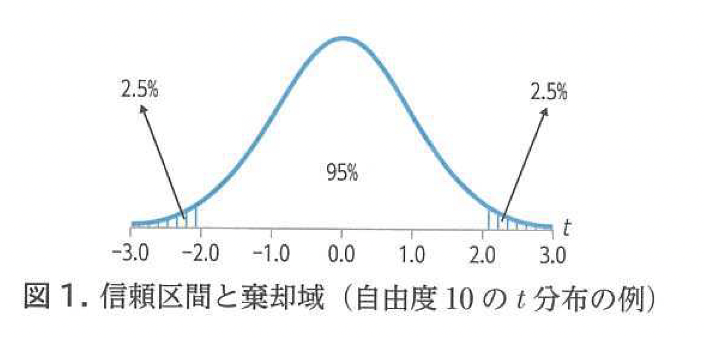
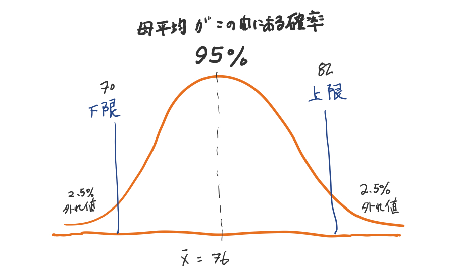
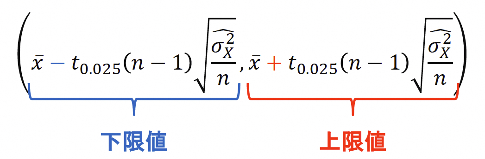
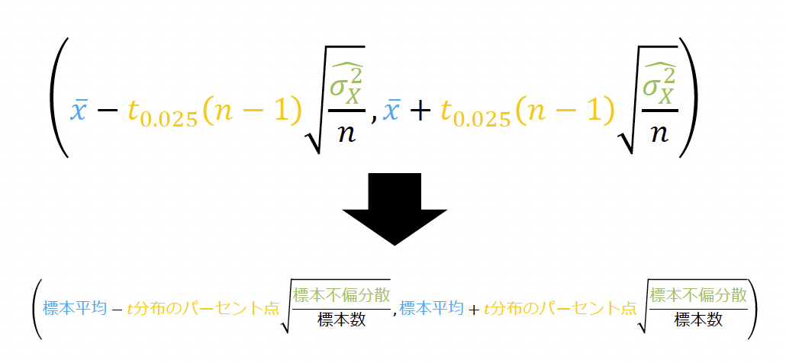

<xlarge>

統計学B

</xlarge>

Week 9

# 2章3節 母平均の区間推定

Confidence interval estimation for the population mean

## 

## 収穫したマグロの平均重量は？

## サンプルで統計！

### サンプルの平均重量が50kg...

それってどれくらい信頼できるの？

### Well, it depends...

$n$の大きさ！

大きければ大きいほど信頼度は...
高い？低い？

## 信頼係数とは？

この区間に母集団の平均値が含まれているに違いない！

## 母平均の区間推定

- 区間推定
  - 推定量の確率分布における区間を用いて母数を推定
  - ある区間内に母数が含まれることを信頼度で示す

- 推定した区間
- 信頼係数$100(1−𝛼)\%$の信頼区間
  - 信頼係数 confidence coefficient
  - 信頼区間 confidence interval
- 信頼係数95%の信頼区間のことを
  <red>95% 信頼区間 ともいう</red>
– 信頼区間は（<red>下限値，上限値</red>） で表す

###

#

<!-- text book chart -->

## 信頼区間

<medium>母平均$𝜇_𝑋$の 95% 信頼区間とは？</medium>

- ランダムな標本抽出を100 回繰り返し行って信頼区間を 100 回計算するとき区間内に母平均 𝜇𝑋を含むものは 100 回のうち 95 回程度になるような区間

### Pythonで検証！

#

Sushida anyone?

Enter your scores [here](https://docs.google.com/spreadsheets/d/1vwu8iJ-u8NZ-f6UoNJEo80q3uMiujRQzzBD-VhjLXYo/edit?gid=1063303064#gid=1063303064)

# あなたの何㎏？

<xxxl>

🎒

# 
母平均の信頼区間の式p133

<!-- formula -->

<medium>

$\left[ \bar{x} - t_{\alpha}(n-1)\sqrt{\frac{\hat{\sigma}_{\bar{x}}^{2}}{n}} \; , \; \bar{x} + t_{\alpha}(n-1)\sqrt{\frac{\hat{\sigma}_{\bar{x}}^{2}}{n}} \right]$

</medium>

###

###

## 母平均の区間推定に関する計算

#

<!-- formula -->

<medium>

$\left[ \bar{x} - t_{\alpha}(n-1)\sqrt{\frac{\hat{\sigma}_{\bar{x}}^{2}}{n}} \; , \; \bar{x} + t_{\alpha}(n-1)\sqrt{\frac{\hat{\sigma}_{\bar{x}}^{2}}{n}} \right]$

</medium>

すなわち

<large>

$\bar{x} \pm t_{\alpha}(n-1)\sqrt{\frac{\hat{\sigma}_{\bar{x}}^{2}}{n}}$

</large>

#

#

###
ポイントカード所有者2万人の母集団から50人を無作為抽出

標本数

<xl><b>50</b></xl>

標本平均
<xl><b>1.98</b></xl>

標本分散
<xl><b>2.6196</b></xl>

母平均の95% 信頼区間を求める

##

<medium>

$\textcolor{red}{\bar{\chi}}\pm t_{0.025}(n-1)\sqrt{\frac{{\hat{\sigma_x^2}}}{n}}$

</medium>

❶平均値

##

<medium>

$\textcolor{green}{1.98}\pm \textcolor{red}{t_{0.025}(n-1)}\sqrt{\frac{{\hat{\sigma_x^2}}}{n}}$

</medium>

❷ 95%信頼区間の場合：$\frac{1-0.95}{2}=\frac{0.05}{2}=0.025$

$\textcolor{red}{t_{0.025}(49)}=2.0096$ 

##

<medium>

$\textcolor{green}{1.98}\pm \textcolor{green}{2.0096}\sqrt{\frac{\textcolor{red}{\hat{\sigma_x^2}}}{n}}$

</medium>

❸標本不偏分散（赤い部分）を求める

これが結構厄介！

##

p132

$\textcolor{red}{\hat{\sigma_x^2}}=\frac{1}{n-1}\Sigma(x_i-\bar{x})^2=\frac{n}{n-1}\frac{1}{n}\Sigma(x_i-\bar{x})^2=\frac{n}{n-1}S_x^2$

<medium>

↓

$\textcolor{red}{\hat{\sigma_x^2}}=\frac{n}{n-1}S_x^2=\frac{50}{49}\times2.6196$

↓

$\textcolor{red}{\hat{\sigma_x^2}}=2.6731$

##

<medium>

$\textcolor{green}{1.98}\pm \textcolor{green}{2.0096}\sqrt{\frac{\textcolor{green}{2.6731}}{\textcolor{red}{50}}}$

</medium>

❹ $n$を代入して計算！

${1.98\pm 0.46466}$

$=(1.98-0.46466,1.98+0.46466)$

<medium>

$\approx(1.52,2.44)$

</medium>

## 信頼区間を計算してみよう

### 手順：

1. Google Sheets の寿司打スコア一覧から、**ランダムに5人分**のスコアを選ぶ。

2. 次の統計量を計算する：

- 平均（$\bar{x}$）
- 分散（$\hat{\sigma}_{\bar{x}}^{2}$）：  
  $\hat{\sigma}_{\bar{x}}^{2} = \frac{1}{n - 1} \sum_{i=1}^{n} (x_i - \bar{x})^2$
- 標準誤差：$\sqrt{\frac{\hat{\sigma}_{\bar{x}}^{2}}{n}}$
- t値：$t_{\alpha}(n - 1)$（教科書の表を参照）

3. 信頼区間を計算する：

$\bar{x} \pm t_{\alpha}(n-1)\sqrt{\frac{\hat{\sigma}_{\bar{x}}^{2}}{n}}$

## 結果報告 Slack に投稿！

- 選んだ5人の名前：
  - ①＿＿＿＿＿＿＿
  - ②＿＿＿＿＿＿＿
  - ③＿＿＿＿＿＿＿
  - ④＿＿＿＿＿＿＿
  - ⑤＿＿＿＿＿＿＿

- 平均（$\bar{x}$）：＿＿＿＿＿＿  
- 分散（$\hat{\sigma}_{\bar{x}}^{2}$）：＿＿＿＿＿＿  
- 信頼区間（95%）：

= （＿＿＿＿＿＿ , ＿＿＿＿＿＿）

※ 小数第2位まで書いてください。