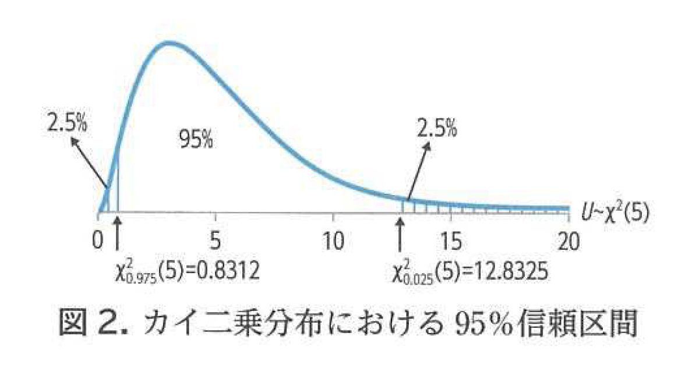
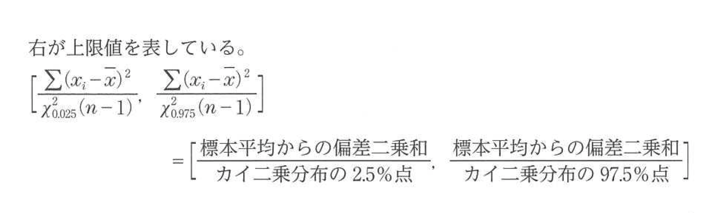
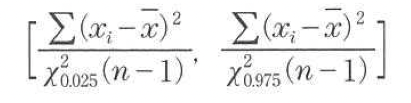

<xlarge>

統計学B

</xlarge>

Week 10

# 2章3節 母平均の区間推定

Confidence interval estimation for the population mean

# 
母平均の信頼区間の式p133

<!-- formula -->

<medium>

$\left[ \bar{x} - t_{\alpha}(n-1)\sqrt{\frac{\hat{\sigma}_{\bar{x}}^{2}}{n}} \; , \; \bar{x} + t_{\alpha}(n-1)\sqrt{\frac{\hat{\sigma}_{\bar{x}}^{2}}{n}} \right]$

</medium>

###

###

## 母平均の区間推定に関する計算

#

<!-- formula -->

<medium>

$\left[ \bar{x} - t_{\alpha}(n-1)\sqrt{\frac{\hat{\sigma}_{\bar{x}}^{2}}{n}} \; , \; \bar{x} + t_{\alpha}(n-1)\sqrt{\frac{\hat{\sigma}_{\bar{x}}^{2}}{n}} \right]$

</medium>

すなわち

<large>

$\bar{x} \pm t_{\alpha}(n-1)\sqrt{\frac{\hat{\sigma}_{\bar{x}}^{2}}{n}}$

</large>

#

#

###
ポイントカード所有者2万人の母集団から50人を無作為抽出

標本数

<xl><b>50</b></xl>

標本平均
<xl><b>1.98</b></xl>

標本分散
<xl><b>2.6196</b></xl>

母平均の95% 信頼区間を求める

##

<medium>

$\textcolor{red}{\bar{\chi}}\pm t_{0.025}(n-1)\sqrt{\frac{{\hat{\sigma_x^2}}}{n}}$

</medium>

❶平均値

##

<medium>

$\textcolor{green}{1.98}\pm \textcolor{red}{t_{0.025}(n-1)}\sqrt{\frac{{\hat{\sigma_x^2}}}{n}}$

</medium>

❷ 95%信頼区間の場合：$\frac{1-0.95}{2}=\frac{0.05}{2}=0.025$

$\textcolor{red}{t_{0.025}(49)}=2.0096$ 

##

<medium>

$\textcolor{green}{1.98}\pm \textcolor{green}{2.0096}\sqrt{\frac{\textcolor{red}{\hat{\sigma_x^2}}}{n}}$

</medium>

❸標本不偏分散（赤い部分）を求める

これが結構厄介！

##

p132

$\textcolor{red}{\hat{\sigma_x^2}}=\frac{1}{n-1}\Sigma(x_i-\bar{x})^2=\frac{n}{n-1}\frac{1}{n}\Sigma(x_i-\bar{x})^2=\frac{n}{n-1}S_x^2$

<medium>

↓

$\textcolor{red}{\hat{\sigma_x^2}}=\frac{n}{n-1}S_x^2=\frac{50}{49}\times2.6196$

↓

$\textcolor{red}{\hat{\sigma_x^2}}=2.6731$

##

<medium>

$\textcolor{green}{1.98}\pm \textcolor{green}{2.0096}\sqrt{\frac{\textcolor{green}{2.6731}}{\textcolor{red}{50}}}$

</medium>

❹ $n$を代入して計算！

${1.98\pm 0.46466}$

$=(1.98-0.46466,1.98+0.46466)$

<medium>

$\approx(1.52,2.44)$

</medium>

## 信頼区間を計算してみよう

### 手順：

1. Google Sheets の寿司打スコア一覧から、**ランダムに5人分**のスコアを選ぶ。

2. 次の統計量を計算する：

- 平均（$\bar{x}$）
- 分散（$\hat{\sigma}_{\bar{x}}^{2}$）：  
  $\hat{\sigma}_{\bar{x}}^{2} = \frac{1}{n - 1} \sum_{i=1}^{n} (x_i - \bar{x})^2$
- 標準誤差：$\sqrt{\frac{\hat{\sigma}_{\bar{x}}^{2}}{n}}$
- t値：$t_{\alpha}(n - 1)$（教科書の表を参照）

3. 信頼区間を計算する：

$\bar{x} \pm t_{\alpha}(n-1)\sqrt{\frac{\hat{\sigma}_{\bar{x}}^{2}}{n}}$

## 結果報告 Slack に投稿！

- 選んだ5人の名前：
  - ①＿＿＿＿＿＿＿
  - ②＿＿＿＿＿＿＿
  - ③＿＿＿＿＿＿＿
  - ④＿＿＿＿＿＿＿
  - ⑤＿＿＿＿＿＿＿

- 平均（$\bar{x}$）：＿＿＿＿＿＿  
- 分散（$\hat{\sigma}_{\bar{x}}^{2}$）：＿＿＿＿＿＿  
- 信頼区間（95%）：

= （＿＿＿＿＿＿ , ＿＿＿＿＿＿）

※ 小数第2位まで書いてください。

# Let's practice

### Yoh's class 期末試験

標本数

<xl><b>5</b></xl>

標本平均
<xl><b>75</b></xl>

標本分散
<xl><b>10</b></xl>

母平均の95% 信頼区間を求める

##

標本数

<xl><b>5</b></xl>

標本平均
<xl><b>75</b></xl>

標本分散
<xl><b>10</b></xl>

母平均の95% 信頼区間を求める

<medium>

$\textcolor{red}{\bar{\chi}}\pm t_{0.025}(n-1)\sqrt{\frac{{\hat{\sigma_x^2}}}{n}}$

</medium>

❶平均値

##

標本数

<xl><b>5</b></xl>

標本平均
<xl><b>75</b></xl>

標本分散
<xl><b>10</b></xl>

母平均の95% 信頼区間を求める

<medium>

$\textcolor{green}{75}\pm \textcolor{red}{t_{0.025}(n-1)}\sqrt{\frac{{\hat{\sigma_x^2}}}{n}}$

</medium>

❷ 95%信頼区間の場合：

 
<medium>

$\frac{1-0.95}{2}=\frac{0.05}{2}=0.025$

$\textcolor{red}{t_{0.025}(4)}=2.7764$ 

</medium>

##

標本数

<xl><b>5</b></xl>

標本平均
<xl><b>75</b></xl>

標本分散
<xl><b>10</b></xl>

母平均の95% 信頼区間を求める

<medium>

$\textcolor{green}{75}\pm \textcolor{green}{2.7764}\sqrt{\frac{\textcolor{red}{\hat{\sigma_x^2}}}{n}}$

</medium>

❸標本不偏分散（赤い部分）を求める

これが結構厄介！

##

標本数

<xl><b>5</b></xl>

標本平均
<xl><b>75</b></xl>

標本分散
<xl><b>10</b></xl>

母平均の95% 信頼区間を求める

<medium>

$\textcolor{red}{\hat{\sigma_x^2}}=\frac{n}{n-1}S_x^2$

↓

$\textcolor{red}{\hat{\sigma_x^2}}=\frac{5}{4}\times10$

↓

$\textcolor{red}{\hat{\sigma_x^2}}=12.5$

##

標本数

<xl><b>5</b></xl>

標本平均
<xl><b>75</b></xl>

標本分散
<xl><b>10</b></xl>

母平均の95% 信頼区間を求める

<medium>

$\textcolor{green}{75}\pm \textcolor{green}{2.7764}\sqrt{\frac{\textcolor{green}{12.5}}{\textcolor{red}{5}}}$

</medium>

❹ $n$を代入して計算！

<medium>

${75\pm 4.39}$

$=(75-4.39,75+4.39)$

$\approx(70.61, 79.39)$

</medium>

#

# Ch 9 母分散の区間推定

Confidence interval estimation for variance

Trying to estimate <medium>$\sigma^2$</medium> from <medium>$s^2$</medium>

## （復習）区間推定の考え方

- 区間推定
  - 推定量の確率分布における区間を用いて母数を推定
  - ある区間内に母数が含まれることを信頼度で示す

- 推定した区間
  - 信頼係数100(1−𝛼)%の信頼区間
    - <red>信頼係数</red>	confidence coefficient
    - <red>信頼区間</red>	conidence interval
  - 信頼係数95%の信頼区間のことを95%信頼区間ともいう
  - 信頼区間は（<red>下限値，上限値</red>）で表す

## （復讐）母平均の区間推定

## What is 分散？

 

## Let's see it in Python

##

しかし...標本分散の標本分布は正規*ではありません*

え？どういうこと？

##

なので、母分散の推定をする時に使う分布はt分布ではなく、
<xl>
カイ二乗分布を使う
</xl>

##

まず…母分散の区間推定に使う分布はカイ二乗分布...覚えてる？

##

##

##

## 

ピンとこないな〜

## 病院滞在日数

<medium>

<pre>

Y-axis: Patients  
^
|           *
|        *
|     *
|   *
| *
+------------------------------> X-axis: Days in Hospital
 0    3     7     14     30     40

</pre>

</medium>

## 収入

<medium>

<pre>

Y-axis: Frequency  
^
|           *
|         *
|      *
|    *
|  *
| *
+-----------------------------> X-axis: Income (万円)
  0     200     400     800    1500

</pre>

</medium>

## 車の保険

<medium>

<pre>

Y-axis: Number of Claims  
^
|           *
|        *
|     *
|   *
| *
+-------------------------------> X-axis: Claim Amount (万円)
 0    20     50     100    200

</pre>

</medium>

#

Page 135

#

Page 136

## カイ二乗分布表をつかう

## カイ二乗分布表をつかう

## やってみよう

# あるクラスの反応時間を測定したところ：

- 標本サイズ：$n = 6$
- 標本平均：$\bar{X} = 0.52$ 秒
- **標本不偏分散**：$\hat{\sigma}^2 = 4$

母分散 $\sigma^2$ の 95% 信頼区間を求めよ。

# Step 1：偏差二乗和の計算

標本不偏分散の定義：

$$
\hat{\sigma}^2 = \frac{1}{n-1}\sum (x_i - \bar{x})^2
$$

したがって：

$$
\sum (x_i - \bar{x})^2 = \hat{\sigma}^2 (n-1)
$$

$$
= 4 \times 5 = 20
$$

# Step 2：カイ二乗値の確認（df = 5）

95% CI では：

- 下側：$\chi^2_{0.025}(5) = 12.833$
- 上側：$\chi^2_{0.975}(5) = 0.831$

（χ²分布表より）

# Step 3：公式に代入

母分散の95%信頼区間：

$$
\left(
\frac{\sum (x_i - \bar{x})^2}{\chi^2_{0.025}(n-1)},\;
\frac{\sum (x_i - \bar{x})^2}{\chi^2_{0.975}(n-1)}
\right)
$$

数値を代入：

$$
\left(
\frac{20}{12.833},\;
\frac{20}{0.831}
\right)
$$

# 結果（95% 信頼区間）

$$
(1.56,\; 24.07)
$$

母分散 $\sigma^2$ の 95% 信頼区間は **1.56 〜 24.07** である。
