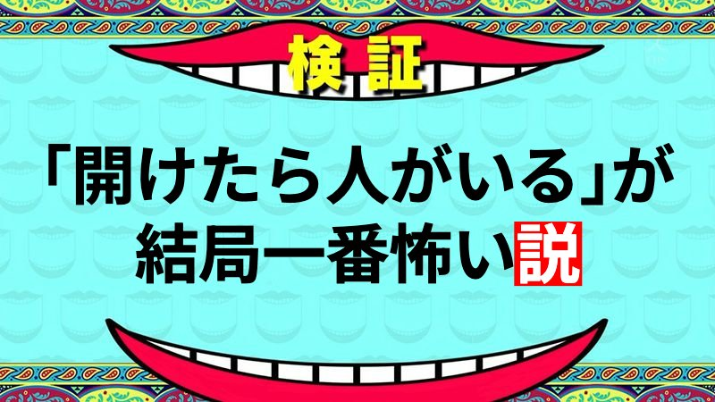
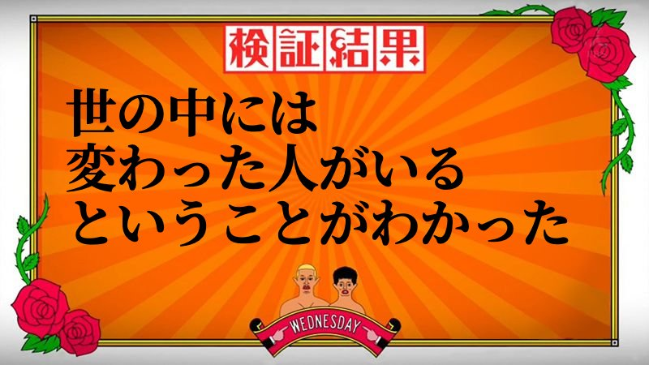
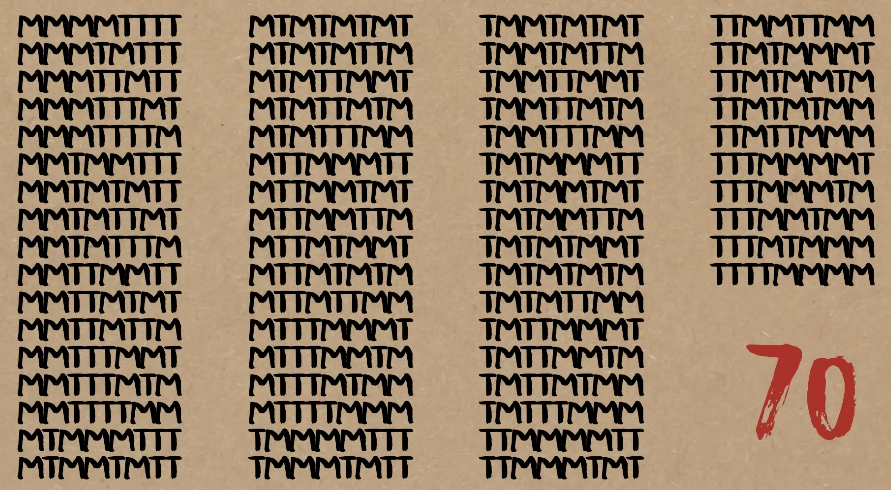

<xlarge>

統計学B

</xlarge>

Week 11

#

<!-- 水ダウ -->

#

# 水曜日のダウンタウンで学ぶ  

H₀ と H₁

#

<large>**H₀ (帰無仮説):** つまらない前提</large>  
<large>**H₁ (対立仮説):** おもしろい仮説</large>

<!-- slide -->

# 帰無仮説 H₀  
（つまらない前提）

「その説は成り立たない」
  

普通の状態・特別なことは起きていない
  

Null hypothesis = boring baseline
  

<!-- slide -->

# 対立仮説 H₁  
（◯◯説＝おもしろい仮説）

番組の「◯◯説」＝ H₁
  

成立してほしい、おもしろい世界
  

Alternative hypothesis = exciting claim

<!-- slide -->

# 水ダウの検証 = 仮説検定

H₀ と H₁ を立てる
  

データ（ロケ・検証）を集める
  

H₀ を棄却できるか判断する
  

<!-- slide -->

# 「説、立証です」 の意味

H₀ を棄却 (reject the null)
  

つまらない説明では説明できない
  

H₁ がデータとより整合的

<!-- slide -->

# 「説、立証ならず」 の意味

H₀ を棄却できない (fail to reject)
  

データ不足で結論を変えられない
  

H₀ が「正しい」とは限らない

<!-- slide -->

# 例：  

<large>「どんな状況でも芸人はツッコむ説」</large>

H₀：ツッコミ率は普通・高くない
  

H₁：どんな状況でも高確率でツッコむ
  

結果が大きく違えば → H₀ 棄却

<!-- slide -->

# まとめ

H₀ = つまらない世界（Null）
  

H₁ = おもしろい世界（◯◯説）
  

「説、立証です」＝ H₀ を棄却
  

「説、立証ならず」＝ H₀ を棄却できない

# 

Calpis first, then water?

Or water first, then Calpis?

#

# その女性は、紅茶とミルクの順序を見分ける特別な能力を持っているのか？

紅茶を先に注いだのか、ミルクを先に注いだのかを識別できる能力があるかどうかを検証する実験

<large>$H_0$:</large> 女性は区別できない能力がない。

<large>$H_1$:</large> 女性は本当に区別できる特別な能力がある！

#

# p-value と有意水準

**p-value**  
帰無仮説が正しい場合に、観測されたデータと同じかそれ以上に極端な結果が得られる確率です。p値が小さいほど、帰無仮説を棄却する根拠が強くなります。

**有意水準**  
帰無仮説を棄却する基準値で、一般的に0.05が用いられます。p値がこの値より小さい場合、帰無仮説を棄却します。これは、第一種の過誤を5%以下に抑えることを意味します。

## 臨界値と判定ルール

**臨界値**  
帰無仮説を棄却するための基準となる値です。p値がこの臨界値より小さい場合、帰無仮説を棄却します。

このルールに従って、実験結果を評価し、仮説検定を行います。

判定ルール

**α = 0.05 のとき**

p-value < 0.05 → H₀ を棄却  
p-value ≥ 0.05 → H₀ を棄却できない

#

#

How many combinations?

<medium>

$_8C_4 = \frac{8!}{4!(8-4)!} = \frac{8!}{4!4!} = \frac{8 \times 7 \times 6 \times 5}{4 \times 3 \times 2 \times 1} = 70$

</medium>

<!-- slide -->

# Lady Tasting Tea: p-value 計算

8杯中8杯正解の確率：  
p = 1/70 ≈ 0.014

**0.014 < 0.05** → H₀ を棄却 ✓

  
## 有意水準 α = 0.05 の意味

<!-- slide -->

# 実験の設定

女性：「ミルク先か紅茶先かを当てられる」
  

H₀：区別できない（ただの当てずっぽう）
  

H₁：本当に区別できる（ability）
  

8 杯中 4 杯がミルク先、4 杯が紅茶先

<!-- slide -->

# 有意水準 α = 0.05 とは？

Type I error（第一種の過誤）を 5% 以下に抑える
  

「区別できない人を、できると誤判定する確率」
  

＝ 5% まで許容するという事前ルール

<!-- slide -->

# 何杯正解したら H₀ を棄却できるか？

H₀ が正しい（区別できない）→ 全て偶然
  

8/8 全問正解の確率 = 1 / 70 ≈ 1.4%
  

1.4% < 5%（= 0.05）

<!-- slide -->

# 6/8 正解の場合の計算

6 杯正解、2 杯不正解の確率：  
$_8C_6 = \frac{8!}{6!2!} = \frac{8 \times 7}{2 \times 1} = 28$

p = 28/70 ≈ 0.40

**0.40 > 0.05** → H₀ を棄却できない ✗

40% の確率で起こり得る結果 → 「区別できない」でも説明できる

<!-- slide -->

# まとめ

α = 0.05 は「誤判定を 5% に抑える」基準
  

H₀：区別できない
  

8/8 正解だけが H₀ を棄却する根拠になる
  

→ 統計的に “区別できる” と言える

# Hypothesis Testing Glossary  
 仮説検定用語（英語＋日本語）

<!-- slide -->

# Null Hypothesis  
帰無仮説（きむかせつ）

- The “boring” baseline explanation  
- Default assumption we treat as true  
- 「特別なことは起きていない」という前提

<!-- slide -->

# Alternative Hypothesis  
対立仮説（たいりつかせつ）

- The interesting hypothesis we hope to support  
- 「◯◯説」に相当  
- We do *not* prove H₁ directly

<!-- slide -->

# Test Statistic  
検定統計量

- Numerical summary used to evaluate hypotheses  
- データから計算される判断のための数値

<!-- slide -->

# Significance Level  
有意水準（ゆういすいじゅん）

- Often α = 0.05  
- Threshold for rejecting the null hypothesis  
- H₀ を棄却するかどうかの基準

<!-- slide -->

# p-value  
p値（ぴーち）

- Probability of obtaining results this extreme if H₀ is true  
- 「H₀ が正しいと仮定したときの極端な結果の確率」

<!-- slide -->

# Reject the Null  
帰無仮説を棄却する

- Equivalent to “説、立証です”  
- Data are inconsistent with the boring explanation  
- Supports H₁, but does not *prove* it

<!-- slide -->

# Fail to Reject the Null  
帰無仮説を棄却できない

- Equivalent to “説、立証ならず”  
- Not enough evidence to rule out H₀  
- Does *not* mean H₀ is true

<!-- slide -->

# Type I Error  
第一種の過誤

- Rejecting H₀ when it is actually true  
- “False positive”  
- 本当は成り立たない説を立証してしまう

<!-- slide -->

# Type II Error  
第二種の過誤

- Failing to reject H₀ when H₁ is true  
- “False negative”  
- 本当は成り立つ説なのに、立証できない

<!-- slide -->

# Power  
検出力

- Probability of correctly rejecting H₀ when H₁ is true  
- 検定が「本当に面白い説」を見抜く力

<!-- slide -->

# Sample  
標本（ひょうほん）

- Data collected from part of the population  
- 例：検証の対象になる芸人

<!-- slide -->

# Population  
母集団（ぼしゅうだん）

- The group we want to generalize to  
- 例：全芸人、全人間など

<!-- slide -->

# Statistical Evidence  
統計的証拠

- Data strong enough to reject the null hypothesis  
- H₀ を否定できるだけの強いデータ