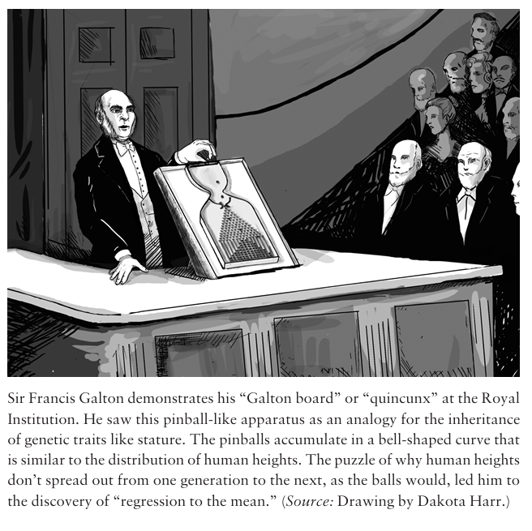
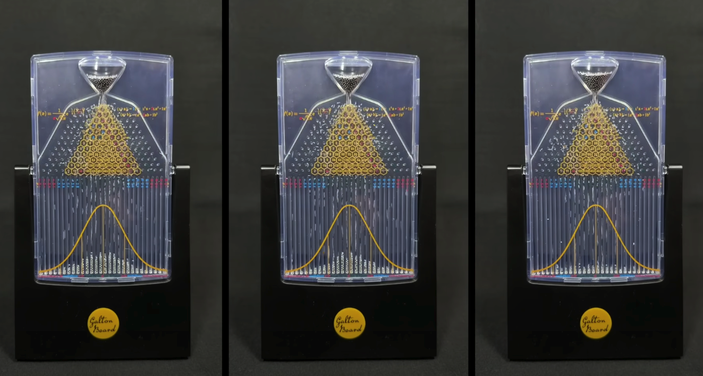
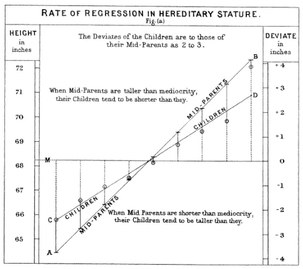

<xlarge>

統計学B

</xlarge>

Week 12: 回帰分析 2

#

なぜ

<xxxl>  
「回帰」  
</xxxl>

なのか

#

<large style="color:white">

The Galton Board

</large>

#

- Sir Francis Galton (1822-1911)
- British mathematician
- invented the "Galton Board"
- regression to the mean, or "reversion to mediocrity"
- 回帰先平均
(ex: test scores, heights, sports)

#

#

[Source: YouTube](https://www.youtube.com/watch?v=XXsTu66VB-E&ab_channel=3Blue1BrownJapan)

#
<large>

中心極限定理

</large>

Central Limit Theorem

#

ようするに…

<medium>
The Central Limit Theorem says that if you take a lot of averages from random samples, those averages will look like a bell curve, no matter how the original data looks!

 
 

中心極限定理とは、たくさんのデータをランダムに平均すると、その平均がどんなデータでもベルカーブ（正規分布）に近づくということです！

#

Galton wanted to see if this idea applied to real life data.

#

Do tall parents have tall children?

Do short parents have short children?

#

Galtonが気づいたのは…
930人の親子の身長データを使って
回帰分析を行うと…

#

回帰分析とは、
極端な世界が
平均に引き戻される様子を
数式で表したもの

<xxl>
極端な値は  
平均に戻る
</xxl>

<medium>

Regression toward the mean  
平均への回帰

</medium>

#

だから

<xxxl>  
「回帰」  
</xxxl>

なのだ