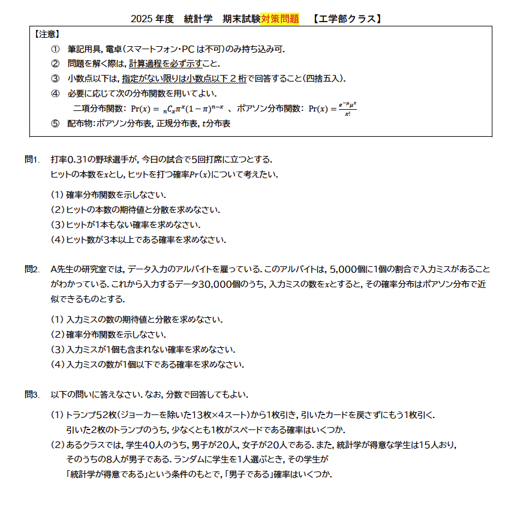
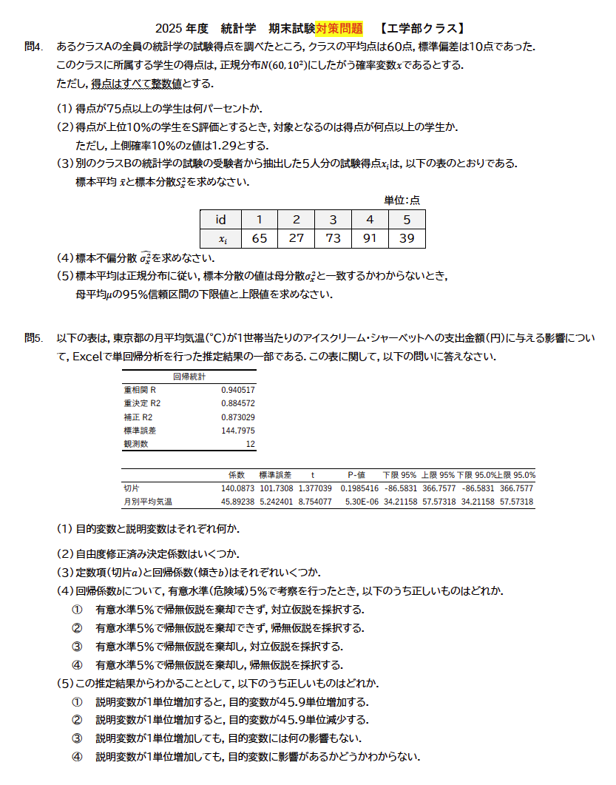
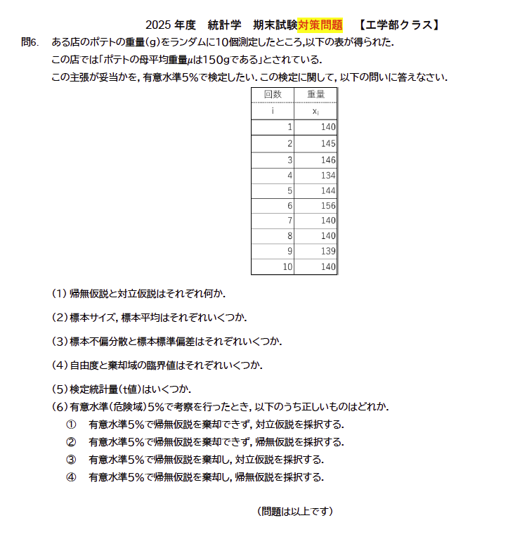
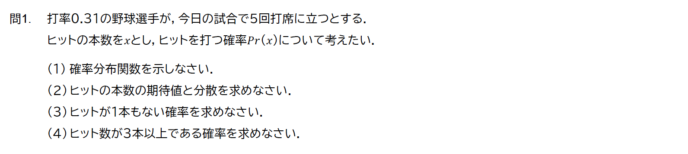
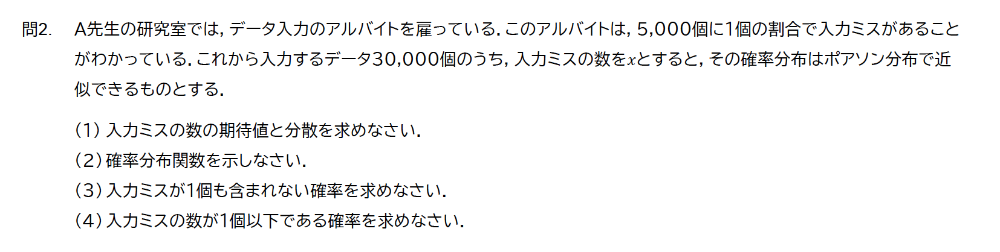
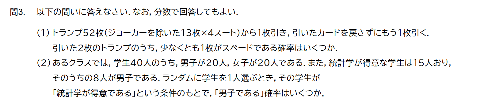
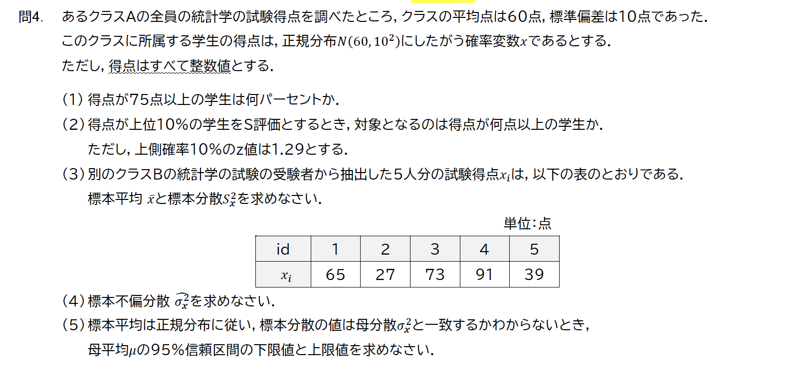
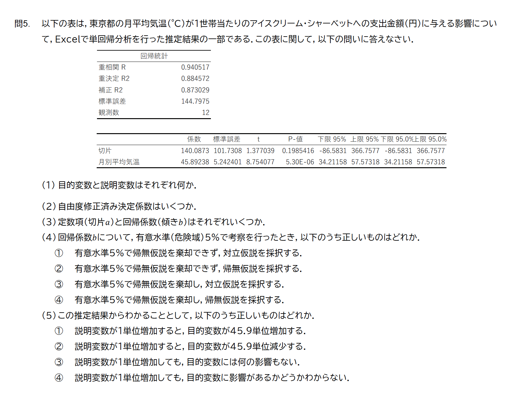
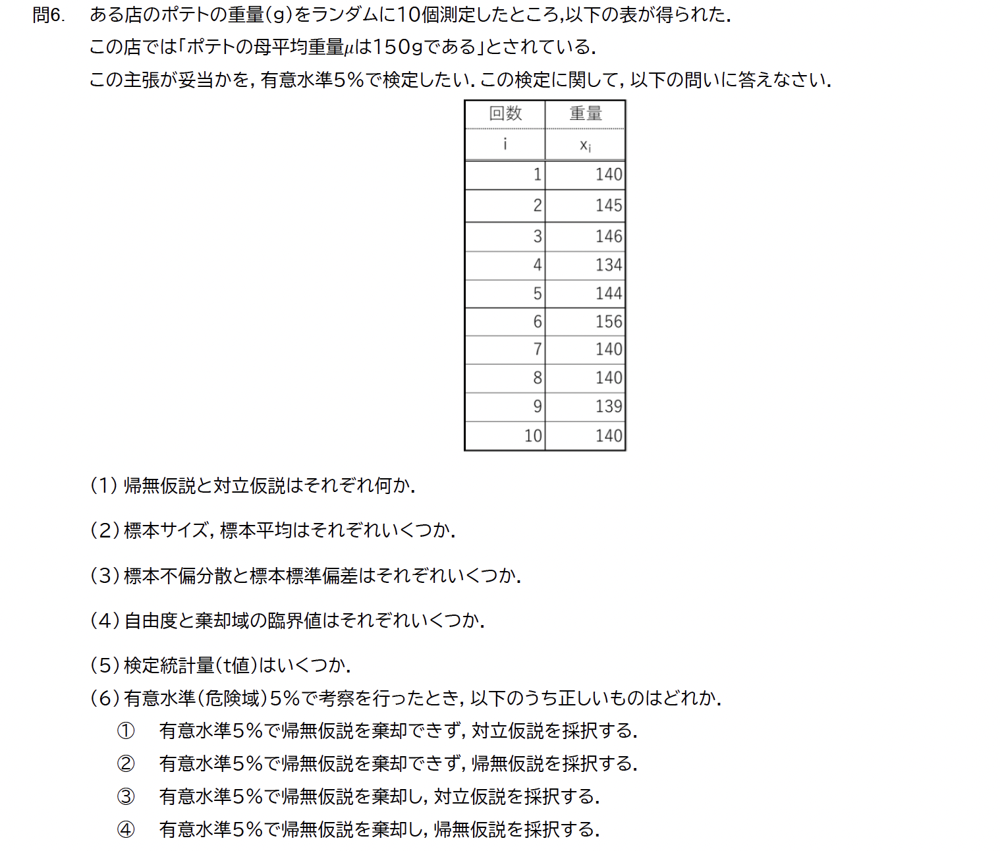

<!-- _class: bg-problem -->

# 

#

#

#

<!-- 問１ -->

 
 
 
 
 

##
<subtitle>問1の①（確率分布関数）p118</subtitle>

<medium>

ヒットの本数を $X$ とすると  

$X \sim \mathrm{Bin}(n,\pi)$

$n = 5,\ \pi = 0.31$

</medium>

<medium>

確率分布関数  

$P(X = x)
= {}_nC_x \cdot \pi^x \cdot (1-\pi)^{\,n-x}$  

$(x = 0,1,2,3,4,5)$

</medium>

##
<subtitle>問1の②（期待値・分散）p120</subtitle>

<medium>

二項分布の公式  

$E[X] = n\pi$  

$\mathrm{Var}(X) = n\pi(1-\pi)$

</medium>

##
<subtitle>問1の③（ヒットが1本もない確率）</subtitle>

<medium>

求めたい確率  

$P(X = 0)$

</medium>

<medium>

$P(X = 0)
= {}_5C_0 \cdot \pi^0 \cdot (1-\pi)^5$

</medium>

##
<subtitle>問1の④（ヒット数が3本以上の確率）</subtitle>

<medium>

求めたい確率  

$P(X \ge 3)$

</medium>

<medium>

$P(X \ge 3)
= P(X=3)+P(X=4)+P(X=5)$

</medium>

<medium>

$= \sum_{x=3}^{5}
{}_5C_x \cdot \pi^x \cdot (1-\pi)^{\,5-x}$

</medium>

#

<medium>

$\sum_{x=3}^{5}
{}_5C_x \cdot \pi^x \cdot (1-\pi)^{\,5-x}$

</medium>

 
 
 
 
 
 
 
 
 
 
 
 
 
 
 

#

<!-- 問２ -->

 
 
 
 
 

##
<subtitle>問2の①（期待値・分散）p120</subtitle>

<medium>

入力ミスの個数を $X$ とすると  

$E[X] = n\pi$

$\mathrm{Var}(X) = n\pi$

##
<subtitle>問2の②（確率分布関数）</subtitle>

<medium>

ポアソン分布関数  

$P(X = x)
= \dfrac{ e^{-\mu}\mu^x}{x!}$

</medium>

<medium>

$(x = 0,1,2,\dots)$

</medium>

##
<subtitle>問2の③（入力ミスが1個も含まれない確率）</subtitle>

<medium>

求めたい確率  

$P(X = 0)$

</medium>

<medium>

<!-- x = 0, mu = 6 -->
$x=0$  

$\mu=6$ 

ポアソン分布表より求める

</medium>

##
<subtitle>問2の④（入力ミスが1個以下である確率）</subtitle>

<medium>

求めたい確率  

$P(X \le 1)$

</medium>

<medium>

$P(X \le 1)
= P(X=0)+P(X=1)$

</medium>

<medium>

$\mu$ の行，$x=0\sim1$ の列を  
ポアソン分布表から読む

</medium>

#
<!-- 問３ -->

 
 
 
 
     

##
<subtitle>問3の①（少なくとも1枚はスペードである確率）p112</subtitle>

$\Pr(\text{少なくとも1枚はスペード})
= 1 - \Pr(\text{2枚ともスペード以外})$

スペード以外の枚数  

<medium>

$52 - 13 = 39$

</medium>

$\Pr(\text{2枚ともスペード以外})
= \dfrac{39}{52} \times \dfrac{38}{51}
= \dfrac{19}{34}$

$= 1 - \dfrac{19}{34}
= \dfrac{15}{34}$

##
<subtitle>問3の②（条件付き確率）p113</subtitle>

<medium>

$A$：統計学が得意である  

$B$：男子である  

</medium>

<medium>

条件付き確率の定義  

$\Pr(B \mid A)
= \dfrac{\Pr(A \cap B)}{\Pr(A)}$

</medium>

<medium>

$\Pr(B \mid A)
= \dfrac{\frac{8}{40}}{\frac{15}{40}}
= \dfrac{8}{15}
$

</medium>

#

<!-- 問４ -->

##
<subtitle>問4の①（正規分布）p123</subtitle>

<medium>

$X \sim N(\mu,\sigma^2)$

$\mu = 60,\ \sigma = 10$

</medium>

<medium>

① 75点以上  

$z = \dfrac{x - \mu}{\sigma}
= \dfrac{75 - 60}{10}
= 1.5$

</medium>

標準正規分布表より
<medium>
$P(Z \ge 1.5) = を調べる$
</medium>

##

<subtitle>問4の②（正規分布）</subtitle>

<medium>

② 上位10%の境界値  

$x = \mu + z\sigma$  

$z_{0.10} = 1.29$

</medium>

<!-- 1.29 z is how many points formula -->
<medium>

$x = 60 + 1.29 \times 10 = 72.9$

</medium>

##
<subtitle>問4の③（標本平均・標本分散）</subtitle>

<medium>

標本平均  

$\bar{x} = \dfrac{1}{n}\sum x_i$

</medium>

<medium>

標本分散  

$s_x^2 = \dfrac{1}{n}\sum (x_i - \bar{x})^2$

</medium>

##
<subtitle>問4の④（標本不偏分散）p132</subtitle>

<medium>

$\hat{\sigma}_x^2 = \dfrac{1}{n-1}\sum (x_i - \bar{x})^2$

</medium>

##
<subtitle>問4の⑤（母平均の95%信頼区間）p133</subtitle>

<medium>

母分散未知 → t分布を使用  

</medium>

<large>

$\bar{x} \pm t_{\alpha}(n-1)\sqrt{\frac{\hat{\sigma}_{\bar{x}}^{2}}{n}}$

</large>

<medium>

自由度：$n-1$  

t分布表より  
$t_{0.025}(n-1)$ を読む

</medium>

#

<!-- 問５ -->

##
<subtitle>問5の①（目的変数・説明変数）</subtitle>

<medium>

目的変数（$y$）  
1世帯当たりの  
アイスクリーム・シャーベットへの支出金額（円）

</medium>

<medium>

説明変数（$x$）  
東京都の月平均気温（℃）

</medium>

##
<subtitle>問5の②（自由度修正済み決定係数）</subtitle>

<medium>

自由度修正済み決定係数  
Adjusted $R^2$

</medium>

<medium>

Excel出力より  

$\text{Adjusted } R^2 = 0.873029$

</medium>

##
<subtitle>問5の③（切片と回帰係数）</subtitle>

<medium>

回帰式  

$y = a + bx$

</medium>

<medium>

切片 $a$  

$a = 140.0873$

</medium>

<medium>

回帰係数 $b$（月別平均気温）  

$b = 45.89238$

</medium>

##
<subtitle>問5の④（回帰係数の有意性）</subtitle>

<medium>

帰無仮説  

$H_0: b = 0$

</medium>

<medium>

対立仮説  

$H_1: b \ne 0$

</medium>

<medium>

P値  

$p = 5.30 \times 10^{-6}$

</medium>

<medium>

$p < 0.05$  
→ 有意水準5%で  
帰無仮説を棄却

</medium>

##
<subtitle>問5の⑤（結果の解釈）</subtitle>

<medium>

回帰係数 $b = 45.9 > 0$

</medium>

<medium>

説明変数が1単位増加すると  
目的変数は平均して  
約45.9単位増加する

</medium>

<medium>

（他の選択肢は不適切）

</medium>

#

<!-- 問６ -->

##
<subtitle>問6の①（帰無仮説・対立仮説）</subtitle>

<medium>

帰無仮説  

$H_0 : \mu = 150$

</medium>

<medium>

対立仮説  

$H_1 : \mu \ne 150$

</medium>

##
<subtitle>問6の②（標本サイズ・標本平均）</subtitle>

<medium>

標本サイズ  

$n = 10$

</medium>

<medium>

標本平均  

$\bar{x} = \dfrac{1}{n}\sum x_i$

</medium>

##
<subtitle>問6の③（標本不偏分散・標本標準偏差）</subtitle>

<medium>

標本不偏分散  

$\hat{\sigma}^2 = \dfrac{1}{n-1}\sum (x_i-\bar{x})^2$

</medium>

<medium>

標本標準偏差  

$s = \sqrt{\hat{\sigma}^2}$

</medium>

##
<subtitle>問6の④（自由度・臨界値）</subtitle>

<medium>

自由度  

$n-1 = 9$

</medium>

<medium>

有意水準5%（両側）  

$t_{0.025}(9)$  

（t分布表より）

</medium>

##
<subtitle>問6の⑤（検定統計量 t）p145</subtitle>

<medium>

検定統計量  

$t = \dfrac{\bar{x}-\mu_0}{\sqrt{\hat{\sigma}^2/n}}$

$t = \dfrac{142.4 - 150}{\sqrt{34.7111/10}} = -4.079$

</medium>

##
<subtitle>問6の⑥（検定結果の判断）</subtitle>

<medium>

判定基準  

$|t| \ge t_{0.025}(9)$  
→ 帰無仮説を棄却  

</medium>

<medium>

$|t| < t_{0.025}(9)$  
→ 帰無仮説を棄却できない  

</medium>
