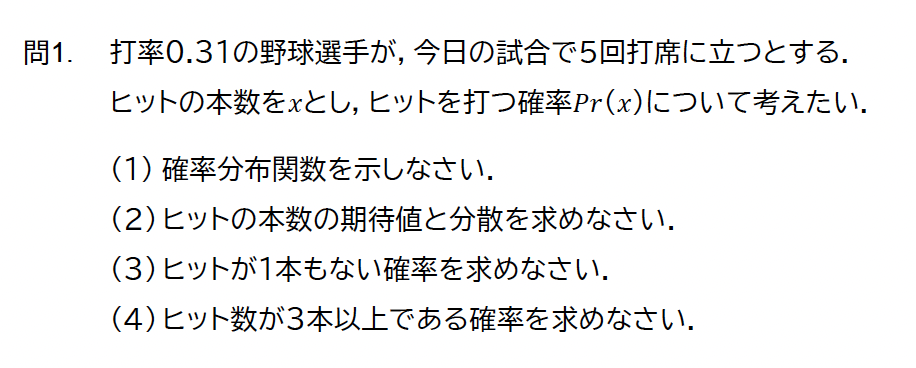

<xlarge>

統計学B

</xlarge>

Week 13: Practice Exam Prep

# 統計学B 期末試験 チートシート

<xl>

問題文を読む  
分布を判断  
式を書く  
表を見る  
数値を代入

</xl>

<medium>

※ 計算より「判断」が重要

</medium>

# 二項分布  
こういう時に使う

<medium>

- 成功 / 失敗が明確  
- 各試行は独立  
- 試行回数 $n$ が決まっている  
- 成功確率 $\pi$ が与えられている  

</medium>

<medium>

例  
・4択問題の正解数  
・フリースロー成功回数  

</medium>

# 二項分布  
確率分布関数（答案で必ず書く）

<large>

$$ 
P(X = x) =  _nC_x \cdot \pi^x \cdot (1 - \pi)^{n - x}

$$

</large>

<medium>

$x=0,1,2,\dots,n$

</medium>

# 二項分布  
期待値・分散

<large>

$E[X]=n\pi$  

$\mathrm{Var}(X)=n\pi(1-\pi)$

</large>

# 二項分布  
「◯回より大きい」「◯回以上」

<medium>

- $P(X>k)$  
- $P(X\ge k)$  

</medium>

<medium>

答案の書き方（和で書く）

</medium>

$P(X>k)=\sum_{x=k+1}^{n}\binom{n}{x}\pi^x(1-\pi)^{n-x}$  

$P(X\ge k)=\sum_{x=k}^{n}\binom{n}{x}\pi^x(1-\pi)^{n-x}$  

# 二項分布  
「◯回以下」「◯回未満」

<medium>

答案の書き方

</medium>

$P(X\le k)=\sum_{x=0}^{k}\binom{n}{x}\pi^x(1-\pi)^{n-x}$  

$P(X<k)=\sum_{x=0}^{k-1}\binom{n}{x}\pi^x(1-\pi)^{n-x}$  

# ポアソン分布  
こういう時に使う

<medium>

- 試行回数は決まっていない  
- 平均回数だけ分かる  
- まれに起こる現象  

</medium>

<medium>

例  
・事故件数  
・誤入力回数  

</medium>

# ポアソン分布  
確率分布関数

$X \sim \mathrm{Poisson}(\lambda)$  

$P(X=x)=\dfrac{e^{-\lambda}\lambda^x}{x!}$

<medium>

$x=0,1,2,\dots$

</medium>

# ポアソン分布  
期待値・分散

$E[X]=\lambda$  

$\mathrm{Var}(X)=\lambda$

# ポアソン分布  
表の使い方（超重要）

<medium>

- 計算で $e^{-\lambda}$ は求めない  
- 与えられた **ポアソン分布表** を使う  
- 行：$\lambda$  
- 列：$x$  

</medium>

<medium>

例  
$P(X\le 2)$ → 表で  
$P(0)+P(1)+P(2)$ を足す  

</medium>

# 確率  
こういう聞かれ方

<medium>

- 「少なくとも1つ」  
- 「〜のもとで」  

</medium>

# 確率  
答案で使う式

<medium>

補集合

</medium>

$P(\text{少なくとも1つ})=1-P(\text{0個})$

<medium>

条件付き確率

</medium>

$P(A\mid B)=\dfrac{P(A\cap B)}{P(B)}$

# 正規分布  
こういう時に使う

<medium>

- 母平均 $\mu$ と母分散 $\sigma^2$ が既知  
- 割合・上位◯％・下位◯％  

</medium>

# 正規分布  
標準化

$X \sim N(\mu,\sigma^2)$  

$z=\dfrac{x-\mu}{\sigma}$

# 正規分布  
z表の使い方

<medium>

- z表は **標準正規分布** 用  
- 行：整数＋小数第1位  
- 列：小数第2位  

</medium>

<medium>

確率 → z  
z → 確率  
問題文で判断  

</medium>

# 標本統計量  
こういう時に使う

<medium>

- 生データが与えられている  
- まず平均と分散を求める  

</medium>

# 標本統計量  
答案で使う式

<medium>

標本平均

</medium>

$\bar{x}=\dfrac{1}{n}\sum x_i$

<medium>

標本分散

</medium>

$s^2=\dfrac{1}{n}\sum(x_i-\bar{x})^2$

# 標本不偏分散  
こういう時に使う

<medium>

- 母分散を推定したい  
- t検定・信頼区間の前処理  

</medium>

# 標本不偏分散  
答案で使う式

$\hat{\sigma}^2=\dfrac{1}{n-1}\sum(x_i-\bar{x})^2$

# 母平均の95%信頼区間  
こういう時に使う

<medium>

- 母分散が未知  
- 標本サイズが小さい  

</medium>

# 母平均の95%信頼区間  
答案で使う式

$\bar{x}\pm t_{0.025}(n-1)\dfrac{s}{\sqrt{n}}$

# t表の使い方

<medium>

- 行：自由度 $n-1$  
- 列：上側確率 $0.025$  

</medium>

# 回帰分析  
こういう時に使う

<medium>

- $y$ を $x$ で説明したい  
- 関係の向き・強さを知りたい  

</medium>

# 回帰分析  
答案で使う式

$y=a+bx$

<medium>

$a$：切片（$x=0$ のときの $y$）  
$b$：回帰係数  

</medium>

# R²・Adjusted R²  
答案での意味

<medium>

$R^2$

</medium>

目的変数の分散のうち  
説明変数で説明できた割合

<medium>

Adjusted $R^2$

</medium>

変数の数を考慮した  
モデル評価

# 回帰係数の検定  
こういう時に使う

<medium>

- その説明変数が有効か  

</medium>

# 回帰係数の検定  
答案で使う式

$H_0:b=0$  

$t=\dfrac{\hat{b}}{\mathrm{SE}(\hat{b})}$  

$p<0.05 \Rightarrow$ 帰無仮説を棄却  

# t検定（母平均）  
こういう時に使う

<medium>

- 標本平均と母平均の比較  
- 母分散は未知  

</medium>

# t検定（母平均）  
答案で使う式

$t=\dfrac{\bar{x}-\mu_0}{\sqrt{\hat{\sigma}^2/n}}$

$|t|\ge t_{0.025}(n-1)\Rightarrow$ 帰無仮説を棄却

# 最後に

<xl>

判断が8割  
計算は2割  

</xl>